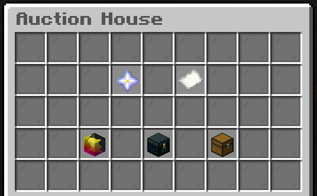

 

## Player Auctions

The Player Auctions are another means of boosting your income, particularly for items you may want to allow players to fight over rather than set a definite price or that you're unsure of a worthy value for (ie rare MD stuff, enchanted books, brews, event-only items etc...).

As with player shops, you are limited to how many items you can throw on the auction. However - unlike player shops this is not level based it is rank based. 
- General players can have up to 20 items up for auction at once.
- Players with the Trusted rank can have up to 30 items up for auction at once.
- Players with the Donator rank can have up to 40 items up for auction at once.

You can open the Auction GUI via `/auc` (or `/auction`/`/auctions`) - this will open a menu such as this:

From here you will be able to access the submenus of: 
- Nether Star Icon - **All Active Auctions**: 
From here you will be able to see all active auctions, and place bids on any that catch your eye!

- Paper Icon - **Auctions You Have Bid On**: 
From here you will be able to see any auctions you are actively bidding on, rather than needing to find them in the full list again to make sure you're still the top bidder!

- Your Skull Icon - **Your Auctions**: 
You will be able to see all items you have up for auction currently here. You can also cancel your auctions from here if you wish to!

- Enderchest Icon - **Expired Items** 
Any items you put up for auction that expired without being bid on can be found and retrieved here.

- Chest Icon - **Items You Have Won**: 
Any items you bid on and won can be retrieved from here!

When in any submenu you can click the painting icon at the bottom to refresh the list - particularly useful or the full active auctions list and the list of auctions you are already bidding on!

## Starting an Auction

To auction an item simply hold it and do `/auc start` - this will open a GUI to select the various settings for your auction.

During the creation process of an auction you will be given pages with options on the left/right of the GUI to decrease/increase certain settings - these are:
- Quantity - How many of the held stack are you putting up for auction together (**Min:** 1 - obviously).
- Starting Price - The starting bid value (**Min**: $500).
- Minimum Bid Increment - The minimum players can increase the bidding each time (**Min**: $100).
- Auction Duration - How long to run the auction for before it expires (**Min**: 1 Hour).

These options all start on their minimum amount as stated above, and can be increased using the GUI you are given - however they all also have a maximum start setting:
- Quantity - **Max**: 64 (obviously)
- Starting Price - **Max**: $1,000,000
- Bid Increment - **Max**: $500,000
- Duration - **Max**: 7 Days

## Cancelling an Auction

Simply open the GUI, click your skull icon to list your active auctions and then middle click on the item you wish to take out of the auctions! 
Once cancelled you can retrieve the item from the Expired Items submenu.

## Bidding on an Auction

Simply go to the Active Auctions list and click on the item you wish to bid on and follow the instructions in the GUI. Note that when you make a bid the money is taken from your balance at that time!
If you are outbid on an item the amount you bid previously will be added back to your balance automatically.

## Auction Earnings

Any monetary earnings from items you auction will be automatically added to your balance when the auction ends.
Any items - whether they be items you won by bidding on them, or items you auctioned that got no bids - can be retrieved from the relevant `/auc` menu section.

 
 
 

### **NOTE**:
Auctions do not work in Creative **at all** - not even to bid on items. To use the Auctions you must be in any other world on the server.
