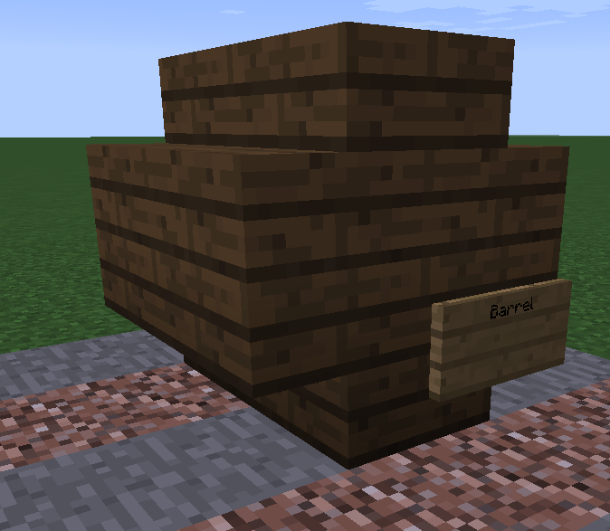
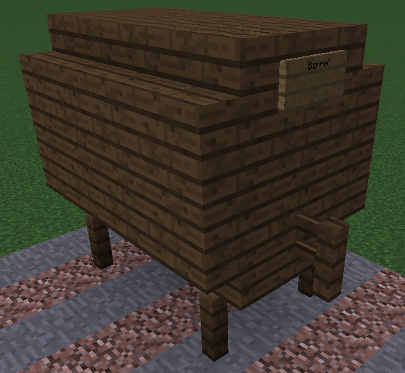

 

# Brewery

Brewery has been added! So what do you need to know?

Well first up it’s important to understand the different/extra stages brewery brews have in comparison to vanilla brews, but with that difficulty comes many new fascinating drinks. There are many steps in creating these new drinks and if one step is not perfectly done it can ruin the entire drink.

- [Brewing Cauldron](#brewing-cauldron)
- [Aging Barrels](#aging-barrels)
- [Side Notes](#side-notes)

Step one involves brewing the ingredients you plan to use, while at first finding what ingredients to use is trial and error, eventually you’ll know enough recipes to become a master.

## Recipes

Recipe books will drop at random from mobs killed by players directly. These books will list the ingredients for a specific brew and the steps to make it!

## Brewing Cauldron

To brew the ingredients you must:

1. Place a Cauldron over a fire (Put netherrack under the fire to keep it going).
2. Fill it with water.
3. Add Ingredients by right clicking on the cauldron with them.
4. Wait while they ferment - the optimal amount of minutes for the drink is listed as the 'Brew Time' in the recipe book.
5. Extract with empty bottles when it is done!

>To find out how long your ingredients have been brewing simply right click the cauldron with a clock in your hand.

The final extra step - for some drinks - is aging.

To age your drink you must first create aging barrels - There are two types of barrels you can create, along with using a normal MC barrel.

## Aging Barrels

### MC Barrel

If you place a brew into a normal Minecraft barrel it will still age as with the custom barrels, however it can only hold up to 6 brews at a time!

### Small Barrel
To make this you’ll need 8 wooden stairs and a sign (the stairs must be all the same type of wood, but any overworld-wood can be used).

Using the stairs make the above
Then to finalize your barrel place a sign in the lower right corner with Barrel on the top line

The message “Barrel created” should appear if done correctly

### Big Barrel
To build you’ll need 5 fences, 16 wooden stairs, 18 wood planks, a sign and have it be hollow inside (the stairs and planks must be all the same type of wood, but any overworld-wood can be used).

You now need to attach a spigot (fence) and a sign that has “Barrel” written on the top line:

Message “Barrel created” should appear
With a big barrel you can then remove the sign (for small barrels it must be left on).

The small barrel can be opened with a rightclick to the sign, for the big barrel click the spigot.
Put your now distilled bottles in for aging and leave them there for the requested time,
To know how long you must leave them in there open the barrel up and check the lore of the bottle.

## Side Notes
You will be able to craft a lot of alcoholic beverages on the server but note that drinking too much will have a ton of negative side effects such as slurred 'speech', wandering off randomly and throwing up soulsand (you can't pick it up, it's just visual). That being said if you are drunk, eating most foods or drinking milk can help you sober up slowly but the best medicine is time (or buy a Sobering Thought from the pawn shop - this is an instant sober up item). 
