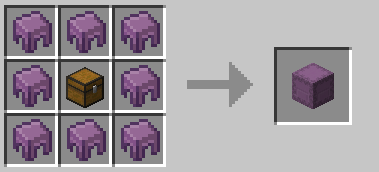

 

# Changes We Make To Some Vanilla Mechanics

Not all Vanilla/singleplayer features are a good idea for multiplayer/server scenarios.
In fact - a **lot** of the stuff Mojang adds/changes is dumb as hell from a server perspective, because they don't really give a rats ass about servers (even less so about non-Realms servers... but that's a rant for another day).

As such we do make changes to a few Vanilla features - or "features" said very loosely, as a lot of the "features" we change are actually exploits, that people ytu to argue are "features". 
Any major ones that players are likely to notice/care about will be listed on this page.

> **Note that just because something is not listed on here does not mean we have not made changes to it, or a plugin isn't making changes to it (particularly if it's considered a bug/exploit - regardless of whether it's in Vanilla or not). This is just a lit of the main things.**

## Table of Contents
As a quick run down so you don't need to scroll down to find what you're looking for:
- [Brewing Stand GUI](#brewing-stand-api)
- [Aquiring Mending](#aquiring-mending)
- [Elytra Limits](#elytra-limits)
- [End World Tweaks](#end-world-tweaks)
- [Hopper Limits](#hopper-limits)
- [ShulkerBox Recipe Tweak](#shulkerbox-recipe-tweak)
- [Nether Scaling](#nether-scaling)
- [Notable Exploit Patches](#notable-exploit-patches)

 
 

## Brewing Stand GUI

This is overriden by the McRPG Sorcery Skills custom GUI for brewing - it works the same, it just looks vastly different.
You can view the change on the [Sorcery](mcsorcery.md) page.

## Aquiring Mending

Mending - to put it bluntly - is one of the **dumbest** things to ever be added to Minecraft when it comes to multiplayer/server situations. 
It may be extremely useful as a player, and almost necessary on singleplayer - but it is **far** too easy to get, particularly when abusing certain exploits, and makes the risk of losing equipment considerably lower to the point of it basically not being Survival any more. 

From a server/multiplayer perspective this causes **many** issues longterm - As such we're limiting the ways you can get it to make it considerably less farmable.

You will still be able to find Mending books in dungeon/treasure chests around the world as you normally would in Vanilla - however, you will not be able to trade for them with Villagers.

Instead, as an extra few ways they can be gained, you have a chance to gain Mending books on days 14 and 28 of your DailyBonus rewards through Bonus Bill and they will be given out as Top Voter and Build Competition rewards as well.

## Elytra Limits

Elytras... another extremely dumb thing Mojang have added. Not for what it allows you to do, but for the fact it is not limited in almost any way - to the point they made the item unbreakable, which is **beyond** dumb in a server scenario where they almost never end up staying rare for long - and that it is **SO** easy to kill a server with them, when you add the **MANY** serverside performance issues Mojang has now ignored for years (such as the major issues chunk loading/generation causes... you know - that you load a BUTTLOAD of in when flying around with an Elytra and rockets...?).

To try and limit this somewhat a few things have been changed with how Elytras work. 
**1** - They **are** breakable. We reset our End once a fortnight, and you can get Elytras through the Token Shop - they aren't extremely rare, and in a Survival game everything should have some amount of risk of being broken/lost. 
**2** - Using rockets to boost your flight will damage your Elytra. It's only a small amount of damage per rocket use, but if you use a lot - it will quickly deplete your Elytras durability (and if it hits 0 it **will** break, so keep an eye on it). 
**3** - You cannot eat or drink potions etc... while gliding with your Elytra. To fill your hunger/heal up you will need to land. 
**4** - Riptide use will interrupt your gliding, so you cannot endlessly fly about in the rain. 

## End World Tweaks

A few tweaks have been made to the End world to make it a bit more challenging compared to the rest of the server - A couple to base MC mechanics, and a couple to server mechanics (for the sake of clarity they'll all be listed here).

**1** - There is a 30% chance that the Graves the server uses will not function in the End - causing you to drop everything as you would normally on MC (remember that DeathPoint Scrolls cannot take you back to the End either). Each death that **does** trigger a Grave in the End will increase the chances that the next death will fail to create a Grave - when it fails it resets to 30%. It's never a **guaranteed** fail, but the chances get close! 
**2** - There is a chance each End-reset for the Dragon to spawn with extra health and resistance to make it more of a challenge. If it has spawned in with these boosts it will also have a trail following it as it flies around, and will also have a higher chance to drop a Crystal item compared to the normal Dragon spawn. 
**3** - A small chance for Shulkers to also spawn with extra health and resistance. Any that spawn in with these boosts will have a small chance to drop a single bottle of Dragon Breath on death, however these will not glow to signify which they are. 
**4** - Any shulker bullet that hits you has a small added chance to cause either a few seconds of blindness or a slightly longer period of nausea. 
**5** - Enderpearls will have a cooldown of 1 minute so you cannot endlessly jump about via them. 
**6** - Elytras will not work in the End for 3 minutes after going through the End portal from Resources. 
**7** - Any rockets used to boost Elytra flight will also have a chance to be a dud and do nothing.. 

## Hopper Limits

By this point it should be fairly common knowledge that one of the many things that are poorly optimised and highly prone to cause server TPS drops and majpr lag issues.... are Hoppers.

In general - if you don't **need** to place many hoppers, then don't. For example: You don't need to make an item sorter for every item in the game - that many hoppers **will** cause server issues, and it doesn't take you **that** much longer to sort your chests yourself.
However - to keep potential problems from overuse of hoppers down there are two things we have done:

**1**: - Added Upgradeable Hoppers. You can read up on them [HERE](hopper.md). 
**2**: - Limited how many hoppers you can have in one chunk to 50. You physically won't be able to place any more once a 50th has been placed in the same chunk (this applies to Upgradeable Hoppers too, but as they work completely differently you would never need 50 of them in one chunk).

## ShulkerBox Recipe Tweak

ShulkerBoxes are too easy to craft - it is very very easy to get shulker shells on multiplayer servers (as it only takes one person to go farm shulkers in the End and then sell them to allow **everybody** to have all the shells they'll ever need) and only requiring 2 for a box is ridiculous.

As such we have tweaked it to require 8 shells per shulker box, as it is still easy enough to get that many and it helps limit how many shulkerboxes are floating around.

## Nether Scaling

The scaling between the Overworld and Nether has been abusable for as long as the Nether has existed. 
If you don't know what I mean by this I mean the fact that every 1 chunk in the Nether is 8 chunks in the Overworld - allowing for the use of fast travelling around the Overworld without anybody knowing, by going into the Nether, walking 1/8th of the distance you want to go and building a portal to the Overworld.

It also makes it annoying as hell to set world borders correctly without any risk of bugging when people go between these worlds and accidentally dropping them outside of a world border.
As such we have changed the scaling for our Nether worlds.

The default scaling is 1:8 (Nether:Overworld) - in our Survival Nether world it has been reduced to 1:2 and in our Resource Nether world it has been reduced to 1:4.

## Notable Exploit Patches

### Villager Trade Cheesing
Removing Mending from Villager trades is not the only thing we have changed with Villager trades.
The feature added where if you cure a Zombie Villager they give you a discount? That's the feature. Where you re0=-infect and cure and repeat to get 1 emerald trades for rarer shit (like enchant books)? **That's an exploit**.

As such a Villager cannot be turned back into a Zombie Villager once cured. The initial discount they give you is all they will give.

Other than these two things, Villager trading works as normal.

### Zero Tick Farms
Not a feature - never has been, never will be. It has been an exploit from the second it became doable. These are disabled.

### Various Duplication Glitches
A prime example being the mob chest duplication glitch. This is patched and will not work.

### Nether Roof Access
It is not supposed to be accessible, never has been - that is the point of there being a flat layer of bedrock there, you can't get through it by normal Survival means only by abusing glitches/bugs.

### Offhand Tool Looting Exploit
The exploit - having a tool in your offhand such as a bow that does not have looting, and a sword in your main hand that has looting. You use the bow - it applies the looting from your sword to it even though the bow does not have looting itself.

This is patched - **however** it should be noted that currently the way it gets patched is just to disable looting from working when you have tools in both hands, so to use looting, don't dual-weild. If a better patch comes up I'll swap it to that.

**There are other bugs/glitches/exploits patched but these are the main, notable ones**.
