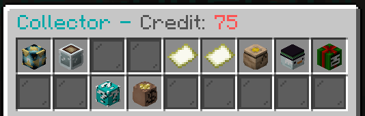
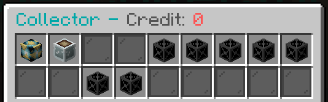

 

# The Collector

The Collector is a strange being - all he wants are chunks of rocks.... and the occasional soul. In exchange however he has a big warehouse full of excess stock from previous server events and competitions that have not yet been claimed, and a number of other loot/cash to trade for!
You can visit The Collector with `/collect`.

When you right click on him, you will see a menu similar to this:

Note that if you don't have enough credits for the cheapest item in one of the stores The Collector will lock you out! For example if you have no credits, they will all be locked:

From here you can sell fragments and souls to him, or trade in your store credit for various loot!

### Fragments/Souls

You can find these items that The Collector covets randomly when mining ores or killing mobs. 
Any ore block has a chance to drop a fragment but **not when silk touched**. Not all mobs have the chance to release a soul that The Collector wants - but we're not going to tell you which do or don't!

You can sell these coveted items to The Collector via the two options to the left of the main store GUI, which will open the following pages:

 

When you click any of these options The Collector will have a casual rummage around your inventory and find any of the chosen item and will take them all - you will then be rewarded some store credit!
The amount you will be rewarded for each item is as follows:

|Fragment/Soul Types|Credits Given|
|---|---|
|Coal and Quartz Fragments|1 Token each|
|Iron and Redstone Fragments|2 Tokens each|
|Gold and Lapis Fragments|3 Tokens Each|
|Diamond and Emerald Fragments|4 Tokens each|
|Pitiful and Ordinary Souls|1 Token each|
|Restless and Tainted Souls|2 Tokens each|
|Vengeful Souls|3 Tokens each|
|Exotic Souls|4 Tokens each|
|Pure Souls|5 Tokens each|
|Unique Souls|10 Tokens each|

Once you've traded in some fragments/souls and have gained some credit you can then purchase titles, costumes, items and mob drops from previous events and competitions - **all items in the store are 25 tokens unless they're newly added from the last event/competition, in which case they will be 50!** 
(currently all are 25 tokens, after the next competition for example the titles from that competition will be 50 until the next event/competition etc...)

**Note::** Reward items from builkd competitions (such as the everlasting water jug) will **not** be given as rewards from The Collector - all event items/titles etc.. will be added, and the titles from competitions will be added. Brew recipes from events/competitions will also not be added.

Currently you have the option to purchase the titles from the **Black Magic** and **Winter Getaway** build competitions, and the titles/mob drops/costumes and other items from the **Halloween 2019** and **Winter 2019** events!

## Current Purchasable Options

### Competition Titles

**Available Titles:**
- Illusionist
- Elementalist
- Sorceror
- Evoker
- Santa
- Snowflake
- Frozen
- Jolly

### Event Titles

**Available Titles:**
- Jack'O'
- Boney
- Walker
- Night King
- Electric
- Arachnid
- Meat Sack
- Lost
- Slasher
- Final Girl
- Token Virgin
- Monster
- Werewolf
- Fleshy
- Undead
- Trick Or
- Gargoyle
- Mummified
- Grim
- Polar
- Gingerbread
- Mulled
- Scrooge
- Grinch
- Rudolph
- Frosty
- Krampus

### Event Drops

Due to the amount of drops this has been split into sub-shops for each event:

**Halloween 2019**: 

Here you can purchase any of the **Jack'O'Lanterns** that were dropped by Pumpkinheads in the event, and any of the **Walker Skulls** which were dropped by the Walkers in the event!

**Winter 2019**: 

Here you can purchase any of the **Sacks** and **Orbs** that were dropped by special mobs during the event!

### Costumes

**Available Costumes**:
- Walker
- The Pumpkin
- Night King
- Lost Soul
- Goblin
- Witch
- Zombie
- Werewolf
- Dracula
- Demon
- Ghast Demon
- Mummy
- Reaper
- Clown
- Pennywise
- Rudolph
- Snowman
- Grinch
- Santa
- Mrs Claus
- Candy Cane
- Krampus
- Christmas Groot

### Advent Items

Here you can purchase the items that were given out in the Winter 2019 Advent if you missed out! These include:
- 9 different coloured baubles (the black bauble has rainbow particle effects).
- 5 trail effects that were specific to the Advent (not available as a donation trail).
- Firework Launcher (**currently does not work due to changes in Skript - but likely to be fixed, it is on the to do list).
- The 4 pieces of the Winter Armour Set (gives particle effects when the full set it worn).
- Any of the 15 different dice blocks.

### Trade for Cash

Here you can trade your credits for some server money, plus some items for the higher trades!

|Credit Amount|Reward Given|
|---|---|
|1 Credits|$1000|
|3 Credits|$3000|
|5 Credits|$5000|
|10 Credits|$10000|
|25 Credits|$25000 + 1 Golden Apple|
|50 Credits|$50000 + 2 Golden Apples|
|100 Credits|$100000 + 3 Golden Apples + 1 Totem of Undying|

### Mythic Items

Here you can trade your credits in for some Mythic Drops items! Note that each item given is generated randomly - you are not guaranteed to have X amount of enchants or essence slots (but obviously higher ranks = more chance for both more and higher level enchants and more essence slots).

|Credit Amount|Reward Given|
|---|---|
|75 Credits|1 Random Spirit Essence|
|400 Credits|1 Random Epic Item|
|750 Credits|1 Random Legendary Item|
|1000 Credits|1 Random Crystalline Item|

**Note that this is the only place to get Crystalline Items outside of event rewards!**
