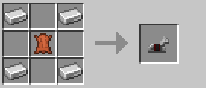
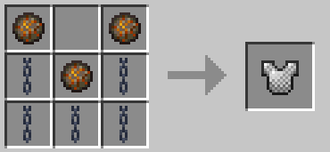
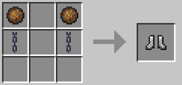

 

# New Items
You can find recipes for new items we have added to the server over on **[this page](newcraft.md)** (so as not to make this page excessively large).

# Table of Contents
As a quick run down so you don't need to scroll down to find what you're looking for:
- [Cobweb](#cobweb)
- [Saddle](#saddle)
- [Horse Armor](#horse-armor)
- [Leather](#leather)
- [Ore Blocks](#ore-blocks)
- [Chainmail Armor](#chainmail-armor)
- [Slime Ball](#slime-ball)
- [Name Tag](#name-tag)
- [Grass](#grass)
- [Mycelium](#mycelium)
- [Podzol](#podzol)
- [Planks](#planks)
- [Leaves](#leaves)
- [Misc.](#miscellaneous)

## All of these recipes are for Vanilla items that either lack a recipe in 1.13.2 (or in general) or their current recipes suck so we have another!

### Cobweb

### Saddle

### Horse Armor

### Leather

### Ore Blocks

The same can be done for all ore blocks, simply replace the Iron Ingots with either:
- Coal (Works with both Coal and Charcoal)
- Gold Ingots
- Lapis Lazuli
- Redstone Dust
- Diamonds
- Emeralds

### Chainmail Armor

### Slime Ball

### Name Tag

 
Any type of sign may be used!

### Grass

You can use any of the four seed types for this!

### Mycelium

### Podzol

### Planks

You can use any 6 of the same sapling to get their respective block of planks!

### Leaves

You can use any 3 of the same sapling to get 2 of their respective block of leaves!

# Miscellaneous

- You can craft any block of wool back into 3 string!
- You can craft any netherwart block back into 9 netherwart!
- You can craft a Quartz Block (only plain quartz blocks) back into 3 quartz.
- Prismarine can be smelted into Prismarine Bricks (along with their normal crafting recipe).
- Dark Prismarine can be crafted from 4 Prismarine Bricks (along with their normal crafting recipe).
- Ink Sacs can be crafted with a clay ball and either a piece of coal or charcoal (due to the less frequent spawning of Squid now there are other sea critters).
- Smooth Stone from smelting Stone has been added (as it is only actually a thing in 1.14+ normally).
- Smooth Quartz from smelting plain Quartz Blocks has been added (again, normally a 1.14+ thing - note that smooth quartz looks like normal quartz in 1.13.2 without texture packs).
- 8 Concrete Powder of the same colour around an Ice Block = 8 Concrete of the same colour.
- 4 Bones in a 2x2 square will give you 1 Bone Block (loss compared to Vanilla bonemeal > bone block, but less steps to make and less inventory space to mass produce bone blocks).
