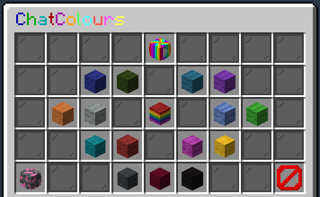

 

# Donation Perks and their Commands

You can purchase donations via our [Donation Store](http://store.legioncraft.co.uk/) at any time - when purchased you should receive anything they grant ingame within 20 minutes (if not let BurntValentine know!).

**Please Note::**
These are __donations__ - any donations go towards the upkeep of the server and any costs for future chages/additions etc... 
As such refunds are **not applicable**. Please be sure that you can afford to and that you have permission to if it is with somebody elses money before you donate!

The donations you can purchase are split into a couple of groups - General Donations, Chat Colours, Disguises, Trails and Others.

# General Donations

This section will allow you to make a donation without purchasing a specific ingame perk. You can donate either through the $5/10/20/50 packages or through the package that allows you to choose how much to donate ($1+)!

If you use the $5/10/20/50 packages and have not done so before you will also receive the Donator rank ingame as a thank you - this grants you the ability to:
- Change your ingame name via `/nick` (you can use colour codes for this as well) 
- Use colour codes on signs ingame
- Get a 4th `/sethome` (if you already have 4+ from your server levels this does not add an extra home)
- Use `/sit` to sit where you stand, rather than being limited to just stairs/slabs/carpets
- Have up to 15 layers on any banners than you create (normal players can go up to 10)

**NOTE:** The custom donation amount package will **not** give the Donator rank.

# Boosters

Boosters are exactly what they sound like - Purchase a booster and activate it on the server to grant all players 1 hour of either double mcMMO experience or double Jobs experience!

When you purchase any boosters they will be added to your personal pool and can be checked and used from the `/boosters` menu ingame! If there is already one active you can use another to add an hour onto the timer (and there can be a booster for each type active at the same time)!

When a booster is activated it will also be announced in the Discords **#server-boosters** channel!

# Chat Colours

Here you can purchase either all chat colours or individual colours you wish to use. Any that you have purchased grant you the ability to select that colour through the `/ccmenu` ingame, which will change all of your ingame chat text to that colour! The middle option of the `/ccmenu` will also toggle these on or off.

The `/ccmenu` with all colours purchased would look like this (ignore the bottom 3 colours as these are staff only, they are not purchaseable):

# Chat Titles

Somewhat self explanatory - they aloow you to purchase a custom title for the ingame chat! 

You can either purchase a single colour title, a title with up to 3 colour changes or a title with as many colour changes as you want! 
Each title is limited to 15 characters - this does not include the colour codes or the space on the end (which is not required if you don't want it, but it is what puts the gap between the title and your name in the chat - you could switch it to a dash or something too!).

There are also upgrade options so if you buy a single colour title today but later on decide you want it with multiple colours you can buy an upgrade!

**Note**: You can change the colour/s of the title at any time by contacting BurntValentine! The package is for the word itself and the amount of colours you can use - to change the word or how many colours it can have you'd need to either buy a new title or an upgrade!

# Disguises

Also somewhat self explanatory - they grant you the ability to disguise yourself as something else! 
There are different packages available for different sets of disguises - when you have purchased them you can use them via either `/dis <diguise>` or through the `/disgui`!

## The packages available and what they give you are:

|Package Name|Disguises It Grants|
|---|---|
|Humanoid Package|Enderman, Snowman, Iron Golem, Witch, Villager and Zombie Villager|
|Farmyard Package|Pig, Cow, Sheep, Chicken, Mushroom Cow, Horse, Donkey and Mule|
|Nether/End Package|Blaze, Magma Cube, Pig Zombie, Endermite, Silverfish and Wither Skeleton|
|Hostile Package|Skeleton Horse, Zombie Horse, Creeper, Skeleton, Stray, Husk, Zombie, Spider, Cave Spider, Slime and Guardian|
|Non-Hostile Package|Bat, Ocelot, Wolf, Polar Bear, Rabbit and Squid|
|1.11/1.12 Package|Evoker, Vindicator, Illusioner, Vex, Parrot and Llama|
|1.13 Package|Cod, Salmon, Pufferfish, Tropical Fish, Turtle, Dolphin, Drowned and Phantom|
|1.14/1.15 Package|Fox, Panda, Wandering Trader, Trader Llama, Pillager and Ravager|
|Objects Package|Boats, Minecarts, Item Drops, Falling Blocks, Ender Crystals and Shulker Bullets|
|||

There is also a **Modifications Package** which will allow you to set some specific modifications to the disguises you own. You can view a full list of the modifications each mob has access to on the page .

You can also choose to purchase an individual disguise out of any of the above options - when purchased simply let BurntValentine know which one you want! All individual disguises come with that mobs specific modifications!

# Trails

The Trails section of the store allows you to purchase various sets of trails that can be enabled/disabled through the `/trails` menu ingame.
**NOTE**: I'm leaving the images of everything for Trails as links not putting them straight in because jesus...

You can also change the 'mode' the trails are set to as well between Default, Circle, Magician, Shooter and Pulse. Here are some screenshots of these modes as examples (using the Spark particle):

- [Default Mode](https://i.gyazo.com/4b9f8c01529571a662ab45614bda4e51.png) 
- [Circle](https://i.gyazo.com/b9b5c305ace6e033b031082266fbe647.png)
- [Magician](https://i.gyazo.com/f6011884f32c351573c95d30d24dae79.png)
- [Shooter](https://i.gyazo.com/cfe8620efd6b814fba86954c7b2e016f.png) (harder to screenshot, basically you punch air and the particles shoot out)
- [Pulse](https://i.gyazo.com/a4ac2dfcb102cdf842e7fe6e550bf080.png)

The modes also alter slightly depending on the particle used - for example if you check the screenshot of the Green particle it looks more like a halo than a spiral which most Circle mode particles look like!

These sets of trails, plus a quick screenshot of what they look like (in various modes) are as follows:

## Colorful Trails Pack
- [Breath](https://i.gyazo.com/b6953d3ff15809dbc351ac9fa2f33bab.png) (Old screenshot with an old mode as it is broken in updated plugin - waiting on fix)
- [Green](https://i.gyazo.com/3fd3c78a285c1f29ef5abc3d97ac8d4c.png)
- [Fun](https://i.gyazo.com/262191af28054b381f951efa8c8414d8.png)
- [Spell](https://i.gyazo.com/3e18df5a5070b68fb206071b1f6d8b72.png) (One of the hardest to screenshot.... it looks alright ingamee)
- [Note](https://i.gyazo.com/6fefeeb7ee3653d73ab99a152d18b93e.png)
## Burnt Trails Pack
- [Void](https://i.gyazo.com/9bc613a8e3192d459d458d3e71f5330c.png)
- [Lava Pop](https://i.gyazo.com/74bd3044a9b126b6284fc61a6d6326f6.png) (Easily the most insane trail)
- [Smoke](https://i.gyazo.com/b87e2b8726011c555e6069f184ecaa07.png)
- [Lava](https://i.gyazo.com/03639f8b70c26d1f978f578d45b4e06c.png)
- [Flame](https://i.gyazo.com/8b69ad07d6664978796d4406cc67d2ad.png)
## Magic Trails Pack
- [Totem](https://i.gyazo.com/664f9e2eff6dd69b57cbb28d37625841.png)
- [Ender](https://i.gyazo.com/9378611bf466fbf73a4e0dd3e05519f9.png)
- [Enchant](https://i.gyazo.com/01ea705bb5f69d96c238ff3305fe4244.png) (Another that is hard to screenshot!)
- [Magic](https://i.gyazo.com/ab4bea6cb21d7966125aeba99ad6fa59.png)
- [White Magic](https://i.gyazo.com/9651e7c7cfa370adf962bc47b4ae4873.png)
- [Witch Magic](https://i.gyazo.com/36ee20329fda2eae773f3e228db25e18.png)
## Misc Package 1
- [Slime](https://i.gyazo.com/94c452cae83df778152a1f625c35035d.png)
- [Angry](https://i.gyazo.com/dde737cba95c9a1c8b09b95471b15c40.png)
- [Heart](https://i.gyazo.com/8fd7d331650b36a56e2c6a0a1e584228.png)
- [Damage](https://i.gyazo.com/57967dc9409d69cf7409d32729eb5086.png)
- [Crit](https://i.gyazo.com/5770a82511699d75288753beba7da32b.png)
- [Spark](https://i.gyazo.com/29b359d5c9c2fde1905b05d34c4c61cd.png)
- [EndRod](https://i.gyazo.com/c19041714eeb81b60f3ed518326106d3.png)
## Misc Package 2
- [Splash](https://i.gyazo.com/c369e4c4debd448bae3457fb655f48f3.png)
- [Snowball](https://i.gyazo.com/bb8dba162ec5b54886fcc023df06075f.png)
- [Water](https://i.gyazo.com/41d28b5c1b5fdc4259b5b7dd24b66db4.png)
- [Snow](https://i.gyazo.com/f79665d01b3fbb034b6a31320154ecf9.png)
- [Cloud](https://i.gyazo.com/4425d1d6a8bf02c44e18f0301442d7a5.png)

You can also purchase any of above trails individually - just let BurntValentine know which one you want!

There are also two specialist trail types - Rain and Wings! I'll give an example of both but each has variations and can be edited in certain ways.

## Rain

## Wings

# Others

There are also a few donation options that do not fit into the above categories.

## Chat Sounds

If you purchase this you can have a sound play to everyone on the server when you say a specific trigger in the ingame chat!
As an example when BurntValentine says "Moo!" in the chat, you will hear a cow moo at you!

If other peoples chat sounds are getting annoying you can also toggle them off so you don't hear them with either `/chatsounds` to turn on/off all chat sounds, or `/chatsounds <player>` to just toggle that one players sounds off!

## Log In/Out Sounds

If you purchase this you can have a sound play to everyone on the server when you log in and out of the server!

You can toggle your own log in/out sound off with `/tlsound` to turn it on/off completely, or `/tlsound <quit/join>` to just turn it off for when you log in or out specifically.

If other peoples log in/out sounds are getting annoying, as with the chat sounds, you can toggle them off so you don't hear them with either `/logsounds` to turn on/off all log in/out sounds, or `/logsounds <player>` to just toggle that one players sounds off!

## Log In/Out Messages

Messages that play in the ingame chat when you log in/out of the server. This can be toggled on/off (both individually)!

## Extra Creative Plot
 
If you build an extreme amount but don't want to keep wiping your plot and losing old builds you an just buy another! Each purchase will add a new plot, up to a limit of 10 per person (though I doubt anybody would need 10 200x200 plots...).

## Custom Brewery Recipe

You can purchase your own custom brew through the Donation Store! When you purchase this you will be sent a Google form to fill in with the information needed - once done let BurntValentine know and it will be added to the game!

The options you have when creating a brew are:
- Names (poor/normal/good name, and their colour)
- The colour of the potion item
- The ingredients (up to 5 ingredients - all items **should** be usable, but if not we shall let you know when we test it so you can change it)
- The effects the drink gives when used (up to 3 potion effects, can be negative or positive or a mix)
- How long the drink takes to brew in the cauldron
- How many times it needs to be distilled
- How long it needs to be barrel aged
- How strong you want the alcohol content to be (can be 0 - ie non-alcoholic)
- Whether you want the recipe book for it to be added to the mob drops, just to be given to you or not have a recipe book at all!
