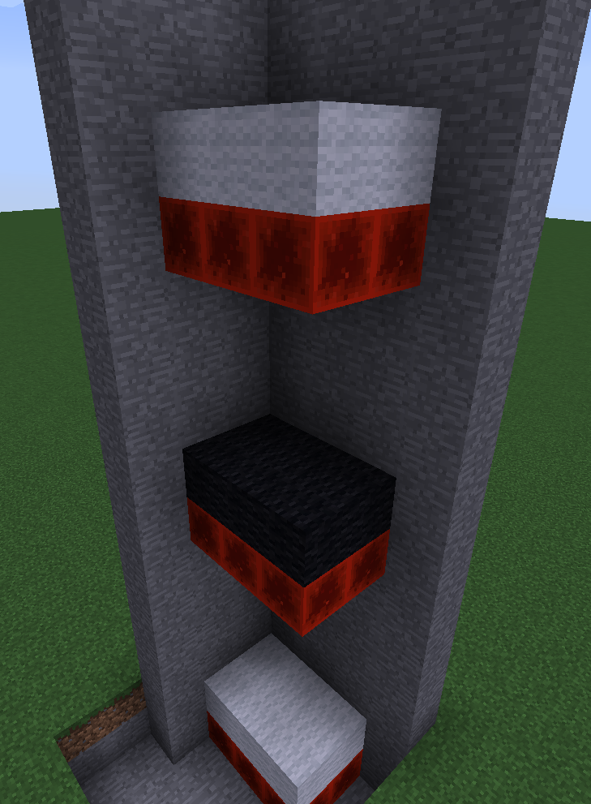

 

# Elevators

Want to build an elevator to another floor, rather than try and fit in stairs or use ladders? Easy!

All you need to do this is some redstone blocks and some wool blocks or slabs!

It is then a simple matter of placing the wool block/slab where you want it, with a redstone block underneath. A maximum distance of 36 blocks can be between each, you can have blocks between them but the space above the elevators themselves (where you would be stood) must be clear of solid blocks!
You can however place signs, torches/redstone torches, buttons, banners, item frames and paintings above the elevator where you would be stood!

To go up and down it is a simple matter of jumping on the block to go up, and pressing sneak to go down!

## Valid Elevator Blocks/Slabs

You can use any wool block, any carpet or any slab (placed in the lower location ontop of the redstone block)!

You can also add a bit of customization - An elevator will only take you to another of the same wool block/slab (ie to the same colour of wool)!

For example:

If I stand on the white wool elevator blocks at the bottom and jump, it will take me to the third floor, as it is the next one with white wool elevator blocks! 

**Note:** Elevators can only be made/used in Creative and Survival - not in Resource, the Nether or the End!
