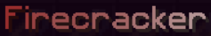

 

Quicklinks:
- [Active Server Event](#active-server-event)
- [Active Competition](#active-competition)
- [Last Competition](#last-competition)

# Active Server Event

There are no current events on the server - the next one is scheduled to begin on **December 1st!** (though the start may be delayed a little - if it is it'll end later than planned too).

---
---
---

# Active Competition

You can view a basic rundown (pretty much the same as listed here to be fair... just... smaller) in game via `/events`!

> Please remember that while anybody can join in the competition and try for a prize (as the only guarantee you won't get a prize is if you don't enter!), you cannot use WorldEdit on your plot to aid you in your building until player level 10+!

**Build Competition Theme**: Fireworks! 
**Competition Run Time**: November 7th-21st 2020 
**The rules/advice for this competition were as follows:** 
- You may work alone or in pairs in this competition. Any builds created by a group of 3+ will be not be counted!
- No copying builds from other players or straight from Google/PMC etc...! If you don't make an effort, then you won't win - simple as!
- More detailed builds are preferred over a larger, but plainer build!
- Be creative/Think outside the box! Don't go for the obvious builds that everyone will do for the theme! Multiple build entries of the same thing will make them less likely to place (if they're too similar)!
- When you have finished your build open a /ticket on your plot to confirm entry or you will not be counted!
- Builds have no size limits for this competition and no height limit!

You can build **ANYTHING** you want (as long as it doesn't break the server rules on being offensive etc...) as long as there is an element of "Fireworks" in the build. The more creative the better but anything and everything built will be considered for placement in the Top 3!

### Competition Prizes

**First Place** 
Chat Titles: 
- Short Fused 
- Pyromaniac 
- Firecracker 
These all have a gradient colour applied, as shown here: 
   

Items: 
- 1x Random Crystalline MD Item. 
- 1x Crate'O'Rockets. This is similar to the Alchemical Storage items, but uncraftable, and will hold up to 1728 of all 3 basic firework rockets (ie non-star rockets that are just used for flight boosts). 
- 1x Firework Launcher. This fires a random number of random fireworks when placed and right clicked on. 
- 5x Smokescreen Bombs. Place them and when clicked... something happens! 
- 1x Reusable SafariNet. 
- 5x DeathPoint Scrolls. 
- 3x Hex Tags. 

Extras:
- 10000 McRPG XP 
- 50 Tokens

**Second Place** 
Chat Titles: 
- Two of the Winner Titles.

Items: 
- 1x Random Legendary MD Item. 
- 1x Crate'O'Rockets. 
- 1x Firework Launcher. 
- 5x Smokescreen Bombs. 
- 1x Reusable SafariNet. 
- 3x Hex Tags. 

Extras:
- 7500 McRPG XP 
- 35 Tokens

**Third Place** 
Chat Titles: 
- One of the Winner Titles.

Items: 
- 1x Random Epic MD Item. 
- 1x Crate'O'Rockets. 
- 5x Smokescreen Bombs. 
- 3x Hex Tags. 

Extras:
- 5000 McRPG XP 
- 20 Tokens

**Consolation Prize**
Items: 
- 1x Random Mid-High Level Essence. 
- 1x Crate'O'Rockets. 
- 1x Hex Tag. 

Extras:
- 2500 McRPG XP 
- 5 Tokens

# Last Competition

**Build Competition Theme**: Outbreak! 
**Competition Run Time**: May 7th-29th 2020 

**Competition Winner**: Xuqi 
**Second Place**: murderspoon 
**Third Place**: babiesynflower 
**Consolations**: aknitwhitz
