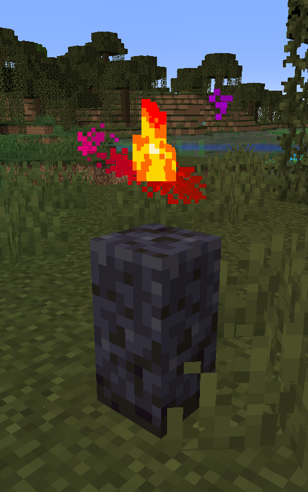

 

# Graves

You will notice that a cobblestone wall with some particles around it will spawn within a 5 block radius of where you died, either where there is air, water or lava to replace - This is your grave. Your items will be locked within for a short period of time. 
You will be given the co-ordinates of that block in your chat when you die and if you missed it you can do `/grave` to get the co-ords again, so you can find your way back!

Once you find the grave, click it to get your items back (You don't need to break it as that takes a while with a fist, just click it!). If you do not have space in your inventory for those items (eg if you picked more up on the way back, or if you had a full inv + armour when you died) then the excess items will drop where the grave was (so be aware of this if you died by lava or a cactus etc...).

Other players will not be able to get the items out of your grave. However - there is a time limit until the grave will despawn and drop your items (20 minutes). 
If you die a second time then the previous grave will despawn as before also (You will be told in the chat if it despawns, either due to a second death or due to it timing out) and will drop the contents it had stored.

>As there seems to have been confusion with this in the past - If you die a second time or the time runs out and the items fall they are fair game to be picked up by another player. This is not against the rules. You are never guaranteed to retrieve your items after dying in a **Survival** style server.

There is also an addition that if you die with no items in your inventory it will not spawn a new grave (a previous/active one will still break open however).

**Note**: There will be exceptions. For example, if you manage to kill yourself by suffocating in a 5x5x5 or larger pile of sand or gravel, and the grave cannot spawn, then your items will drop as normal and you will need to get back to them faster if those chunks are active to get them back (And again, if another player finds the dropped items first it is fair game).
If you die in the End by falling into the void then the grave also may not spawn (or may spawn out of reach) - you will lose your items this way, this cannot be helped and will not be changed as it is Survival and the End is supposed to be harder and have more risks.

There should always be the possibility of losing items on a Survival server. For this reason if anybody complains that they lost their items because of X when they died, or because of where they died - All they will be told, to be completely blunt, is tough. 
