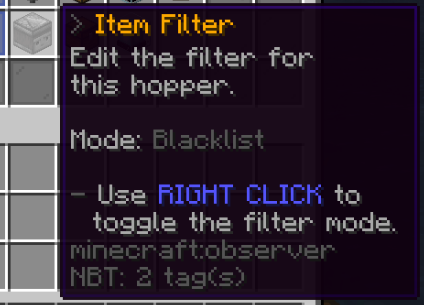

 

# Upgradable Hoppers

You can now purchase and upgrade special hoppers (**from player level 30 and above**)!

To purchase your upgradable hopper simply do `/uhopper get` - note that this costs $10000. You can also do `/uhopper get <amount>` to get more than 1 at once.
This hopper will be locked to you - it will have no use for normal block locks and does not push items to a chest under it like a Vanilla hopper!

These hoppers work very differently!
By default they will suck up items in a 2x2x2 area around the placed hopper location every 3 seconds and will transfer them to a linked container 8 at a time every 3 seconds.
The container it is linked to can be up to 50 blocks away by default - to link it open the hoppers menu by sneak left clicking (sneak punch it!) the hopper and clicking the middle option in the bottom row. 
Then go and left click the chest to link it to!

On this menu, when you sneak left click/punch the hopper, you will also find a number of upgradable and settable options! 
These options and upgradables are, in order from left to right, top to bottom:

Upgradable Options:
- [Hopper Transfer Speed](#hopper-transfer-speed)
- [Hopper Container Links](#hopper-container-links)
- [Hopper Suction Radius](#hopper-suction-radius)
- [Hopper Container Distance](#hopper-container-distance)

Hopper Settings:
- [Hopper Item Filter](#hopper-item-filter)
- [Hopper Containers](#hopper-containers)
- [Hopper Suction](#hopper-suction)

## Upgradable Options

### Hopper Transfer Speed

This option will upgrade how many items the hopper transfers to it's linked container(s) every 3 seconds by one at a time! 
The costs for these upgrades are as follows:

|Increased From > To|Cost for the Upgrade|
|---|---|
|8>9|$2500|
|9>10|$5000|
|10>11|$7500|
|11>12|$10000|
|12>13|$15000|
|13>14|$20000|
|14>15|$25000|
|15>16|$30000|
|16>17|$35000|
|17>18|$40000|
|18>19|$45000|
|19>20|$50000|
|20>21|$55000|
|21>22|$60000|
|22>23|$65000|
|23>24|$70000|
|24>25|$75000|
|25>26|$80000|
|26>27|$85000|
|27>28|$90000|
|28>29|$95000|
|29>30|$100000|
|30>31|$100000|
|31>32|$100000|
|Total to upgrade from 8 to 32 items at a time|$1260000|

### Hopper Container Links

This option will upgrade how many containers the hopper will transfer it's contents to! 
*Note*: There is no way (at least not currently) to set what items go where, it'll just randomly send items to the linked containers until they're full!

The costs for these upgrades are as follows:

|Increased From > To|Cost for the Upgrade|
|---|---|
|1>2|$250000|
|2>3|$250000|
|3>4|$500000|
|4>5|$500000|
|5>6|$500000|
|Total to upgrade from 2 to 6 linked containers|$2000000|

### Hopper Suction Radius

This option will upgrade the radius around the hopper that it will check for item drops every 3 seconds!
The costs for these upgrades are as follows:

|Increased From > To|Cost for the Upgrade|
|---|---|
|2x2x2 > 3x3x3|$1000000|
|3x3x3 > 4x4x4|$1000000|
|Total to upgrade from a 2x2x2 area to a 4x4x4 area|$2000000|

### Hopper Container Distance

This option will upgrade the allowed distance between the hopper and the linked container(s)!
The costs for these upgrades are as follows:

|Increased From > To|Cost for the Upgrade|
|---|---|
|50 blocks > 75 blocks|$50000|
|75 blocks > 100 blocks|$75000|
|100 blocks > 125 blocks|$100000|
|125 blocks > 150 blocks|$150000|
|150 blocks > 175 blocks|$200000|
|175 blocks > 200 blocks|$250000|
|Total to upgrade from 50 blocks away to 200 blocks away|$825000|

## Hopper Settings

### Hopper Item Filter

This option will allow you to set either a blacklist or whitelist (right click to change between these, left click to open the list) of items that you do or do not want your hopper to pick up!

To add to the whitelist/blacklist you simply need to open it and click an item in your inventory to add it's base item type to the list (it does not take the item out of your inventory), or click the item in the list to remove it!
This works off base items only - for example all diamond swords are treated as *just* diamond swords, regardless of the items name or lore.

### Hopper Containers

This option will let you link the hopper to a container - or containers if you have upgraded!
Simple click this option and then go and left click a chest to link the hopper to it, or right click a chest that is already linked to remove it!

Any containers that have been linked will be noted on this option in the hoppers menu with the co-ordinates it can be found at!

### Hopper Suction

This option will very simply toggle on/off whether the hopper is actively sucking in items or not!
