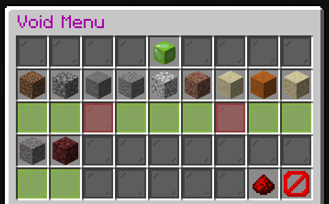

 

# Levels

Each player has two ladders they can climb on the server - their [server rank](ranks.md) and their player level!

There are 100 player levels that you can advance through using your ingame balance, which can be earned through use of your [jobs](money.md)!
Each level costs a set amount to rank up to (you can't skip levels by paying an excess) with the `/levelup` command, which will tell you how much you need if you do not yet have enough to rank up! 

The perks you gain along the way are as follows (there is also more detailed information below the chart):

|Level|Cost|Perks|Titles|
|---|---|---|---|
|1|Free|- **Player Shops**: Up to 10. - **RandoShops**: 1. - **SetHomes**: Up to 2. - **Graves**: Will only save your equipped armour and the first 3 slots of your hotbar. Other items will drop.|Visitor, Commoner, Peasant|
|2|$2000||Villager|
|3|$3500||Outlaw, Bandit|
|4|$5000||Fugitive, Rogue|
|5|$6500|- **Hats**: Wear a block/item on your head. Hold it and do `/hat`.|Magician, Mage|
|6|$8000||Ruffian, Sellsword|
|7|$10000||Warlock|
|8|$12500|- **SafariNets**: Ability to net Bats, Chickens, Rabbits and Pigs.|Druid|
|9|$15000||Wizard, Witch|
|10|$17500|- **Creative**: Ability to use WorldEdit on your plot. - **Graves**: Will save your equipped armour, hotbar and offhand. Other items will drop.|Knave|
|11|$20000|- **Health**: An extra heart (may need to relog for it to take effect).|Scout, Archer|
|12|$22500| - **BowEffects**: First set unlocked. Access with `/bmenu`.|Recruit, Private|
|13|$25000||Ensign|
|14|$27500|- **RandoShops**: Up to 3.|Bard|
|15|$30000|- **SafariNets**: Ability to net Cows, Sheep, Squid and Zombies - **PvP**: You will drop a copy of your head when you die in PvP.|Deckhand, Swabbie|
|16|$35000||Merchant| 
|17|$40000|- **ElytraEffects**: First set unlocked. Access with `/emenu`.|Sleuth, Detective|
|18|$45000|- **Player Shops**: Up to 15.|Jester, Performer|
|19|$50000||Herald|
|20|$57500|- **WorkBench**: Access a portable workbench with `/wb` - **SafariNets**: Ability to net Mushroom Cows, Horses, Mules and Donkeys.|Noble|
|21|$65000|- **Health**: A second extra heart (may need to relog for it to take effect). - **SetHomes**: Up to 3.|Officer, Airman|
|22|$72500||Engineer, Blacksmith|
|23|$80000||Lieutenant|
|24|$87500|- **Backpack**: 9 Slot/1 Row Backpack. Access with `/bp` - **Graves**: Will save your equipped armour, hotbar, offhand and the top left 5 items in your inventory. Other items will drop.|Huntsman, Mercenary|
|25|$95000|- **SafariNets**: Ability to net Llamas, Skeletons and Skeleton/Zombie Horses.|Diver|
|26|$100000|- **GravityTubes**: Initial access. Can be created up to 10 blocks high.|Viking|
|27|$120000|- **BowEffects**: Second set unlocked. Access with `/bmenu`.|Butler, Maid|
|28|$140000|- **Player Shops**: Up to 20. - **LightLevel**: Access to `/ll`. Shows where mobs can spawn.|Sprite|
|29|$160000|- **RandoShops**: Up to 5.|Corsair, Buccaneer|
|30|$180000|- **Upgradeable Hoppers**: Access to purchase them via `/uhopper get`. - **SafariNets**: Ability to net Wolves, Ocelots and Cats.|Major, Commander|
|31|$200000|- **Health**: A third extra heart (may need to relog for it to take effect). - **Graves**: Will save your equipped armour, hotbar, offhand and the top row of your inventory. Other items will drop.|Maiden|
|32|$220000|- **SetHomes**: Up to 4. - **ElytraEffects**: Second set unlocked. Access with `/emenu`.|Captain,Cap'n|
|33|$240000||Father, Mother|
|34|$260000||Priest, Priestess|
|35|$280000|- **TownyFlight**: Ability to use `/tfly` to allow flight in your own towns land. Unlike the TokenShop temporary access, this will allow it to work in allied towns as well. - **SafariNets**: Ability to net Spiders, Cave Spiders and Turtles.|Disciple, Scholar|
|36|$300000|- **GravityTubes**: Ability to create them up to 20 blocks high.|Lord, Lady|
|37|$340000||Viscount|
|38|$380000|- **Player Shops**: Up to 25. - **JumpPads**: Ability to create Jump Pads.|Baron, Baroness|
|39|$420000|- **BowEffects**: Third set unlocked. Access with `/bmenu`.|Forsaken, Rover|
|40|$460000|- **SafariNets**: Ability to net Bees, Pandas and Foxes.|Earl, Jarl|
|41|$500000|- **Health**: A fourth extra heart (may need to relog for it to take effect). - **Graves**: Will save your equipped armour, hotbar, offhand, top row and the 4 leftmost slots in the middle row of your inventory. Other items will drop.|Marquis, Marquess|
|42|$550000||Puppet|
|43|$600000|- **ElytraEffects**: Third set unlocked. Access with `/emenu`.|Brigadier, Colonel|
|44|$650000|- **Backpack**: 18 Slots/2 Rows Backpack. Access with `/bp`|Sniper|
|45|$700000|- **Player Shops**: Up to 30. - **SafariNets**: Ability to net Dolphins, Polar Bears and Guardians.|Conjuror|
|46|$750000|- **GravityTubes**: Ability to create them up to 30 blocks high.|Samurai|
|47|$800000||Marshall|
|48|$850000|- **WorkBench**: Access to use FastCraft when interacting with a physical workbench.|Ninja|
|49|$900000|- **RandoShops**: Up to 10.|Magister, Prefect|
|50|$950000|- **SafariNets**: Ability to net Drowned, Husks, Strays and Zombified Piglins.|General|
|51|$1000000|- **Health**: A fifth extra heart (may need to relog for it to take effect). - **DailyBonus**: Monetary rewards from the dailybonus (Bonus Bill) are now 5x as much.|Gnome, Harpy|
|52|$1000000|- **Player Shops**: Up to 35. - **Graves**: Will save your equipped armour, hotbar, offhand, top row and all but the rightmost slot of the middle row of your inventory. Other items will drop.|Professor|
|53|$1200000|- **Flashlight** - Ability to toggle your flashlight with `/fl`.  **BowEffects**: Fourth set unlocked. Access with `/bmenu`.>|Regent|
|54|$1200000||Paladin|
|55|$1400000|- **SafariNets**: Ability to net Silverfish, Endermites, Witches and Creepers.|Sultan, Pharaoh|
|56|$1400000||Assassin, Slayer|
|57|$1600000|- **ElytraEffects**: Fourth set unlocked. Access with `/emenu`.|Kaiser, Shogun|
|58|$1600000||Admiral|
|59|$1800000|- **Player Shops**: Up to 40.|Judge|
|60|$1800000|- **SafariNets**: Ability to net Slimes, Magma Cubes, Striders and Blazes.|Summoner|
|61|$2000000|- **Health**: A sixth extra heart (may need to relog for it to take effect). - **GravityTubes**: Ability to create them up to 40 blocks high.|Vampire, Zombie|
|62|$2000000|- **SetHomes**: Up to 5. - **Graves**: Will save your equipped armour, hotbar, offhand, top row, middle row and the 3 leftmost slots in the bottom row of your inventory. Other items will drop.|Spirit|
|63|$2200000||Praetor|
|64|$2200000|- **Backpack**: 27 Slots/3 Rows Backpack. Access with `/bp` - **Player Shops**: Up to 45.|Prince, Princess|
|65|$2400000|- **SafariNets**: Ability to net Hoglins, Piglins and Zoglins.|Consul|
|66|$2400000|- **RandoShops**: Up to 15.|Thane|
|67|$2600000|- **Combiner**: Initial access to `/combine`. Allows for combining of Iron/Gold Nuggets into Ingots, Bones into Bone Blocks and Wheat into Bread/Hay Bales on pickup.|Pontiff|
|68|$2600000|- **Backpack**: Ability to toggle items go into your backpack on pickup if your inventory is full.|Duke, Duchess|
|69|$2800000|- **Player Shops**: Up to 50.|Dragon, Wyvern|
|70|$2800000|- **SafariNets**: Ability to net Endermen, Wither Skeletons and Shulkers.|Champion|
|71|$3000000|- **Health**: A seventh extra heart (may need to relog for it to take effect).|Centurion|
|72|$3000000|- **BowEffects**: Fifth set unlocked. Access with `/bmenu`.|Count, Countess|
|73|$3250000||Guardian, Protector|
|74|$3250000|- **V.O.I.D.**: Initial access to `/void`. Allows for destruction of Sticks, Seeds, Cocoa Beans, Feathers, Rotten Flesh, Gunpowder, Spider Eyes, Flint and String on pickup.|Elder|
|75|$3500000|- **SafariNets**: Ability to net Evokers, Vindicators and Vex.|King, Queen|
|76|$3500000|- **GravityTubes**: Ability to create them up to 50 blocks high.|Dictator|
|77|$3750000||Nephilim|
|78|$3750000|- **ElytraEffects**: Fifth set unlocked. Access with `/emenu`.|Demon|
|79|$4000000|- **Combiner**: Increased access to `/combine`. Adds ability to combine Coal, Iron/Gold Ingots, Lapis and Glowstone into their respective Block forms on pickup.|Angel|
|80|$4000000|- **SafariNets**: Ability to net Phantoms.|Emperor, Empress|
|81|$4500000|- **Health**: An eighth extra heart (may need to relog for it to take effect). - **Graves**: Will save all items except for the 3 rightmost slots in the bottom row of your inventory. Other items will drop.|Phoenix, Titan, Hydra, Sylph|
|82|$4500000|- **SetHomes**: Up to 6.|Alpha|
|83|$5000000|- **V.O.I.D.**: Increased access to `/void`. Adds ability for destruction of Andesite, Diorite, Granite, Red Sand and Sandstone on pickup.|Shadow, Dark|
|84|$5000000|- **RandoShops**: Up to 20.|Beta|
|85|$5500000|- **SafariNets**: Ability to net Pillagers.|Nightmare, Reaper|
|86|$5500000||Gamma|
|87|$6000000|- **SafariNets**: Ability to net Piglin Brutes.|Ballista, Berserker|
|88|$6000000|- **Combiner**: Full access to `/combine`. Adds ability to combine Redstone, Quartz, Diamonds and Emeralds into their respective Block forms on pickup.|Delta|
|89|$7000000||Shield Master, Shield Maiden|
|90|$7000000|- **SafariNets**: Ability to net Ravagers.|Omega|
|91|$8000000|- **Health**: A ninth extra heart (may need to relog for it to take effect).|Daeva, ArchFiend|
|92|$8000000|- **V.O.I.D.**: Full access to `/void`. Adds ability for destruction of Dirt, Cobblestone, Stone, Sand, Gravel and Netherrack on pickup.|Esper|
|93|$9000000||Spectre, Revenant|
|94|$10000000|- **BowEffects**: Final set unlocked. Access with `/bmenu`.|Lifeless, Zombified|
|95|$12000000||Saint|
|96|$14000000|- **Graves**: Will now save all items.|Risen, Necromancer|
|97|$16000000|- **ElytraEffects**: Final set unlocked. Access with `/emenu`.|Warden|
|98|$18000000||Celestial|
|99|$20000000||Burnt, Valentine|
|100|$25000000|- **SetHomes**: Up to 7. - **Health**: A tenth extra heart (may need to relog for it to take effect). - **Suffix**: The option to request a custom symbol and colour for your suffix (the level symbol/number in the chat).|Legionnaire|

> You can also double check the cost to rank up, and perks/titles gained at any level with the `/levelinfo` command ingame!

QuickLinks to Information on Perks Below:
- [Chat Titles](#chat-titles)
- [Player Shops](#player-shops)
- [Player Homes](#player-homes)
- [Graves](#graves)
- [Creative](#creative)
- [Health](#health)
- [SafariNets](#safarinets)
- [Hats](#hats)
- [Bow/Elytra Effects](#bow-and-elytra-effects)
- [WorkBench](#workbench)
- [BackPack](#backpack)
- [GravityTubes/JumpPads](#gravity-tubes-and-jump-pads)
- [Light Level](#light-level)
- [TownyFlight](#townyflight)
- [Flashlight](#flashlight)
- [The Combiner](#the-combiner)
- [V.O.I.D.](#void)

#### Chat Titles

You will get new titles as you go up the levels, which you can select/change/disable via the GUI brought up with `/titles`!
A full list of the titles currently added through your player levels can be found [here](titles.md)!

#### Player Shops

You can create up to a set amount of player chest shops - as you level up you can create more so you can buy/sell more options at once!
You can view the full information on player shops [HERE](shops.md)!

#### Player Homes

You can set a home, go to a home and delete homes with these commands:
- `/sethome <name>`
- `/home <name>`
- `/delhome <name>`
You can also pull up a list of your homes with `/homes` and can teleport to them or delete them by clicking them as they state.

You will start with 2 homes and can get up to 7 maximum by levelling up. 
Note that these are **not** to be abused in any way - do not set a home in someone elses property/town without their permission to do so, and do not abuse homes for harrassing/attacking others.

#### Graves

Graves will store a certain amount of your items when you die, more as you level up, so that they do not drop - this means they won't despawn/disappear anywhere near as quickly and players cannot steal them right away.
You can view the full information on graves [HERE](graves.md)!

#### Creative

This unlocks more access in the Creative world. By default you will only have access to go to the Creative world and look around, and build on other peoples plots if they add you - as you level up you will be able to claim your own plot to build on and eventually also have access to use WorldEdit on your plot (and others you have access to build on) as well!

#### Health

Your health will go up as your level does! By default you will have the normal 10 hearts (20 health) you normally would on Minecraft, however as you level up you will go up a heart at a time all the way to 20 hearts (40 health)!
When you go up to a level that increases your health you may need to relog for it to take effect!

#### SafariNets

SafariNets can be purchased through the [TokenShop](voting.md) (single-use nets only) or won through events/competitions (single-use and reusable) - depending on your level you can then use them to pick up and move certain types of mobs!
You can release mobs of any type, you just can't catch mobs unless you're at a level that allows you to!

#### Hats

You can stick a block or hat on your head, instead of a helmet! To do so just hold the item/block and do `/hat`!

Note that they give no benefit to your defense unlike helmets, however some items/blocks look great when worn! A prime example is an End Rod, which makes you look like a unicorn!

#### Bow and Elytra Effects

Bow and Elytra Effects add particle effects to either arrows you shoot (whether that be from a bow or crossbow) or a trail of particles behind you while you glide around with an Elytra!

To list the effects you have unlocks, choose which you wish to use and to toggle them on/off use `/bmenu` or `/emenu`!

#### Workbench

As you level up you will gain access to either access a virtual workbench from anywhere with `/wb`, or to the FastCraft workbench when you use a physical workbench!
The FastCraft bench will list all items you can make from the items in your inventory and allow you to change the amount to make and just click to process them all at once. Note that it will list what items it is using for the recipe - make sure it's not trying to use anything rare before crafting (for example a recipe that calls for a Ghast Tear may try and use a Drop of Purity)!

#### Backpack

Once you have unlocked the backpack you can access it via `/bp` or `/backpack`.
Items in your backpack do not drop when you die - allowing for some useful items to be taken with you anywhere you go! The backpack unlocks in three stages and allows for 9-27 items to be stored.
At a certain level you will also unlock the ability to have items go into your backpack on pickup if your main inventory is full as well.

#### Gravity Tubes and Jump Pads

Gravity Tubes will allow you to set a location that will lift you up a set distance (similar to how water over soulsand works, but without the water...) - the height you can make them depends on your level!
Jump Pads allow you to set a pressureplate to act like a launch pad with some set parameters.
You can read up on both in more detail [HERE](jpgt.html)

#### Light Level

This will give you access to `/ll` - when toggles on it will show you via some particles only you can see whether mobs can spawn on each block around you!
If no particles are shown the block cannot have mobs spawn on it, if the particles are yellow then mobs can spawn there at night and if they are red mobs can spawn there any time!

#### Upgradable Hoppers

Upgradable hoppers are an alternative to normal hoppers that you can upgrade to do a much wider range of things.
You can read up how to get and use these hoppers, and what they can do, [HERE](hopper.md)!

#### TownyFlight

This will allow you to fly on claimed land for the town that you are in, and on town land in allied towns!
When on land claimed for your town or an allied town simply do `/tfly` to enable and then fly as you would in Creative!

Note that if you have this on and leave town land it will turn off - you will drop (no fall damage) and will need to do `/tfly` again when you are back on town land to re-activate.

This is **not** to be used during PVP!

#### Flashlight

You can toggle this on/off with `/fl`.
When enabled everything will be as bright as it would be in the daylight or if you were using night vision - note that as with night vision it will not stop mobs spawning so be aware of this when using it while mining etc...!

#### The Combiner

`/combine` will bring up a menu where you can toggle the feature on/off (with the top icon) and enable/disable which of the listed items it will attempt to combine as you pick them up:

For example in the above image the Combiner is enabled, and will attempt to combine all of the items listed except for coal, redstone, lapis and bones and will convert my wheat into bread.

The Combiner can attempt to combine the following if enabled in the above menu (when you are at the right level to use them):

|Items picked up (amount of)|Combined Output|
|---|---|
|Coal (9)|1 Coal Block|
|Iron Nugget (9)|1 Iron Ingot|
|Iron Ingot (9)|1 Iron Block|
|Gold Nugget (9)|1 Gold Ingot|
|Gold Ingot (9)|1 Gold Block|
|Redstone Dust (9)|1 Redstone Block|
|Lapis Lazuli (9)|1 Lapis Lazuli Block|
|Glowstone Dust (4)|1 Glowstone Block|
|Nether Quartz (4)|1 Quartz Block|
|Diamond (9)|1 Diamond Block|
|Emerald (9)|1 Emerald Block|
|Bone (4)|1 Bone Block|
|Wheat (3)|1 Bread|
|Wheat (9)|1 Haybale|

Only one of the Wheat options can be active at a time.

**Note::** This only triggers in the item pick up event - for example if you have the options for combining Iron Nuggets and Iron Ingots enabled, the Ingots you get from picked up Nuggets **will not** combine unless you drop them and pick them back up.

#### VOID

`/void` will bring up a menu where you can toggle the feature on/off (with the top icon) and enable/disable which of the items it can destroy:

For example in the above image VOID is currently disabled, but if I switch it on it will delete any Dirt, Cobblestone, Andesite, Diorite, Granite, Red Sand, Sandstone, Gravel and Netherrack I pick up - but will let me collect Stone and Sand.
There are more options on a second page (by clicking the redstone).
As with The Combiner this happens as you pick items up so if you have dirt enabled in the VOID it will delete the dirt as you pick them up.
