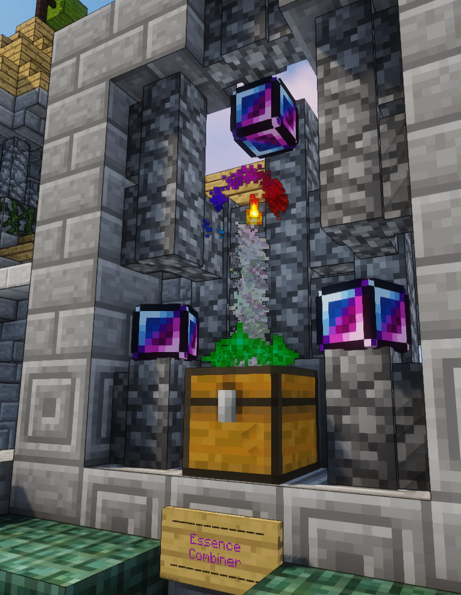
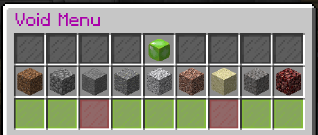

 

# Levels

Each player has two ladders they can climb on the server - their [server rank](ranks.md) and their player level!

There are 100 player levels that you can advance through using your ingame balance, which can be earned through use of your [jobs](money.md)!
Each level costs a set amount to rank up to (you can't skip levels by paying an excess) with the `/rankup` command, which will tell you how much you need if you do not yet have enough to rank up! The perks you gain along the way are:

|Level|Cost|Perks|Titles|
|---|---|---|---|
|1|Free|Ability to use Safari Nets on: Cows, Sheep, Chickens, Pigs, Bats and Rabbits,  ability to have up to 20 player shops & ability to have 1 Upgradable Hopper.|Visitor, Commoner, Peasant|
|2|$2000||Villager|
|3|$3500||Outlaw, Bandit|
|4|$5000||Fugitive, Rogue|
|5|$6500|Portable workbench|Magician, Mage|
|6|$8000|Ability to use Safari Nets on: Mushroom Cows, Squid, Horses, Mules and Donkeys.|Ruffian, Sellsword|
|7|$10000||Warlock|
|8|$12500||Druid|
|9|$15000||Wizard, Witch|
|10|$17500|1 Extra Heart & Drop your own head in PvP|Knave|
|11|$20000||Scout, Archer|
|12|$22500|Ability to use Safari Nets on: Zombies, Spiders and Cave Spiders.|Recruit, Private|
|13|$25000||Ensign|
|14|$27500||Bard|
|15|$30000| 9 Slot Backpack, First set of Bow Effects (This level gets Default, Magic Crit, Sparks, Music and Redstone), Access to `/tfly` to toggle flight on only in your own towns claimed area|Deckhand, Swabbie|
|16|$35000|First set of Elytra Effects (This level gets Default, Magic Crit, Sparks, Music and Redstone)|Merchant|
|17|$40000|Ability to use Safari Nets on: Wolves, Ocelots, Cats and Bees|Sleuth, Detective|
|18|$45000|A fourth /sethome!|Jester, Performer|
|19|$50000|Ability to use Safari Nets on: Skeletons, Guardians, Polar Bears and Zombie Pigmen.|Herald|
|20|$57500|2 Extra Hearts, Ability to toggle The Combiner & ability to have up to 30 player shops.|Noble|
|21|$65000|Ability to have up to 3 Upgradable Hoppers.|Officer, Airman|
|22|$72500||Engineer, Blacksmith|
|23|$80000|Ability to use Safari Nets on: Pandas and Foxes|Lieutenant|
|24|$87500|Ability to create JumpPads, and GravityTubes up to 10 blocks high.|Huntsman, Mercenary|
|25|$95000|Hats, Second set of Bow Effects (This level gets Dust, Swirls, Spell, Angry and Spit)|Diver|
|26|$100000||Viking|
|27|$120000|Ability to use Safari Nets on: Slimes, Magma Cubes, Endermites and Silverfish.|Butler, Maid|
|28|$140000|Ability to open Shulker Boxes in your hand by shift right clicking with them!|Sprite|
|29|$160000|Second set of Elytra Effects (This level gets Swirls, Dust, Spell, Angry and Spit)|Corsair, Buccaneer|
|30|$180000|18 slot backpack and 3 Extra Hearts|Major, Commander|
|31|$200000||Maiden|
|32|$220000|Ability to use Safari Nets on: Dolphins and Turtles.|Captain,Cap'n|
|33|$240000|A fifth /sethome!|Father, Mother|
|34|$260000|Ability to create GravityTubes up to 10 blocks high.|Priest, Priestess|
|35|$280000|Ability to use Silk Touch on spawners & Access to the Item Magnet|Disciple, Scholar|
|36|$300000|Ability to use Safari Nets on: Creepers, Blazes, Witches, Endermen, Wither Skeletons and Shulkers.|Lord, Lady|
|37|$340000||Viscount|
|38|$380000|Ability to have up to 5 Upgradable Hoppers.|Baron, Baroness|
|39|$420000||Forsaken, Rover|
|40|$460000|4 Extra Hearts, Third set of Bow Effects (This level gets Smoke, Ender Breath, Lava, Water and Honey) & ability to have up to 40 player shops.|Earl, Jarl|
|41|$500000||Marquis, Marquess|
|42|$550000|Third set of Elytra Effects (This level gets Glowstone, Ender Breath, Lava, Water and Honey)|Puppet|
|43|$600000|Ability to use Safari Nets on: Llamas, Trader Llamas Zombie/Skeleton Horses, Evokers, Vindicators and Vex.|Brigadier, Colonel|
|44|$650000|Ability to create GravityTubes up to 10 blocks high.|Sniper|
|45|$700000|Flashlight ability|Conjuror|
|46|$750000||Samurai|
|47|$800000|A sixth /sethome!|Marshall|
|48|$850000|Ability to use Safari Nets on: Drowned, Husks and Strays.|Ninja|
|49|$900000||Magister, Prefect|
|50|$950000|5 Extra Hearts|General|
|51|$1000000|Bonus Bill's monetary rewards will be 5x as much.|Gnome, Harpy|
|52|$1000000||Professor|
|53|$1200000|Ability to have up to 7 Upgradable Hoppers.|Regent|
|54|$1200000|Ability to create GravityTubes up to 10 blocks high.|Paladin|
|55|$1400000|27 slot backpack|Sultan, Pharaoh|
|56|$1400000||Assassin, Slayer|
|57|$1600000|Ability to use Safari Nets on: Pillagers.|Kaiser, Shogun|
|58|$1600000||Admiral|
|59|$1800000||Judge|
|60|$1800000|6 Extra Hearts, Fourth set of Bow Effects (This level gets Cloud, Flames, Sneeze, Nautilus and Hearts) & ability to have up to 50 player shops.|Summoner|
|61|$2000000||Vampire, Zombie|
|62|$2000000|A seventh /sethome!|Spirit|
|63|$2200000||Praetor|
|64|$2200000|Ability to create GravityTubes up to 10 blocks high.|Prince, Princess|
|65|$2400000|Items picked up will go into your backpack automatically when your inventory is full|Consul|
|66|$2400000||Thane|
|67|$2600000|Ability to use Safari Nets on: Ravagers.|Pontiff|
|68|$2600000|Fourth set of Elytra Effects (This level gets Cloud, Flames, Sneeze, Nautilus and Hearts)|Duke, Duchess|
|69|$2800000||Dragon, Wyvern|
|70|$2800000|7 Extra Hearts & Ability to toggle V.O.I.D.|Champion|
|71|$3000000||Centurion|
|72|$3000000||Count, Countess|
|73|$3250000|Ability to have up to 10 Upgradable Hoppers.|Guardian, Protector|
|74|$3250000||Elder|
|75|$3500000|36 slot backpack|King, Queen|
|76|$3500000||Dictator|
|77|$3750000|An eighth /sethome!|Nephilim|
|78|$3750000|Ability to use Safari Nets on: Phantoms|Demon|
|79|$4000000||Angel|
|80|$4000000|8 Extra Hearts and Fifth set of Bow Effects (This level gets Sparkles, Totem, End Rod, Boom and Nether)|Emperor, Empress|
|81|$4500000||Phoenix, Titan, Hydra, Sylph|
|82|$4500000||Alpha|
|83|$5000000|Access to `/back` to go back to your last location (note that this is your last **Teleport** location - to go back to where you died you will require a DeathPoint Ticket). Note that this may *NOT* be used for PvP purposes.|Shadow, Dark|
|84|$5000000||Beta|
|85|$5500000|Fifth set of Elytra Effects (This level gets Sparkles, Totem, End Rod, Dark Magic and Nether)|Nightmare, Reaper|
|86|$5500000||Gamma|
|87|$6000000|9 Extra Hearts|Ballista, Berserker|
|88|$6000000||Delta|
|89|$7000000||Shield Master, Shield Maiden|
|90|$7000000||Omega|
|91|$8000000||Daeva, ArchFiend|
|92|$8000000|A ninth, final /sethome!|Esper|
|93|$9000000||Spectre, Revenant|
|94|$10000000|Access to `/fly` to toggle creative fly when in Survival. Note that this may *NOT* be used for accessing other players build areas or for PvP.|Lifeless, Zombified|
|95|$12000000|45 slot backpack|Saint|
|96|$14000000||Risen, Necromancer|
|97|$16000000|Ability to have up to 20 Upgradable Hoppers.|Warden|
|98|$18000000||Celestial|
|99|$20000000||Burnt, Valentine|
|100|$25000000|10/Max Extra Hearts, Final set of Bow Effects and Elytra Effects (This level gets Colourful and Rainbow for both)|Legionnaire|

>For all heart increases you need to relog when you go up to that level to load the changes!

You can double check the cost to rank up, and perks/titles gained at any level with the `/levelinfo` command ingame!

### Commands 

##### Portable Workbench

`/wbench` (Note that `/wb` and `/workbench` will not work due to other plugins on the server).

##### Backpack

`/bp` or `/backpack`
>Note that items in your backpack do not drop when you die.

##### Bow and Elytra Effects:

`/bmenu` to list the bow effects you have unlocked, choose which to use and/or toggle them on/off! These effects will trail any arrow you fire from a bow or crossbow!

`/emenu` to list the elytra effects you have unlocked, choose which to use and/or toggle them on/off! These effects will trail you while you glide with an elytra!

##### Hats

`/hat` to put the item/block in your hand on your head as a helmet. Note that not all items/blocks are visible on your head, and your helmet is removed for this (you can take it off the same as any helmet).

##### The Combiner

`/combine` will bring up a menu where you can toggle the feature on/off (with the top icon) and enable/disable which of the listed items it will attempt to combine as you pick them up:

For example in the above image the Combiner is enabled, and will attempt to combine all of the items listed except for coal, redstone, lapis and bones.

The Combiner will attempt to combine the following if enabled in the above menu:

|Items picked up (amount of)|Combined Output|
|---|---|
|Coal (9)|1 Coal Block|
|Iron Nugget (9)|1 Iron Ingot|
|Iron Ingot (9)|1 Iron Block|
|Gold Nugget (9)|1 Gold Ingot|
|Gold Ingot (9)|1 Gold Block|
|Redstone Dust (9)|1 Redstone Block|
|Lapis Lazuli (9)|1 Lapis Lazuli Block|
|Glowstone Dust (4)|1 Glowstone Block|
|Nether Quartz (4)|1 Quartz Block|
|Diamond (9)|1 Diamond Block|
|Emerald (9)|1 Emerald Block|
|Rotten Flesh (9)|1 Leather|
|Bone (4)|1 Bone Block|

**Note::** This only triggers in the item pick up event - for example if you have the options for combining Iron Nuggets and Iron Ingots enabled, the Ingots you get from picked up Nuggets **will not** combine unless you drop them and pick them back up.

##### The Item Magnet

`/magnet on|off` to toggle the magnet (You can do this through the `/util` menu too).

>When enabled this will cause any item drops within 8 blocks of you to fly towards you - This can be used alongside the Combiner and VOID perks!

##### Flashlight

`/fl` or `/flashlight` to toggle night vision on/off.

##### V.O.I.D.

`/void` will bring up a menu where you can toggle the feature on/off (with the top icon) and enable/disable which of the 9 items it can destroy you want it to:

For example in the above image VOID is enabled, and will delete any Dirt, Cobblestone, Andesite, Diorite, Granite, Red Sand, Sandstone, Gravel and Netherrack I pick up - but will let me collect Stone and Sand.

##### Chat Titles

You will get new titles as you go up the levels, which you can select/change/disable via the GUI brought up with `/titles`!
A full list of the titles currently added through your player levels can be found [here](titles.md)!

#### Upgradable Hoppers

You can read up how to get and use these hoppers [HERE](hopper.md)!
