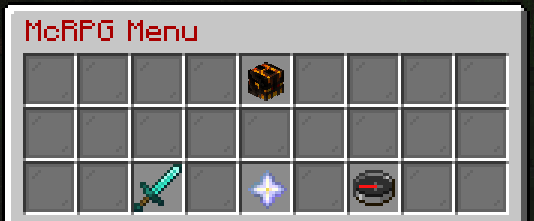
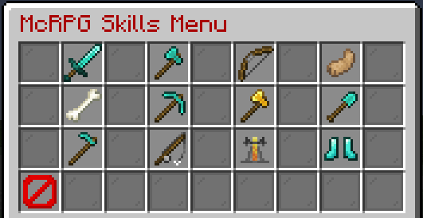
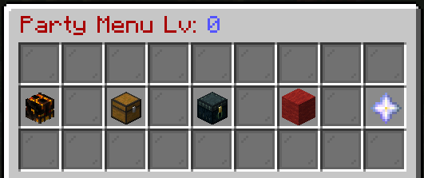

 

# McRPG

McRPG is an alternative to that skill plugin you will probably know from 90% of servers out there (mcMMO). 
While LegionCraft did utilize mcMMO for it's skills and abilities for a very long time, it's become too expected and stagnant - when so many servers utilize the exact same feaures.... what's the point!

So when we took the plunge to give the server a reset/rework for the Minecraft 1.16+ update, and a number of other features were either removed or changed up - mcMMO was also up for the chop! However - we didn't want to completely remove the feature of skills/abilities for players to enjoy, so an alternative was required. 
And this is where McRPG comes into play. It uses a similar base train of thought to mcMMO, and even a couple of the same abilities (though tweaked a little), but works very differently and with a lot more going on for players to mess around with and enjoy using.

While there's no possible way this wiki will ever have **every** tiny bit of information on McRPG listed (as with almost everything else on this wiki, it's mostly the main/core parts that you'll want to know and the rest you can figure out ingame or by asking the staff) we will keep a semi-detailed list of each skill, the abilities that skill will grant you and how McRPG works in general.

# The Basics

McRPG adds a number of skills for you to level up and unlock new abilities for, of which you can only have a set few active at once, and these can be managed very easily through the `/mcrpg` GUI:

The sections you can access from here are:

**-- Your Profile**:
This is the skull icon in the `/mcrpg` menu. When you hover over this icon it will give you a run down of your currentpower level and the level of each of your skills. 

If you then click on this icon it will take you to a page of some options you can toggle on/off. For example, just a couple of these options are: 
- Change the display type of the information given with `/mcdisplay <skill>` between Scoreboard, Action Bar and Boss Bar.
- Change how mob health is displayed when fighting them from a Bar, Hearts or disabled entirely.
- Enable/Disable the McRPG Tips that come up in the chat every now and then.
- Enable/Disable auto-accepting party TPs from party members.
As well as a few others.

**-- Skill Menu**:
This is the sword icon in the `/mcrpg` menu. When clicked it will take you to this page:

 Note that this menu will look different as the plugin is developed and more skills are added.

From here you can hover over a skills icon to see your current level and the chance you have for the skills default ability to trigger, and if you click the skills icon it will list all abilities that skill has with a small note on what they do and when they unlock!

**--Upgrade Abilities**:
This is the nether star icon in the `/mcrpg` menu. 
When clicked it will list all of the abilities you have unlocked - if you have met the requirement for upgrading the ability (for example to upgrade the Puncture ability from the Archery skill to Tier 2, your Archery level must be 150+) then you can click on the ability to upgrade it!

As you upgrade your abilities they will become more useful with longer effects, more strength, a higher chance to trigger etc... What each Tier of an ability grants is listed on each Skills page linked further down this page.

**--Edit Ability Loadout**:
This is the compass icon in the `/mcrpg` menu.

When clicked you will be given some options as to what you want to edit in your loudout - from these you can: 
- Toggle default abilities on/off. Each skill must be level 1+ to have their default ability usable, but **all** default abilities will be active unless turned off on this page (they're not part of your loadout).
- Replace Abilities in your current loudout.
- Toggle Unlocked Abilities on/off.

Note that you can only have **9 Abilities** active in your loudout at once, and if you make changes to your loudout you then can't make changes again for 6 hours!

# McRPG Skills

McRPG grants you access to 11 Skills currently - each with their own abilities you can level up and include in your loadout to customize your gameplay to your own style a little. 

Each skill levels up as you do certain actions. 
As the skill reaches a certain level it will start to unlock it's abilities (aside from their default ability, which just requires yout o be level 1 in a skill) on their first Tier. 

To increase the Tier of an ability you require two things - each Tier upgrade requires the Skill it belongs to to have reached a certain level, and an ability point to do the upgrade itself! 
You will receive an ability point every 150 level of your Power Level (the Power Level is the total of all of your Skills levels).

Currently you have access to use the following skills:
- [Swords](mcswords.md)
- [Axes](mcaxes.md)
- [Archery](mcarchery.md)
- [Unarmed](mcunarmed.md)
- [Mining](mcmining.md)
- [Woodcutting](mcwoodcutting.md)
- [Excavation](mcexcavation.md)
- [Herbalism](mcherbalism.md)
- [Fishing](mcfishing.md)
- [Sorcery](mcsorcery.md)
- [Fitness](mcfitness.md)

Note that you can also find Ability Unlock and Ability Upgrade Books as a rare mob drop. These will either unlock a specific Ability (regardless of the level of the Skill it is for at the time), or will upgrade a specific Ability one tier (if it is not already at it's top tier).

# Parties

As with mcMMO before it, you can create a Party with various perks between yourself and those in the same party as you!

To create a party use the command `/mcparty create <party name>`. 
Once you have created a party you can open a GUI with information on and options for your party with `/mcparty`, like so:

These options allow you to:
- **Skull Icon** - View information on all current party members (list of all members, when they last logged into the server and their current party role).
- **Chest Icon** - Party Bank. You can store items here (up to 27 stacks) for all party members to access and swap between them (such as some equipment to share etc...).
- **Enderchest Icon** - Private Bank. You can store items in here that only certain members of your party can access, however the size is much more restricted (it increases as your party level does).
- **Red Wool Icon** - Party Permissions. From here you can change the permissions for who can invite or kick players, whi has access to the private bank, who can upgrade the party and whether certain members of the party can PVP each other or not.
- **Nether Star Icon** - Party Upgrades. 

### Party Upgrades 

You will get an upgrade point every 3rd level as your party level increases (it increases as players in the party earn McRPG experience) up to the max level of 45. 
This gives you a maximum of 15 upgrade points, meaning you cannot fully upgrade your party (as this would take 20 upgrade points).

From the Party Upgrade page of your `/mcparty` GUI you can upgrade one of 4 things for your party, and each of those 4 options can be upgraded up to 5 times.

**--Member Count**: 
How many players you can have in your party. 
Tier 0 - Maximum of 5 Players. 
Tier 1 - Maximum of 6 Players. 
Tier 2 - Maximum of 7 Players. 
Tier 3 - Maximum of 8 Players. 
Tier 4 - Maximum of 9 Players. 
Tier 5 - Maximum of 10 Players. 
You cannot have more than 10 players in the same party.

**--Exp Share Percentage**: 
When you are within range of another party member to share your earned McRPG experience with them you wll earn 70% of the experience you would normally earn. How much of the extra 30% is shared between the party members nearby depends on this option. 
Tier 0 - 5% Exp. 
Tier 1 - 10% Exp. 
Tier 2 - 15% Exp. 
Tier 3 - 20% Exp. 
Tier 4 - 25% Exp. 
Tier 5 - 30% Exp.

**--Exp Share Range**: 
This is how far away from you another party member can be to earn a share of the experience you are earning. 
Tier 0 - 20 blocks. 
Tier 1 - 40 blocks. 
Tier 2 - 60 blocks. 
Tier 3 - 75 blocks. 
Tier 4 - 100 blocks. 
Tier 5 - 150 blocks.

**Private Bank Size**: 
This will increase the size of your parties Private Bank. 
Tier 0 - 3 Slots. 
Tier 1 - 6 Slots. 
Tier 2 - 9 Slots. 
Tier 3 - 12 Slots. 
Tier 4 - 15 Slots. 
Tier 5 - 18 Slots.

### Party Commands

- `/mcparty` - Open the GUI of your party (if you're in one).
- `/mcparty create <name>` - Create a new party under the stated name.
- `/mcparty invite <name>` - Invite the stated player to your party (if you have permission to invite players).
- `/mcparty invites` - View any invites you have received.
- `/mcparty chat` - Toggle party chat. If a message is added it will send the message to the chat without changing the chat channel you are in.
- `/mcparty tpahere <player>` - Send a party teleport request to the stated party member to come to you.
- `/mcparty tpa <player>` - Send a party teleport request to the stated party member to go to them.
- `/mcparty tpaccept` - Accept the TP request. If you have toggled auto-accpting of party TPs in your `/mcrpg` GUI then you will auto go to them/they will auto come to you without the need for this command.
- `/mcparty storage` - Opens the Party Bank (not the private bank).
- `/mcparty kick <player>` - Kick the stated player from the party (if you have permission to kick players).
- `/mcparty promote <player>` - Promote the stated player (currently party owner only).
- `/mcparty demote <player>` - Demote the stated player (currently party owner only).
- `/mcparty setowner <player>` - Set the stated player as the new party owner (currently party owner only).
- `/mcparty rename <name>` - Rename the party (currently party owner only).
- `/mcparty disband <name>` - Disband the party (currently party owner only).

**NOTE:** 
If you disband a party that still has items in the Private or Party Banks - **YOU WILL LOSE THE ITEMS**. They cannot be recovered.

# Misc. Information and Extra Commands

You can view a little but of information on a skill, such as your currently level and XP to the next level, via the `/mcd <skillname>` command.

If/when you have received any redeemable experience or levels you can redeem them for a set skill via the `/mcredeem <skillname>` command.

**Please Note**: 
This is a **BETA** plugin. It is still heavily in development, and there may be issues - if you run into any report them via the ingame `/ticket`s or on the Discord in the relevant channel and we will inform the plugin developer if it is not something we can fix via the plugin configs.
