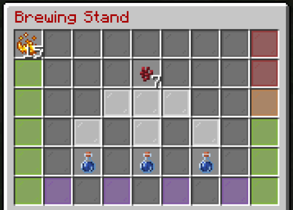

 

# McRPG Skill - Sorcery

This skill will give you access to various abilities and buffs of a magic/alchemical nature!

## How To Increase Your Sorcery Level?
Brew up a load of potions!

## McRPG Custom Brewing GUI

In order to efficiently work with brewing, including adding new potions correctly - McRPG replaces the brewing GUI with it's own custom GUI.

This works mostly exactly the same as a normal Vanilla brewing GUI. Put your fuel in the top left slot, your bottles in the three empty slots and your ingredient in the top middle slot.

The left column will show you the % left of the fuel item that is currently in use, and the right column will show you the % of the brew time there is left before the brew is complete. Any Artifacts you gain (which has a small chance per brew event) will appear in the 4 purple slots at the bottom.

## Artifacts

These are items you can gain while brewing. Each Artifact has a different use: 
- **Redeemable XP** - Use it to redeem XP against any Skill 
- **Skill Specific XP** - Use to boost a specific Skills XP 
- **Redeemable Level** - Flat 1 level boost to any Skill 
- **Ability Point** - Gain 1 Ability Point 
- **Unlock Book Summon** - Use to summon an Ability Unlock Book 
- **Upgrade Book Summon** - Use to summon an Upgrade Ability Book 
- **Cooldown Reset**- Reset any cooldowns you have active for your skills/abilities, 1-5 uses 
- **Magnet** - Pull items towards you in a range of 5-12, with 15-50 uses 

In theory yes - these artifacts should be sellable/auctionable if you don't want to use them yourself. If they are - **great use for the auction house - hint, hint.**

## What is the Sorcery Skills Default Ability?

### **Hasty Brew**.

This grants a boost to the brewing speed of your potions. 

## Unlockable Sorcery Passive Abilities

These abilities just need to be in your active loudout for their effects to be active.

### **Circes Recipes**.

This allows you to brew new potions at each tier. 

**What Sorcery Level does Tier 1 Unlock?**: 50

As the Tier of this ability increases you will gain access to new potions to brew.

|Tier|New Potion 1|New Potion 2|New Potion 3|New Potion 4|Sorcery Level Required To Upgrade (plus 1 Ability Point)|
|---|---|---|---|---|---|
|1|**Levitation Potion**: - Ingredient: Ender Pearl - Upgradable? ✘ - Extendable? ✔ - Splash? ✔ - Lingering? ✔|**Confusion Potion**: - Ingredient: Brown Mushroom - Upgradable? ✘ - Extendable? ✔ - Splash? ✔ - Lingering? ✔||||
|2|**Blindness Potion**: - Ingredient: Ink Sac - Upgradable? ✘ - Extendable? ✔ - Splash? ✔ - Lingering? ✔|**Absorption Potion**: - Ingredient: Quartz - Upgradable? ✔ - Extendable? ✔ - Splash? ✔ - Lingering? ✔|||200|
|3|**Hunger Potion**: - Ingredient: Rotten Flesh - Upgradable? ✔ - Extendable? ✔ - Splash? ✔ - Lingering? ✔|**Saturation Potion**: - Ingredient: Fern - Upgradable? ✔ - Extendable? ✔ - Splash? ✔ - Lingering? ✔|||350|
|4|**Dolphins Grace Potion**: - Ingredient: Tropical Fish - Upgradable? ✘ - Extendable? ✔ - Splash? ✔ - Lingering? ✔|**Health Boost Potion**: - Ingredient: Apple - Upgradable? ✔ - Extendable? ✔ - Splash? ✔ - Lingering? ✔|||500|
|5|**Haste Potion**: - Ingredient: Carrot - Upgradable? ✔ - Extendable? ✔ - Splash? ✔ - Lingering? ✔|**Miners Fatigue Potion**: - Ingredient: Slime Ball - Upgradable? ✔ - Extendable? ✔ - Splash? ✔ - Lingering? ✔|**Resistance Potion**: - Ingredient: Golden Apple - Upgradable? ✔ - Extendable? ✔ - Splash? ✔ - Lingering? ✔|**Wither Potion**: - Ingredient: Poisonous Potato - Upgradable? ✔ - Extendable? ✔ - Splash? ✔ - Lingering? ✔|650|

### **Potion Affinity**.

This adds a boost to how long any potions you drink yourself last for. 

**What Sorcery Level does Tier 1 Unlock?**: 150

As the Tier of this ability increases, so does the boost added.

|Tier|Boost Added|Sorcery Level Required To Upgrade (plus 1 Ability Point)|
|---|---|---|
|1|3%||
|2|5%|225|
|3|7%|350|
|4|10%|500|
|5|15%|650|

### **Mana Affinity**.

This increases the chances of receiving artifacts while brewing. 

**What Sorcery Level does Tier 1 Unlock?**: 150

As the Tier of this ability increases, so does the added chance for artifacts.

|Tier|Chance Increase|Sorcery Level Required To Upgrade (plus 1 Ability Point)|
|---|---|---|
|1|1%||
|2|2%|275|
|3|3.5%|425|
|4|5%|575|
|5|7%|700|

### **Circes Protection**.

This grants you a chance to resist negative potion effects. 

**What Sorcery Level does Tier 1 Unlock?**: 250

As the Tier of this ability increases, so does the chance of negating negative effects.

|Tier|Activation Chance|Sorcery Level Required To Upgrade (plus 1 Ability Point)|
|---|---|---|
|1|2%||
|2|4%|350|
|3|7%|500|
|4|10%|650|
|5|15%|800|

### **Hades Domain**.

This provides a boost to XP gains in Nether worlds (for both McRPG and Vanilla XP). 

**What Sorcery Level does Tier 1 Unlock?**: 300

As the Tier of this ability increases, so does the boosted XP amount.

|Tier|Vanilla XP Boost|McRPG XP Boost|Sorcery Level Required To Upgrade (plus 1 Ability Point)|
|---|---|---|---|
|1|3%|2%||
|2|6%|3%|400|
|3|9%|5%|650|
|4|12%|7%|700|
|5|15%|10%|850|

### **Circes Shrine**.

This allows you to build a shrine by placing Quartz Ore on all four sides of a block of water. 
If you then throw diamond blocks into the water (the more blocks the better) you have a chance of converting some of your Vanilla XP into redeemable McRPG experience.

**What Sorcery Level does Tier 1 Unlock?**: 350
**What is this Abilities Cooldown?**: 4 Hours

As the Tier of this ability increases, so does the chance of success - however as the chance of success depends on the amount of sacrificed Diamond Blocks as well as the Tier of your ability, it won't be listed in the table below. 

|Tier|Loss of Sacrificed Blocks, Even on Fail?|Loss of Sacrificed Vanilla XP, Even on Fail?|Sorcery Level Required To Upgrade (plus 1 Ability Point)|
|---|---|---|---|
|1|✔|✔||
|2|✔|✔|475|
|3|✔|✔|650|
|4|✔|✘|825|
|5|✔|✘|1000|
