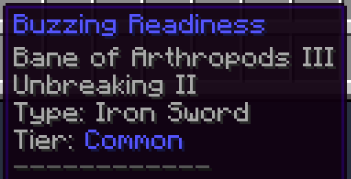
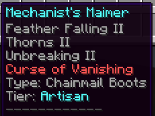
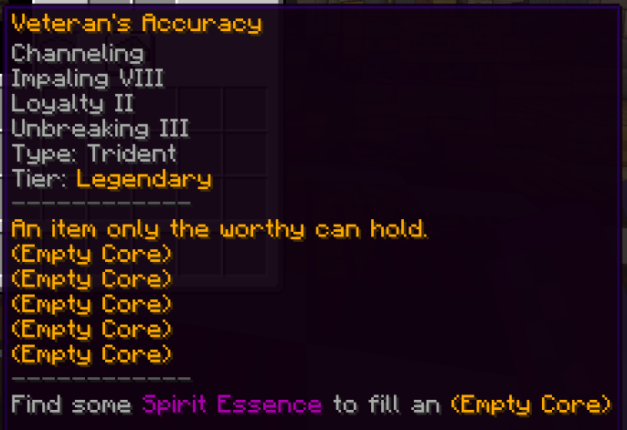
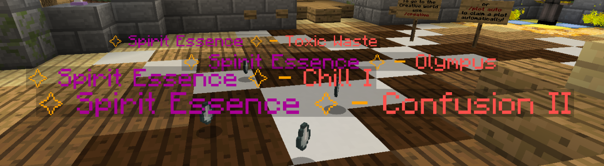
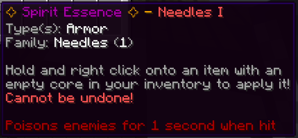
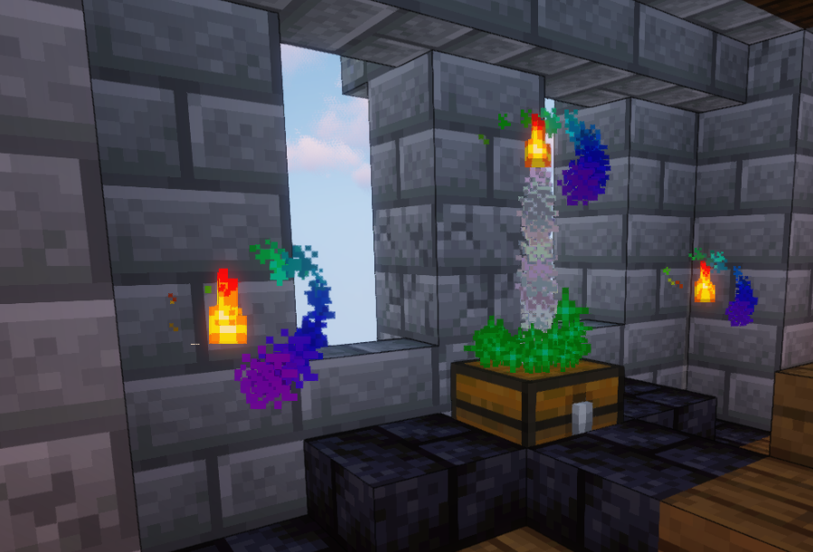
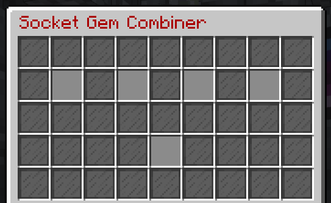
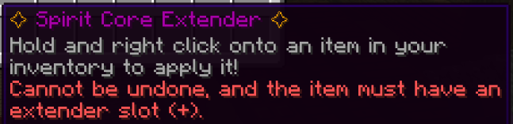
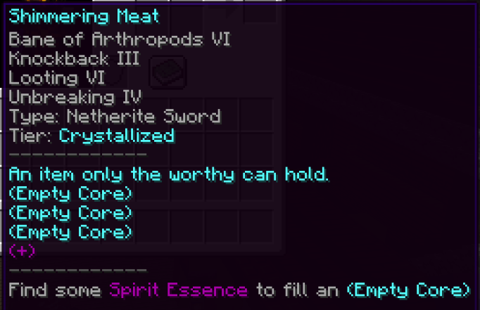

 

# MythicDrops

QuickLinks:
- [Empty Cores and Spirit Essences](#empty-cores-and-spirit-essences)
- [Spirit Essence Types](#spirit-essence-types)
- [Combining Essences](#combining-essences)
- [Spirit Core Extenders](#spirit-core-extenders)
- [Fixing Invalid Enchants](#fixing-invalid-enchants)

MythicDrops is the plugin used to handle weapon/tool/armour drops from mob kills that gives a bit of variety to what you can find.  
For example you'll most commonly (though not too frequently) come across items with no to one or two low level enchants in the Common tier, for example:

The item tiers available go:
- Common
- Rare
- Exotic
- Epic
- Legendary
- Crystalline

Each tier has different amounts of potential enchantments and how many enchantments they can spawn with, and a different amount of potential empty cores (see below).

Exotic is a strange exception to the main rules for the tiers - it is slightly more common to find than it's equivalent normal tier (Epic) but will also come with Curse of Vanishing as standard and a slightly lower top level for some enchants etc.. (ie they are as good as most of the drops from their respective normal tier, will drop more regularly but will also be lost if you die with them in your inventory).

For example, you may find an Exotic item such as this:

And then there is the Crystalline rank - the rarest and best you can find, only from Ender Dragon kills or event/competition rewards. As an example you may find this:

Each tier has different potential item drops and drops from different mobs - which mobs drop what tier and what tier contains what items you'll have to find out for yourself! As a general example however without ruining everything - you won't get diamond items in the Common tier, and rarer enemies will only drop rarer tiers (ie if you summon a Wither it will only drop Epic or Legendary level items)

# Empty Cores and Spirit Essences

Along with these drops there is a potential for the item to have empty cores - these allow you to attach a Spirit Essence to that item!

There are a number of spirit essences available, ranging from adding an effect when hitting something with your weapon/tool to increasing enchantment levels - all of which will drop as a rare drop when killing any hostile or neutral mobs (ie not farm animals..).

When they drop they will look something like this:

To use them simply pick the item up in your inventory and right click on the item you wish to add it to! The essence will give an indication of what it can be added to in it's lore, in the `Type(s)` line:

To clarify it'll say either:
- `Armor` - it can be applied to any Helmet, Chestplate, Leggings or Boots.
- `Weapon` - it can be applied to any Sword, Axe, Bow, Crossbow or Trident.
- `Tools` - it can be applied to anything in the Weapon types **and** Pickaxe, Shovel, Hoe, Fishing Rod or Shears.
- `Bladed-tools` - it can be applied to any Sword or Axe
- `Fortunable-tools` - it can be applied to any Shovel, Pickaxe or Axe.
- If it says something specific it is only for that type of item - for example if it says Boots it can only be used on boots, nothing else.

# Spirit Essence Types

There are a number of different types of Spirit Essence that all do something different! You can use this list as a rough guide.

|Essence Name|What It Does|Does it drop from Mobs?|Can it be Combined?|
|---|---|---|----|
|Panic I-IV|When hit with armour that has this you get a brief speed boost| ✔ | ✔ |
|Panic V|Only gained by combining 4 Panic IV's. 10% chance to trigger for much longer than a level IV!| ✘ | ✘ |
|Harden I-IV|When hit with armour that has this you get a brief boost to damage resistance| ✔ | ✔ |
|Harden V|Only gained by combining 4 Harden IV's. 10% chance to trigger for much longer than a level IV!| ✘ | ✘ |
|Frost I-IV|When hit with armour that has this your attacker is slowed for a brief period| ✔ | ✔ |
|Frost V|Only gained by combining 4 Frost IV's. 10% chance to trigger for much longer than a level IV!| ✘ | ✘ |
|Needles I-IV|When hit with armour that has this your attacker is poisoned for a brief period| ✔ | ✔ |
|Needles V|Only gained by combining 4 Needles IV's. 10% chance to trigger for much longer than a level IV!| ✘ | ✘ |
|Spikes I-IV|When hit with armour that has this your attacker will suffer from wither for a brief period| ✔ | ✔ |
|Spikes V|Only gained by combining 4 Spikes IV's. 10% chance to trigger for much longer than a level IV!| ✘ | ✘ |
|Chill I-IV|When you hit someone/thing with a tool/weapon that has this your target is slowed for a brief period| ✔ | ✔ |
|Chill V|Only gained by combining 4 Chill IV's. 10% chance to trigger for much longer than a level IV!| ✘ | ✘ |
|Counter I-IV|When you hit someone/thing with a tool/weapon that has this you gain absorption for a brief period| ✔ | ✔ |
|Counter V|Only gained by combining 4 Counter IV's. 10% chance to trigger for much longer than a level IV!| ✘ | ✘ |
|Weaken I-IV|When you hit someone/thing with a tool/weapon that has this your target is weakened for a brief period| ✔ | ✔ |
|Weaken V|Only gained by combining 4 Weaken IV's. 10% chance to trigger for much longer than a level IV!| ✘ | ✘ |
|Confusion I-IV|When you hit someone/thing with a tool/weapon that has this your target is confused for a brief period| ✔ | ✔ |
|Confusion V|Only gained by combining 4 Confusion IV's. 10% chance to trigger for much longer than a level IV!| ✘ | ✘ |
|Darkness I-IV|When you hit someone/thing with a tool/weapon that has this your target is blinded for a brief period| ✔ | ✔ |
|Darkness V|Only gained by combining 4 Darkness IV's. 10% chance to trigger for much longer than a level IV!| ✘ | ✘ |
|Poison I-IV|When you hit someone/thing with a tool/weapon that has this your target is poisoned for a brief period| ✔ | ✔ |
|Poison V|Only gained by combining 4 Poison IV's. 10% chance to trigger for much longer than a level IV!| ✘ | ✘ |
|Wither I-IV|When you hit someone/thing with a tool/weapon that has this your target will suffer from wither for a brief period| ✔ | ✔ |
|Wither V|Only gained by combining 4 Wither IV's. 10% chance to trigger for much longer than a level IV!| ✘ | ✘ |
|Adrenaline I-IV|When you hit someone/thing with a tool/weapon that has this you will get a speed boost for a brief period| ✔ | ✔ |
|Adrenaline V|Only gained by combining 4 Adrenaline IV's. 10% chance to trigger for much longer than a level IV!| ✘ | ✘ |
|Marking I-IV|When you hit someone/thing with a tool/weapon that has this they will be marked (they will glow) for a brief period| ✔ | ✔ |
|Marking V|Only gained by combining 4 Marking IV's. 10% chance to trigger for much longer than a level IV!| ✘ | ✘ |
|Vampire|When hit with armour that has this your attacker will suffer damage as well| ✔ | ✘ |
|Smokescreen|When hit with armour that has this you will blind both your attacker and others nearby for a brief period| ✔ | ✘ |
|Shadow|When hit with armour that has this you will go invisible for a brief period| ✔ | ✘ |
|Mucus|When you hit someone/thing with a tool/weapon that has this you will slow both your target and others nearby for a brief period| ✔ | ✘ |
|Toxic Waste|When you hit someone/thing with a tool/weapon that has this you will poison both your target and others nearby for a brief period| ✔ | ✘ |
|Frobscottle|When you hit someone/thing with a tool/weapon that has this you will make your target levitate for a brief period| ✔ | ✘ |
|Mother Earth|When you hit someone/thing with a tool/weapon that has this you will grant yourself and others nearby regeneration for a brief period (not your target)| ✔ | ✘ |
|Second Strike|When you hit someone/thing with a weapon that has this you will have a 15% chance to cause extra damage!| ✔ | ✘ |
|Shield I-II|Adds 1 or 2 levels of Protection to the armour it is applied to| ✔ | ✘ |
|Obsidian I-II|Adds 1 or 2 levels of Blast Protection to the armour it is applied to| ✔ | ✘ |
|Asbestos I-II|Adds 1 or 2 levels of Fire Protection to the armour it is applied to| ✔ | ✘ |
|Shell I-II|Adds 1 or 2 levels of Projectile Protection to the armour it is applied to| ✔ | ✘ |
|Float I-II|Adds 1 or 2 levels of Feather Falling to the armour it is applied to| ✔ | ✘ |
|Water Walker|Adds 1 level of Depth Strider to the boots it is applied to| ✔ | ✘ |
|Ice Walker|Adds 1 level of Frost Walker to the boots it is applied to| ✔ | ✘ |
|Soul Walker|Adds Soul Speed to the boots it is applied to| ✔ | ✘ |
|Gillyweed|Adds 1 level of Respiration to the armour it is applied to| ✔ | ✘ |
|Fletching I-III|Adds 1, 2 or 3 levels of Power to the tool it is applied to| ✔ | ✘ |
|Whetstone I-II|Adds 1 or 2 levels of Sharpness to the tool it is applied to| ✔ | ✘ |
|Power Shot I-II|Adds 1 or 2 levels of Piercng to the tool it is applied to| ✔ | ✘ |
|Pickpocket I-II|Adds 1 or 2 levels of Looting to the tool it is applied to| ✔ | ✘ |
|Scavenger I-II|Adds 1 or 2 levels of Fortune to the tool it is applied to| ✔ | ✘ |
|Quick Draw I-II|Adds 1 or 2 levels of Quick Charge to the tool it is applied to. Please bear in mind that Quick Charge 6+ stops it from working!| ✔ | ✘ |
|Ignis|Adds a level of Flame to the tool it is applied to| ✔ | ✘ |
|Incendia|Adds a level of Fire Aspect to the tool it is applied to| ✔ | ✘ |
|Olympus|Adds a level of Channeling to the tool it is applied to| ✔ | ✘ |
|Duplication|Adds a level of MultiShot to the tool it is applied to| ✔ | ✘ |

# Combining Essences

You can now also mix your essences together to make them stronger! Your essences will state if they can be combined (they will have a line in their lore that starts with `Family:`) - to do so you will need 4 of the exact same essence, same family and level. 

When you have your 4 essences, go to `/mdcombiner` (or `/mdc` for short) and click on the chest to open the Combiner!

Click the 4 essences in your inventory to add them, and the bottom empty slot in the combiner will change into a nether star to confirm they are okay to merge - click the star to get your upgraded essence!

# Spirit Core Extenders

You may come across an item called a Spirit Core Extender here and there - they will be a gold nugget that looks like this:

These allow certain items to receive an extra Empty Core for you to add Spirit Essences to - simply pick the extender up and right click onto an item to add the additional Empty Core!

This cannot be done to any item however - only items with Extender Slots can use these items, such as this:

# Fixing Invalid Enchants

MythicDrops is supposed to honour Vanilla enchantment rules, but it often fails to do so - for example the same pickaxe should never have both Fortune and Silk Touch... but you'll find some that do.

Some enchants that you can't get on the same item in singleplayer/100% Vanilla setups still work fine together (like Smite and Sharpness) so those we're not bothered about but a few pairings stop one or both of the enchants working at all, so we have scripted a command to fix this!

The pairings you can use this command to fix are:
- **Fortune** and **Silk Touch** on the same item. 
- **Frost Walker** and **Depth Strider** on the same item. 
- **Channeling** and **Riptide** on the same item.

To fix these pairings simply hold the item with the two enchants present on it and do:
- `/enchfix [enchant to remove]` - Options being `fortune`, `silktouch`, `frostwalker`, `depthstrider`, `channeling` or `riptide`.

This will remove the enchant that you named in the command, but leave any others. The item **must** have **both** enchants of the pair - it cannot be used to remove other enchants, or these 6 enchants if they're not on an item at the same time as the other enchant from the pair.
