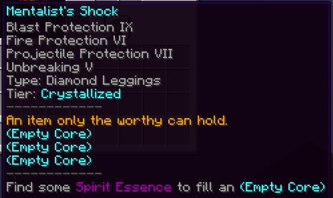
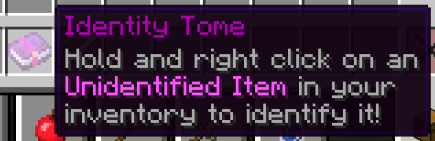

 

# MythicDrops

MythicDrops is the plugin used to handle weapon/tool/armour drops from mob kills that gives a bit of variety to what you can find. For example you'll commonly come across items with no to one or two low level enchants in the Junk and Uncommon tier, for example:

The item tiers in general go:
- Junk
- Common
- Rare > Artisan
- Epic > Exotic
- Legendary

Each tier has different amounts of potential enchantments and how many enchantments they can spawn with, and a different amount of potential empty cores (see below).

Artisan and Exotic are slightly more common to find than their equivalent normalk tier (Rare and Epic respectively) but they will also come with Curse of Vanishing as standard and a slightly lower top level for some enchants etc.. (ie they are as good as most of the drops from their respective normal tier, will drop more regularly but will also be lost if you die with them in your inventory).

For example, you may find an Artisan item such as this:

And then the Legendary rank - obviously the rarest and best you can find via mob drops. As an example you may find this:

Each tier has different potential item drops and drops from different mobs - which mobs drop what tier and what tier contains what items you'll have to find out for yourself! As a general example however without ruining everything - you won't get diamond items in the Junk tier, and rarer enemies will only drop rarer tiers (ie if you summon a Wither it will only drop Exotic, Epic or Legendary level items)

# Empty Cores and Spirit Essence

Along with these drops there is a potential for the item to have empty cores - these allow you to attach a Spirit Essence to that item!

There are a number of spirit essences available, ranging from adding an effect when hitting something with your weapon/tool to increasing enchantment levels - all of which will drop as a rare drop when killing any hostile or neutral mobs (ie not farm animals..).

When they drop they will look something like this:

To use them simply hold the essence and right click, and then right click the item you are applying it to! Each essence will state whether it is for armour or tools/weapons.

# Spirit Essence Types

There are a number of different types of Spirit Essence that all do something different! You can use this list as a rough guide. Obviously for those that add enchantments - use them on items the enchants work on (ie don't use a Fletching essence on a shovel...).

**Armour Essence**

|Essence Name|What It Does|
|---|---|
|Panic I-IV|When hit with armour that has this you get a brief speed boost|
|Harden I-IV|When hit with armour that has this you get a brief boost to damage resistance|
|Frost I-IV|When hit with armour that has this your attacker is slowed for a brief period|
|Needles I-IV|When hit with armour that has this your attacker is poisoned for a brief period|
|Spikes I-IV|When hit with armour that has this your attacker will suffer from wither for a brief period|
|Vampire|When hit with armour that has this your attacker will suffer damage as well|
|Smokescreen|When hit with armour that has this you will blind both your attacker and others nearby for a brief period|
|Shadow|When hit with armour that has this you will go invisible for a brief period|
|Shield I-II|Adds 1 or 2 levels of Protection to the armour it is applied to|
|Obsidian I-II|Adds 1 or 2 levels of Blast Protection to the armour it is applied to|
|Asbestos I-II|Adds 1 or 2 levels of Fire Protection to the armour it is applied to|
|Shell I-II|Adds 1 or 2 levels of Projectile Protection to the armour it is applied to|
|Float I-II|Adds 1 or 2 levels of Feather Falling to the armour it is applied to|
|Water Walker|Adds 1 level of Depth Strider to the armour it is applied to|
|Ice Walker|Adds 1 level of Frost Walker to the armour it is applied to|
|Gillyweed|Adds 1 level of Respiration to the armour it is applied to|

**Tool Essence**

|Essence Name|What It Does|
|---|---|
|Chill I-IV|When you hit someone/thing with a tool/weapon that has this your target is slowed for a brief period|
|Counter I-IV|When you hit someone/thing with a tool/weapon that has this you gain absorption for a brief period|
|Weaken I-IV|When you hit someone/thing with a tool/weapon that has this your target is weakened for a brief period|
|Confusion I-IV|When you hit someone/thing with a tool/weapon that has this your target is confused for a brief period|
|Darkness I-IV|When you hit someone/thing with a tool/weapon that has this your target is blinded for a brief period|
|Poison I-IV|When you hit someone/thing with a tool/weapon that has this your target is poisoned for a brief period|
|Wither I-IV|When you hit someone/thing with a tool/weapon that has this your target will suffer from wither for a brief period|
|Adrenaline I-IV|When you hit someone/thing with a tool/weapon that has this you will get a speed boost for a brief period|
|Mucus|When you hit someone/thing with a tool/weapon that has this you will slow both your target and others nearby for a brief period|
|Toxic Waste|When you hit someone/thing with a tool/weapon that has this you will poison both your target and others nearby for a brief period|
|Frobscottle|When you hit someone/thing with a tool/weapon that has this you will make your target levitate for a brief period|
|Mother Earth|When you hit someone/thing with a tool/weapon that has this you will grant yourself and others nearby regeneration for a brief period (not your target)|
|Fletching I-III|Adds 1, 2 or 3 levels of Power to the tool it is applied to|
|Whetstone I-II|Adds 1 or 2 levels of Sharpness to the tool it is applied to|
|Pickpocket I-II|Adds 1 or 2 levels of Looting to the tool it is applied to|
|Scavenger I-II|Adds 1 or 2 levels of Fortune to the tool it is applied to|
|Ignis|Adds a level of Flame to the tool it is applied to|
|Incendia|Adds a level of Fire Aspect to the tool it is applied to|
|Olympus|Adds a level of Channeling to the tool it is applied to|

# Unidentified Items and Tomes -- **CURRENTLY DISABLED DUE TO BUGS**

You may also sometimes come across an item that is Unidentified! To reveal it's secrets you will need to either find an Identity Tome (also comes as a rare mob drop) or purchase an Identity Tome through the Pawn Shop (only item sold here - use `/pawn` to get there). 

Simply right click with the tome in your hand, and then right click with the unidentified item to reveal it!
