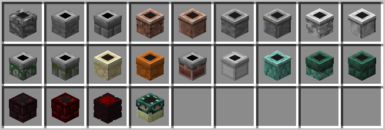
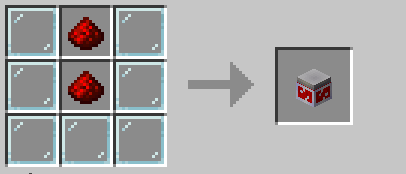
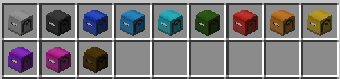
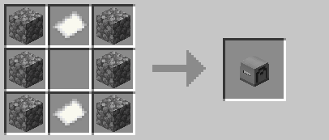

 

# Table of Contents

- [Recycle Bins](#recycle-bins)
- [Chimney Blocks](#chimney-blocks)
- [TeaLights](#tealights)
- [Clocks](#clocks)
- [Drops of Purity](#drops-of-purity)
- [Alchemical Storage](#alchemical-storage)
- [Potted Plants](#potted-plants)
- [Player Gifts and PostBoxes](#player-gifts-and-postboxes)

## Recycle Bins

Note that these are mostly decorative and easier ways of using `/bin` as you just need to click the block, not type a command!

To craft simply follow this guide but for the colour you wish to use (replace the dye - no dye = white):

## Chimney Blocks

Note that there are 3 effects for chimneys - Nether based chimneys get the flame under the smoke, the End Brick Chimney gets a purple spiral around the smoke. All others are just smoke.

To craft simply follow this guide but for the material you wish to use (replace the cobble):

Materials you can use:
- Cobblestone/Stone/Stone Bricks
- Andesite/Granite/Diorite
- Polished Andesite/Granite/Diorite
- Sandstone/Red Sandstone
- Mossy Cobblestone/Mossy Stone Bricks
- Bricks
- Iron Ingots
- Prismarine/Prismarine Bricks/Dark Prismarine
- Nether Bricks/Red Nether Bricks
- Magma Blocks
- End Bricks

### TeaLights

To craft simply follow this guide but replace the stained glass panes for the colour of tealight holder you wish to use! (and yes - they give off a little light. Mood lighting!)

### Clocks

These will allow you to check both the servers current time, and the time of the next world resets! Right click to check server time, and sneak right click to check the time worlds will reset and whether the End is open or closed! 
Please note that the reset dates are set by me manually so they won't change instantly when the worlds reset! I will try and keep them up to date however (along with the channel on Discord).

Add the dye you wish to use in the bottom middle slot to change the colour of the clock - with no dye it will be white!

**Note::** You can get the chimneys and lanterns while in creative with `/deco`!
Clocks and Recycle Bins currently cannot be gotten in Creative, as they're more for the utility than the effects.

### Drops of Purity

Got an item but don't really want to use it because it's Cursed? No worries - PURIFY IT!

Craft the Drop of Purity following this recipe:

Then right click on air with it in your (main) hand to open the Item Purification menu. Add your cursed item to the empty slot and close the inventory - it is THAT simple! All other enchants are kept!

# Alchemical Storage

Index:
- [Sugar Pot](#sugar-pot)
- [Vial Chest](#vial-chest)
- [Jar O'Blaze](#jar-o'blaze)
- [Jar O'Sulphur](#jar-o'sulphur)
- [Jar O'Reddust](#jar-o'reddust)
- [Jar O'Glowdust](#jar-o'glowddust)

These are blocks you can place that have a linked inventory for one specific item, just for you! For example if you place a Cookie Jar in your house you can left click with cookies in your hand to add one per click (or all of what's in your hand if you sneak left click) to your own Cookie Jar storage!

You can then access that Cookie Jar storage anywhere that a Cookie Jar block has been placed and you have permission to build! To retrieve items right click to get one, or sneak right click to get a stack (or however many are left if it's less than a stack). The size of each storage varies for some of these options.

## Sugar Pot

Each player can store up to 5000 sugar in their Sugar Pot storage!

## Vial Chest

Any type of planks can be used, but all 7 planks must be of the same type.
Each player can store up to 5000 glass bottles in their Vial Chest storage!

## Jar O'Blaze

Each player can store up to 5000 blaze powder in their Jar O'Blaze storage!

## Jar O'Sulphur

Each player can store up to 5000 gunpowder in their Jar O'Sulphur storage!

## Jar O'Reddust

Each player can store up to 5000 redstone dust in their Jar O'Reddust storage!

## Jar O'Glowdust

Each player can store up to 5000 glowstone dust in their Jar O'Glowdust storage!

# Potted Plants

An alternative to the plant pot in MineCraft - you can now create 16 different decorative potted plants!

The crafting recipe is simple - one plant pot and 3 of the plant it's for (shapeless recipe - the plant the pot is for is above the pot in the above image)!

# Player Gifts and PostBoxes

Want to send someone an item but they're not online, and you don't know where you can leave it for them? Post it to them!

You can now craft Packing Paper so you can wrap up items as gifts. To craft simply put a piece of string and a piece of paper anywhere in a crafting table - when you have the packing paper in your inventory hold the item stack you want to send and do `/wrap` to package it up ready!

Once you have packaged the items up correctly, you can send them by holding them and doing `/gift <player to send to>` and it will automatically be sent to them!

If the player in question is online at the time they will be told that they have been sent a gift in the ingame chat at the time - if they were not online they will be sent a notification when they log in next!

To retrieve your gifts you can either right click on the red postbox located at the server spawn - which will work for all players - or you can craft your own postboxes which come in a variety of colours and will only work for the person who places them!

You can craft your own postbox following this recipe:

For the differing colours just stick the relevant dye in the center slot!

When you place your own post box only you will be able to right click it to open the contents - other players will be either be told whose postbox it is on right click, or if they are holding a packaged item will drop the package into your postbox on right click!

Simply right click while holding a package to open it!

Note that postboxes are limited to 3 rows/27 items - if someones postbox is full you cannot send them anything else!
