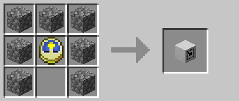
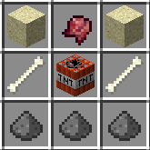
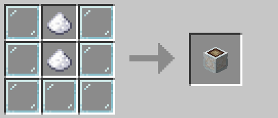

 

# Table of Contents

- [Recycle Bins](#recycle-bins)
- [Backpacks](#backpacks)
- [Chimney Blocks](#chimney-blocks)
- [TeaLights](#tealights)
- [Lanterns](#lanterns)
- [Clocks](#clocks)
- [Drops of Purity](#drops-of-purity)
- [Effect Bombs](#effect-bombs)
- [Home Storage](#home-storage)
- [Potted Plants](#potted-plants)

## Recycle Bins

Note that these are mostly decorative and easier ways of using `/bin` as you just need to click the block, not type a command!

To craft simply follow this guide but for the colour you wish to use (replace the dye - no dye = white):

## Backpacks

If you place a backpack block on the floor it will trigger `/backpack` on right clicking (in any world except for Creative)! You can also sneak and right click with one in your hand (in any world except for Creative) to open the backpack quicker as well!

To craft simply follow this guide for a Brown Backpack, or add the relevant dye in the bottom slot to change the colour:

## Chimney Blocks

Note that there are 3 effects for chimneys - Nether based chimneys get the flame under the smoke, the End Brick Chimney gets a purple spiral around the smoke. All others are just smoke.

To craft simply follow this guide but for the material you wish to use (replace the cobble):

Materials you can use:
- Cobblestone/Stone/Stone Bricks
- Andesite/Granite/Diorite
- Polished Andesite/Granite/Diorite
- Sandstone/Red Sandstone
- Mossy Cobblestone/Mossy Stone Bricks
- Bricks
- Iron Ingots
- Prismarine/Prismarine Bricks/Dark Prismarine
- Nether Bricks/Red Nether Bricks
- Magma Blocks
- End Bricks

### TeaLights

To craft simply follow this guide but replace the stained glass panes for the colour of tealight holder you wish to use! (and yes - they give off a little light. Mood lighting!)

### Lanterns

To craft simply follow this guide but replace the stained glass panes for the colour of lantern holder you wish to use! Note that there is no black lantern but all other colours work! (As with tealight - they give off light. But way more!)

### Clocks

These will allow you to check both the servers current time, and the time of the next world resets! Right click to check server time, and sneak right click to check the time worlds will reset and whether the End is open or closed! 
Please note that due to limits in Skript at the moment (may be able to find a work around at a later date but it's very low priority) the reset dates are set by me manually so they won't change instantly when the worlds reset! I will try and keep them up to date however (along with the channel on Discord).

Add the dye you wish to use in the bottom middle slot to change the colour of the clock - with no dye it will be white!

**Note::** You can get the chimneys, tealights and lanterns while in creative with `/deco`!
Clocks and Recycle Bins currently cannot be gotten in Creative, as they're more for the utility than the effects.

### Drops of Purity

Got an item but don't really want to use it because it's Cursed? No worries - PURIFY IT!

Craft the Drop of Purity following this recipe:

Then right click on air with it in your (main) hand to open the Item Purification menu. Add your cursed item to the empty slot and close the inventory - it is THAT simple! All other enchants are kept!

## Effect Bombs

Index:
- [Barf Bomb](#barf-bomb)
- [Concussion Bomb](#concussion-bomb)
- [Fire Bomb](#fire-bomb)
- [Float Bomb](#float-bomb)
- [Glitter Bomb](#glitter-bomb)
- [Heal Bomb](#heal-bomb)
- [Smoke Bomb](#smoke-bomb)
- [Snot Bomb](#snot-bomb)
- [Vamp Bomb](#vamp-bomb)
- [Venom Bomb](#venom-bomb)
- [Wither Bomb](#wither-bomb)

These bombs can be used to cause various effects on the players/entities within it's blast radius with no risk of damage to any blocks! What each bomb does varies - but each has an effect on the player/entities in it's radius, a particle effect of some kind and have a 5 second countdown timer above them when placed!

Note that any damage is a set amount - Blast Protection will **not** block it! Not all effect bombs do direct damage - some do not at all and some only via their applied effect.

### Barf Bomb
Any player or entity (not the player that placed the bomb) within an 8 block radius (circular) of this bomb when it explodes will be hit with 4 hearts of set damage and will be given hunger for 8 seconds!

Recipe:

### Concussion Bomb
Any player or entity (not the player that placed the bomb) within an 8 block radius (circular) of this bomb when it explodes will be hit with 3 hearts of set damage and will be given confusion for 12 seconds!

Recipe:

### Fire Bomb
Any player or entity (not the player that placed the bomb) within an 8 block radius (circular) of this bomb when it explodes will be hit with 2 hearts of set damage and will be set on fire for 8 seconds!

Recipe:

### Float Bomb
Any player or entity (not the player that placed the bomb) within an 8 block radius (circular) of this bomb when it explodes will be given levitation (a reasonably high level of levitation) for 1 second!

Recipe:

### Glitter Bomb
Any player or entity (not the player that placed the bomb) within an 8 block radius (circular) of this bomb when it explodes will be given the glowing effect for 10 seconds, with a colourful trail (ala nyan cat) and spiraling halo!

Recipe:

### Heal Bomb
Any player or entity (including the player that placed the bomb) within an 8 block radius (circular) of this bomb when it explodes will be given regeneration for 10 seconds!

Recipe:

### Smoke Bomb
Any player or entity (not the player that placed the bomb) within an 8 block radius (circular) of this bomb when it explodes will be hit with 3 hearts of set damage and will be given blindness for 8 seconds!

Recipe:

### Snot Bomb
Any player or entity (not the player that placed the bomb) within an 8 block radius (circular) of this bomb when it explodes will be hit with 2 hearts of set damage and will be given slowness for 5 seconds!

Recipe:

### Vamp Bomb
Any player or entity (not the player that placed the bomb) within an 8 block radius (circular) of this bomb when it explodes will be hit with 3 hearts of set damage and the player that placed the bomb will be healed by 1 heart for each entity/player damaged!

Recipe:

### Venom Bomb
Any player or entity (not the player that placed the bomb) within an 8 block radius (circular) of this bomb when it explodes will be hit with 2 hearts of set damage and will be given poison for 8 seconds!

Recipe:

### Wither Bomb
Any player or entity (not the player that placed the bomb) within an 8 block radius (circular) of this bomb when it explodes will be given wither for 8 seconds!

Recipe:

# Home Storage

Index:
- [Cookie Jar](#cookie-jar)
- [Cake Tin](#cake-tin)
- [Sugar Pot](#sugar-pot)
- [Coffee Pot](#coffee-pot)
- [Egg Basket](#egg-basket)
- [Vial Chest](#vial-chest)
- [Jar O'Blaze](#jar-o'blaze)
- [Jar O'Sulphur](#jar-o'sulphur)
- [Jar O'Reddust](#jar-o'reddust)
- [Jar O'Glowdust](#jar-o'glowddust)

These are blocks you can place that have a linked inventory for one specific item, just for you! For example if you place a Cookie Jar in your house you can left click with cookies in your hand to add one per click (or all of what's in your hand if you sneak left click) to your own Cookie Jar storage!

You can then access that Cookie Jar storage anywhere that a Cookie Jar block has been placed and you have permission to build! To retrieve items right click to get one, or sneak right click to get a stack (or however many are left if it's less than a stack). The size of each storage varies for some of these options.

Only the person who placed the container can break it as well!

## Cookie Jar

Recipe:

Each player can store up to 5000 cookies in their Cookie Jar storage!

## Cake Tin

Recipe:

Each player can store up to 250 cakes in their Cake Tin storage!

## Sugar Pot

Recipe:

Each player can store up to 5000 sugar in their Sugar Pot storage!

## Coffee Pot

Recipe:

Each player can store up to 5000 cocoa beans in their Coffee Pot storage!

## Egg Basket

Recipe:

Each player can store up to 2500 eggs in their Egg Basket storage!

## Vial Chest

Recipe:

Each player can store up to 5000 glass bottles in their Vial Chest storage!

## Jar O'Blaze

Recipe:

Each player can store up to 5000 blaze powder in their Jar O'Blaze storage!

## Jar O'Sulphur

Recipe:

Each player can store up to 5000 gunpowder in their Jar O'Sulphur storage!

## Jar O'Reddust

Recipe:

Each player can store up to 5000 redstone dust in their Jar O'Reddust storage!

## Jar O'Glowdust

Recipe:

Each player can store up to 5000 glowstone dust in their Jar O'Glowdust storage!

# Potted Plants

An alternative to the plant pot in MineCraft - you can now create 16 different decorative potted plants!

The crafting recipe is simple - one plant pot and 3 of the plant it's for (shapeless recipe - the plant the pot is for is above the pot in the above image)!

### Sound Muffler -- DISABLED DUE TO BUGS IN 1.15.2 FOR NOW

Farm animals annoying you? Sound of your nether portal driving you up the wall? Place a sound muffler by them! It'll muffle most sounds in a 16 block radius of where it is placed!

To craft it simply surround a noteblock with white wool:

Note that the placed block is actually an armour stand - you can move through it. It is annoyingly not placed centrally though, and if you place it under the ceiling the physically visible part of the armour stand will be inside the block above.
