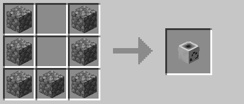
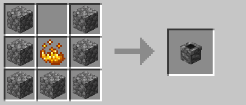

 

# New Items

## Safari Nets

Catch mobs with a safari net

## Recycle Bins

Note that these are mostly decorative and easier ways of using `/bin` as you just need to click the block, not type a command!

To craft simply follow this guide but for the colour you wish to use (replace the dye - no dye = white):

## Backpacks

If you place a backpack block on the floor it will trigger `/backpack` on right clicking (in any world except for Creative)! You can also sneak and right click with one in your hand (in any world except for Creative) to open the backpack quicker as well!

To craft simply follow this guide for a Brown Backpack, or add the relevant dye in the bottom slot to change the colour:

## Chimney Blocks

Note that there are 3 effects for chimneys - Nether based chimneys get the flame under the smoke, the End Brick Chimney gets a purple spiral around the smoke. All others are just smoke.

To craft simply follow this guide but for the material you wish to use (replace the cobble):

Materials you can use:
- Cobblestone/Stone/Stone Bricks
- Andesite/Granite/Diorite
- Polished Andesite/Granite/Diorite
- Sandstone/Red Sandstone
- Mossy Cobblestone/Mossy Stone Bricks
- Bricks
- Iron Ingots
- Prismarine/Prismarine Bricks/Dark Prismarine
- Nether Bricks/Red Nether Bricks
- Magma Blocks
- End Bricks

## TeaLights and Lanterns

### TeaLights

To craft simply follow this guide but replace the stained glass panes for the colour of tealight holder you wish to use! (and yes - they give off a little light. Mood lighting!)

### Lanterns

To craft simply follow this guide but replace the stained glass panes for the colour of lantern holder you wish to use! Note that there is no black lantern but all other colours work! (As with tealight - they give off light. But way more!)

### Clocks

These will allow you to check both the servers current time, and the time of the next world resets! Right click to check server time, and sneak right click to check the time worlds will reset and whether the End is open or closed! 
Please note that due to limits in Skript at the moment (may be able to find a work around at a later date but it's very low priority) the reset dates are set by me manually so they won't change instantly when the worlds reset! I will try and keep them up to date however (along with the channel on Discord).

Add the dye you wish to use in the bottom middle slot to change the colour of the clock - with no dye it will be white!

**Note::** You can get the chimneys, tealights and lanterns while in creative with `/deco`!
Clocks and Recycle Bins currently cannot be gotten in Creative, as they're more for the utility than the effects.

### Sound Muffler

Farm animals annoying you? Sound of your nether portal driving you up the wall? Place a sound muffler by them! It'll muffle most sounds in a 16 block radius of where it is placed!

To craft it simply surround a noteblock with white wool:

Note that the placed block is actually an armour stand - you can move through it. It is annoyingly not placed centrally though, and if you place it under the ceiling the physically visible part of the armour stand will be inside the block above.
