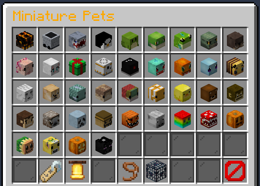

 

# Miniature Pets

You can purchase a Miniature Pet or two from our [Donation Store](http://store.legioncraft.co.uk/) at any time - when purchased you should receive your purchase ingame within 20 minutes (if not let BurntValentine know!).

You can view images on the different pets that are available [HERE](https://imgur.com/a/sl4Gb8m)!

When you have purchased at least one Miniature Pet you can summon them via the `/petgui` (aliases of `/pets`, `/mpets` and `/mpetgui`):

 

Any pets you have purchased will show with the above icons (except for the top left option which will be a skull of your own player skin, as it's for the MiniMe pet!) - any you have not purchased will show as a blank cage icon!

From this GUI you can do a couple of things:
- Summon the pet you wish to use by clicking on it's icon.
- Call the active pet you have out if it's lost or was told to sit by clicking the Bell icon at the bottom.
- Tell it to sit & stay (or to get up and follow you again if it was already sitting) by clicking on the Leash icon at the bottom.
- Remove the pet you currently have out by clicking on the Cage icon at the bottom.

You can also run these commands to do the same and one thing extra:
- `/mpet pet <pet type>` to summon the pet (note that the GUI is easier for this, as not all pets are named as simply as they are in the GUI).
- `/mpet setname <name>` to rename the pet you have out. This can be up to 25 characters and colour codes can be used!
- `/mpet sit` to tell your pet to sit & stay or get up & follow.
- `/mpet call` to call your pet to your side.
- `/mpet remove` to remove the pet you currently have out.

### *There are a few things to note regarding these pets*:

- The pet you have out will persist on world changes and log ins/outs until/unless you remove it, but it will be removed on server restarts.
- Setting a pet name is a single-instance effect. If you remove the pet, summon a different pet, the server restarts or you relog (as basically when you log back in the plugin summons a replacement of the same pet) the name will be lost.

Unfortunately these are issues/limitations with the plugin itself and I can't do a lot about this.

# Donation Package Costs For Pets

All individual pet purchases are *$5* except for one - The Dragon pet is *$7.50*!

On top of this there are a couple of pet packs that will gran access to multiple pets at a slightly reduced cost! These are, including how much you save compared to buying the pets individually:

|Package Name|Pets in the Package|Package Cost|Money Saved|
|---|---|---|---|
|Mini-Me Pack|The MiniMe and CartMe Pets|$8.50|$1.50|
|Frog Pack|The Tadpole, Green Frog, Tree Frog and Toad Pets|$15.00|$5.00|
|Robot Pack|The BB-8 and BB-9E Pets|$8.50|$1.50|
|PokéPack|The Charmander, Bulbasaur and Squirtle Pets|$12.00|$3.00|
|Halloween Pack|The Ghost, Headless Horseman, Pumpkin Kid and Scarecrow Pets|$15.00|$5.00|
|Jungle Pack|The Gorilla, Monkey and Sloth Pets|$12.00|$3.00|
|Fish Pack|The Flying Fish, Flying Cod, Flying Salmon and Flying Clownfish Pets|$15.00|$5.00|
|Potted Plant Pack|The Potted Sunflower, Pumpkin and Piranha Plant Pets|$12.00|$3.00|
