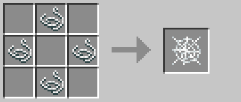
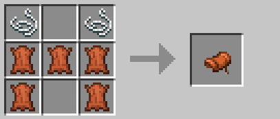
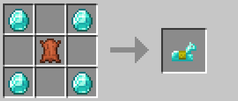
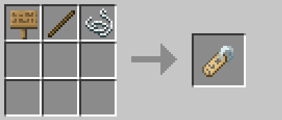
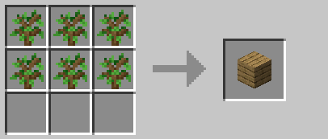
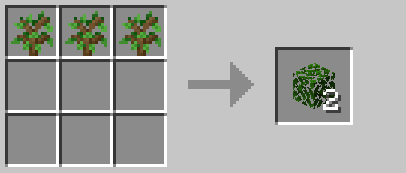
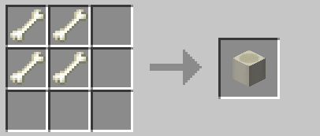

 

# New Items
You can find recipes for new items we have added to the server over on **[this page](newcraft.md)** (so as not to make this page excessively large).

# Table of Contents
As a quick run down so you don't need to scroll down to find what you're looking for:
- [Shulker Boxes](#shulker-boxes)
- [Cobweb](#cobweb)
- [Saddle](#saddle)
- [Horse Armor](#horse-armor)
- [Chainmail Armor](#chainmail-armor)
- [Name Tag](#name-tag)
- [Planks](#planks)
- [Leaves](#leaves)
- [Netherwarts](#netherwarts)
- [Bone Blocks](#bone-blocks)
- [Tall Grass and Ferns](#tall-grass-and-fern)

## All of these recipes are for Vanilla items that either lack a recipe in the current server version or their current recipes suck for one reason or another so we have tweaked them!

### Shulker Boxes

Shulker boxes are **way** to easy to make once you get any End access, which on a multiplayer server is stupid as everybody ends up getting access to them very easily the moment a single player gets to the end.

As such we have tweaked the recipe a little - instead of being 1 chest and 2 shulker shells for a shulker box, it is 8 shells and a chest. This won't make getting them too hard, but will make them a bit less common on the server as they should be (Mojang really never do think about things from an active public servers perspective... ever...).

### Cobweb

### Saddle

### Horse Armor

### Chainmail Armor

### Name Tag

 
Any type of sign may be used!

### Planks

You can use any 6 of the same sapling to get their respective block of planks!

### Leaves

You can use any 3 of the same sapling to get 2 of their respective block of leaves!

### Netherwarts

### Bone Blocks

There is a loss compared to Vanilla bonemeal > bone block, but less steps to make and less inventory space to mass produce bone blocks.

### Tall Grass and Ferns

 

