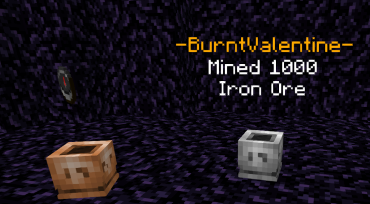

 

# Trophies

As you play on the server doing your day to day Minecrafting you will be doing actions that count towards trophies - not that much different to the achievement/trophies you might gain when playing your Playstation or Xbox!

You can view which trophies you have unlocked, when you will unlock the next level of a trophy and what counts towards each trophy with `/case`, which will bring up a GUI like so:

 

In this example I have unlocked the first level of five trophies, and the second level of a sixth - which shows information about the trophy like so:

 

If you have unlocked a trophy you can click it to get a copy of that trophy to place where you like! The few limits on placed trophies are:
- Each player can only place 1 of each trophy type in a Survival world and 1 in Creative - you cannot place them in the Resource worlds.
- When broken they will simply disappear. You can get another copy any time through your `/case`, however only the latest unlocked level can be summoned! 
(ie if you have upgraded a trophy to Silver level, you can no longer get the Bronze level from the case).
- You cannot place a trophy you have not unlocked yourself - so giving trophy items to other people is pointless.

When a Trophy is placed it will have an item above it that is (in some places very vaguely) related to what the Trophy is for:

 

And if you click on the Trophy it will swap the item out to show the name of who placed it and what the Trophy was awarded for!

Note that some items don't work with the holograms for some reason... as an example, as shown above, the Playtime Trophy uses a Compass, not a Clock... because I can't get Clock to work!

## What Trophies Are Available?
**===--------------------------------------------------===**
|Trophy|What Counts Towards This Trophy|When Each Level Unlocks|Notes|
|---|---|---|---|
|Coal Miner|Mine Coal Ore|**Bronze**: 250 **Silver:** 1000 **Gold**: 2500|This does not count any ores broken with a Silk Touch tool!|
|Iron Miner|Mine Iron Ore|**Bronze**: 250 **Silver:** 1000 **Gold**: 2500|This does not count any ores broken with a Silk Touch tool!|
|Gold Miner|Mine Gold Ore (or Nether Gold Ore)|**Bronze**: 250 **Silver:** 1000 **Gold**: 2500|This does not count any ores broken with a Silk Touch tool!|
|Lapis Miner|Mine Lapis Ore|**Bronze**: 250 **Silver:** 1000 **Gold**: 2500|This does not count any ores broken with a Silk Touch tool!|
|Quartz Miner|Mine Quartz Ore|**Bronze**: 250 **Silver:** 1000 **Gold**: 2500|This does not count any ores broken with a Silk Touch tool!|
|Redstone Miner|Mine Redstone Ore|**Bronze**: 250 **Silver:** 1000 **Gold**: 2500|This does not count any ores broken with a Silk Touch tool!|
|Diamond Miner|Mine Diamond Ore|**Bronze**: 250 **Silver:** 1000 **Gold**: 2500|This does not count any ores broken with a Silk Touch tool!|
|Emerald Miner|Mine Emerald Ore|**Bronze**: 50 **Silver:** 250 **Gold**: 1000|This does not count any ores broken with a Silk Touch tool!|
|Ancient Miner|Mine Ancient Debris|**Bronze**: 50 **Silver:** 250 **Gold**: 1000|This does not count any blocks broken with a Silk Touch tool!|
**===--------------------------------------------------===**
|Trophy|What Counts Towards This Trophy|When Each Level Unlocks|Notes|
|---|---|---|---|
|Animal Culling I|Kill certain Animals. **Mobs That Count**: Cows, Sheep, Chickens, Horses, Cats, Bats, Ocelots, Wolves, Parrots, Rabbits or Llamas.|**Bronze**: 150 **Silver:** 1000 **Gold**: 2500||
|Animal Culling II|Kill certain Animals. **Mobs That Count**: Donkeys, Mules, Pandas, Skeleton/Zombie Horses, Foxes, Trader Llamas, Polar Bears, Mooshrooms or Bees.|**Bronze**: 150 **Silver:** 1000 **Gold**: 2500||
|Hostile Mob Culling|Kill certain Mobs. **Mobs That Count**: Skeletons, Zombies, Creepers, Husks, Strays, Spiders, Cave Spiders, Zoglins or Zombified Piglins.|**Bronze**: 150 **Silver:** 1000 **Gold**: 2500|Spawner mobs are not counted!|
|Humanoid Mob Culling|Kill certain Mobs. **Mobs That Count**: Villagers, Witches, Zombie Villagers, Vindicators, Endermen, Evokers, Pillagers, Vex or Wandering Traders.|**Bronze**: 150 **Silver:** 1000 **Gold**: 2500||
|Beast Mob Culling|Kill certain Mobs. **Mobs That Count**: Phantoms, Shulkers, Drowned, Ravagers or Poglin Brutes.|**Bronze**: 50 **Silver:** 250 **Gold**: 1000|Mob of the Land (Ravager) Mob of the Sky (Phantoms) Mob of the Sea (Drowned) Mob of Hell (Piglin Brutes) Mob of the End (Shulkers).|
|Nether Mob Culling|Kill certain Mobs. **Mobs That Count**: Blazes, Ghasts, Piglins, Wither Skeletons, Hoglins or Striders.|**Bronze**: 150 **Silver:** 1000 **Gold**: 2500|Spawner mobs are not counted!|
|Sealife Mob Culling|Kill certain Mobs. **Mobs That Count**: Cow, Salmon, Tropical Fish, Pufferfish, Turtles, Dolphins, Squid or Guardians.|**Bronze**: 150 **Silver:** 1000 **Gold**: 2500||
|Player Hunter|Kill Players.|**Bronze**: 10 **Silver:** 50 **Gold**: 100|The same player will not count towards this for a while after you kill them (to avoid spam TP/killing to cheese the trophy).|
|Wither Hunter|Kill Withers.|**Bronze**: 1 **Silver:** 10 **Gold**: 50||
|Elder Hunter|Kill Elder Guardians.|**Bronze**: 1 **Silver:** 10 **Gold**: 50||
|Dragon Hunter|Kill Ender Dragons.|**Bronze**: 1 **Silver:** 2 **Gold**: 3||

|Trophy|What Counts Towards This Trophy|When Each Level Unlocks|Notes|
|---|---|---|---|
|Cake Baker|Craft Cakes|**Bronze**: 50 **Silver:** 100 **Gold**: 500|Each craft event is 1 point - if you use the FastCraft menu to create multiple cakes at once, each craft event is 1 regardless.|
|Iron Crafter|Craft Iron Equipment (Any Iron Armour, Weapon or Tool).|**Bronze**: 150 **Silver:** 750 **Gold**: 1500|Each craft event is 1 point - if you use the FastCraft menu to create multiple cakes at once, each craft event is 1 regardless. This counts for shift clicking in a crafting table - if you shift click it is 1 point, even if you made 10 items.|
|Diamond Crafter|Craft Diamond Equipment (Any Iron Armour, Weapon or Tool).|**Bronze**: 150 **Silver:** 750 **Gold**: 1500|Each craft event is 1 point - if you use the FastCraft menu to create multiple cakes at once, each craft event is 1 regardless. This counts for shift clicking in a crafting table - if you shift click it is 1 point, even if you made 10 items.|
|Harvester|Harvest Fully Grown Crops (Wheat, Potatoes, Carrots or Beetroot).|**Bronze**: 250 **Silver:** 1000 **Gold**: 2500||
|Enchanter|Use an Enchantment Table.|**Bronze**: 50 **Silver:** 500 **Gold**: 1000|Each item enchanted via an enchantment table is 1 point.|
|Fishing|Successfully fish up items.|**Bronze**: 500 **Silver:** 1500 **Gold**: 3000|Every item successfully fished up is 1 point, not just fish.|
|WoodStripper|Strip Overworld logs.|**Bronze**: 150 **Silver:** 750 **Gold**: 1500|This will not register the log stripping if the axe is in your offhand.|

|Trophy|What Counts Towards This Trophy|When Each Level Unlocks|Notes|
|---|---|---|---|
|Legionnaire|Actively play on the server.|**Bronze**: 24 Hours **Silver:** 7 Days **Gold**: 1 Month (28 Days)|This is done via Skript so it's not 100% accurate, but it won't be far off.|
|Vote Count|Vote for the server on any of the vote links.|**Bronze**: 250 **Silver:** 750 **Gold**: 1500||
|Top Voter|Be the Top Voter at least once.|||
|Builder|Place in a Build Competition.|**Bronze**: Place 1st **Silver:** Place 2nd **Gold**: Place 3rd||
|Trusted|Gain the Trusted Rank.||The Trusted rank is only given out by staff, randomly - do not ask for it, the second you do you won't get it!|
|Donator|Gain the Donator Rank.||You can get the Donator rank by purchasing any of the General Donation packages in the Donation Store (except for the custom amount option)|
|**-----**|**-----**|**-----**|**-----**|
|Platinum|Max out the level of other Trophies.|**Platinum**: 10 Tophies Maxed. **TRUE Platinum:** ALL Other Trophies Maxed.|The other trophies in this specific table, and on the same row in your `/case`, do not count towards the Platinum trophy.|
