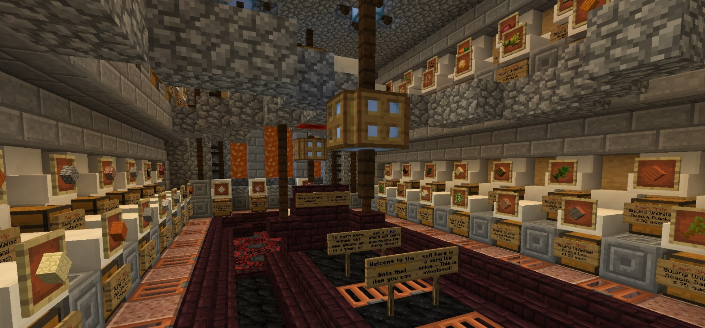

 

## Player Shops

Creating a shop is as simple as placing a chest and punching it with the item you wish to sell in your hand while sneaking!
If done correctly it will ask you to type how much to sell one for in the chat, enter it (without a slash, so to sell for $10 just enter 10) to create the shop, then stick the stock in the chest! (Remember not to unlock your shop chests, though the plugin should protect them itself independant of LWC locks).

To set up a shop that players sell items to do exactly the same as above, and then (whilst looking at the sign on the chest) do `/qs buy`! Alternatively sneak right click the sign of the shop you own to pull some options up in your chat - simply click the relevant option to change it!

To buy/sell from another players shop simply punch the sign on the front of the chest and enter how many you wish to buy/sell in the chat! When selling to a shop there must be space left in the chest for the items you are selling (and stock left for buying) - When you punch the sign it will tell you the available stock/space!
If you punch a shop sign and do not want to purchase from/sell to that shop simply walk away from it to cancel!

>Note that some item names will not fit on the sign for the shop - when you punch the sign to buy/sell it will state what is being sold in full in the chat!

**PLEASE NOTE::**

**Shop teleports are just for shop use.** 
They are **not** to be used to give public access to villager trades or to mob spawners/grinders. Setting these up for your friends or town members to access is fine, but not for every player on the server to access at any time they like.

## Admin/Pawn Shop

There is a shop at spawn (on the island to the right when you go to `/spawn`, or do `/pawn`) where you can sell some basic items for a low amount when necessary - this is not intended to be a main source of income, use [Jobs](money.md) for that!

## Shop Teleports

You can use various commands to allow others to teleport to your shop and to add your shop to a list of advertised shops.

Commands:
- Set your shop tp where you are with `/setshop`
- Go to your own shop with `/shop`
- Teleport to another players shop, if they have one, with `/shoptp <name>`
- Delete your shop teleport *and* advert with `/delshop`
- Lock/unlock your shop teleport with `/shoplock`

- List shops that have bought an advert in a menu, and click them to go to them, with `/shops`
- Set the message in your advert (colour codes allowed) with `/shopadvert <message>`
- Remove the message/lore entirely from your advert with `/clearshopadvert`
- Buy an advert in the /shops listing (which costs $5000) with `/buyadvert`

Shop adverts will last till the end of the month, regardless of when you buy it, as the adverts will wipe on the 1st of each month. If/when the plugin devs adds timed adverts their end I'll use that instead but for now it's an all or nothing advert wipe and I'd rather keep inactive shops out of the list.
