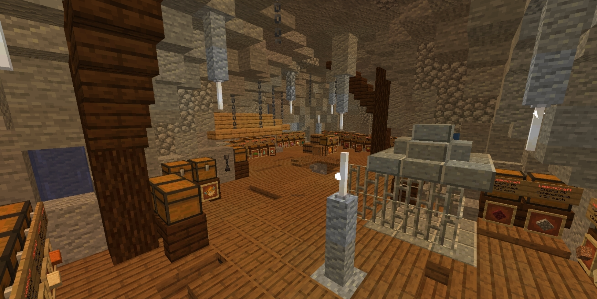

 

## Player Shops

Creating a shop is as simple as placing a chest and punching it with the item you wish to sell in your hand while sneaking! 
If done correctly it will ask you to type how much to sell one for in the chat, enter it (without a slash, so to sell for $10 just enter 10) to create the shop, then stick the stock in the chest!

To set up a shop that players sell items to do exactly the same as above, and then (whilst looking at the sign on the chest) do `/qs buy`! 
Alternatively sneak right click the sign of the shop you own to pull some options up in your chat - simply click the relevant option to change it!

To buy/sell from another players shop simply punch the sign on the front of the chest and enter how many you wish to buy/sell in the chat! 
When selling to a shop there must be space left in the chest for the items you are selling (and stock left for buying) - When you punch the sign it will tell you the available stock/space!

If you punch a shop sign and do not want to purchase from/sell to that shop simply walk away from it to cancel!

**Note:** 
Some item names will not fit on the sign for the shop, or may not show much details - a prime example being Enhanted Books. However - when you punch the sign to buy/sell it will state what is being sold in full in the chat!

## Player Shop Limits

While you will be able to set shops up as a new player, there are limits to how many shops you can create at a time - this goes up as your [player level](https://legioncraft.co.uk/wiki/levels.html) does!

|**Player Level**|**Player Shop Limit**|
|---|---|
|1-17|10 Shops|
|18-27|15 Shops|
|28-27|20 Shops|
|38-44|25 Shops|
|45-51|30 Shops|
|52-58|35 Shops|
|59-63|40 Shops|
|64-68|45 Shops|
|69+|50 Shops|

**A couple of other small limits to note:** 
- The lowest you can sell/buy items for is $2.50 per item. In general, aside from like...dirt... nothing should be set that low anyway. This is mostly to avoid selling/buying for anywhere near as cheaply as the Pawn Shop, but in general be sensible when setting shops up - don't set them stupidly low, it messes with the server economy heavily when doing that or constantly trying to undercut everyone.
- You cannot sell/buy an item through shops for more than $25,000,000 per item - as that's the cap on a players balance!

## Shop Teleports

You can use various commands to allow others to teleport to your shop and to add your shop to a list for all to see.

**PLEASE NOTE::**

**Shop teleports are just for shop use.** 
They are **not** to be used to give public access to villager trades or to mob spawners/grinders - Setting these up for your friends or town members to access is fine, but not for every player on the server to access at any time they like. 
These are also **not** to be used as an extra home/warp. 

**Any shop teleports that we find that have been set up where there isn't a shop, or to give public access to spawners/grinders/villager trades, will be removed and warnings will be issued - repeated offenses will result in temporary/permanent bans.**

Commands:
- Set your shop tp where you are and add it to the shops list with `/setpshop`
- Go to your own shop with `/pshop`
- Teleport to another players shop, if they have one, with `/pshop <name>`
- Delete your shop teleport and remove it from the list with `/delpshop` (any set lore for the shop will remain)

- List all shops and click their icon to go to them with `/pshops`
- Set the lore for your shop in this list (colour codes allowed) with `/setpshoplore <1-4> <message>`
**Note that you can't have gaps in the lore lines, so if you enter 3 as the lore line in the command but don't have text in lines 1 or 2 it'll set it in the lowest free space**
- Delete the lore of the set line from your shop in this list with `/delpshoplore <1-4>`
**Note as above, can't have gaps in the lore lines, so if you had 4 lines set and delete line 3 it will move the text in line 4 down to line 3**
- Set the icon for your shop in the shops list to the item in your hand with `/setpshopicon`
**Note - Base item only, no name/lore/enchants etc.. will carry over**

## Admin/Pawn Shop

There is a shop at spawn (you can use `/pawn` to go straight there) where you can sell some basic items for a low amount when necessary. 
Note that this is **not** intended to be a main source of income for anybody, even new players - use [Jobs](money.md), player shops and [auctions](auctions.md) for that!

## Auctions

You can read up on the player auctions [HERE](auctions.md).
