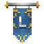

 

## Player Shops

Creating a shop is as simple as placing a slab (lower, not upper) and either right clicking it with a stick in your hand or doing `/ushop create`!

If done correctly it will bring up an inventory to set the shop up - select the item you wish to sell in your inventory, set how much you want to sell it for/buy it for (set to $0 to disable buy or sell), how many to buy/sell at once and then create the shop! Right click the slab again to edit any settings such as prices, quantity, set a message or to deposit stock (each slab can hold up to 150 stacks of the item being sold!).

You can restock either through the shops menu, or by punching the shop slab with the item in your hand! Sneak punching will put *all* of the items in your inventory that the shop sells into the stock!

There are also commands to make changes if the menu is confusing/not working in any way. Look at the slab you wish to edit and do:
- `/ushop modifyBuyPrice <price>` - This allows you to have more accurate prices too, such as $3.75 rather than $3 or $4.
- `/ushop modifySellPrice <price>` - As above.
- `/ushop modifyQuantity <amount>` - Change how many items are bought/sold at once.
- `/ushop modifyVendorNote <note>` - Sets a note that customers can read in the shops menu (it goes in an item lore so don't make it a long message!).

To remove a shop right click with a stick in your hand and confirm in the menu that comes up, or look at the slab and do `/ushop destroy`!

You can also do a quick restock via a chest that is within 24 blocks of the shop slabs by right clicking the chest with a stick in your hand. This will bring up a bulk restock menu - any items you click in your inventory will then be sent to any shops nearby that sell that item!

To buy from someones shop simply right click their shops slab and read the menu that comes up!

## Admin/Pawn Shop

There is a shop at spawn (on the island to the right when you go to `/spawn`, or do `/pawn`) where you can sell some basic items for a low amount when necessary - this is not intended to be a main source of income, use [Jobs](money.md) for that!

## Shop Teleports -- Currently Disabled Due to Issues in the 1.13 Update, will be back ASAP!

The commands are nice and simple:

- `/setshop` - To set/change where your shop teleport is located
- `/delshop` - To delete your shop teleport
- `/shop [player]` - To teleport to that players shop, or your own if you don't add a name
- `/shops` - To list all currently available shop

### Customisation -- Currently Disabled Due to Issues in the 1.13 Update, will be back ASAP!

You can customise your shops icon and description!

- `/shop description [description]` - Set a description for your shop.
- `/shop icon` - Choose an icon for your shop.
