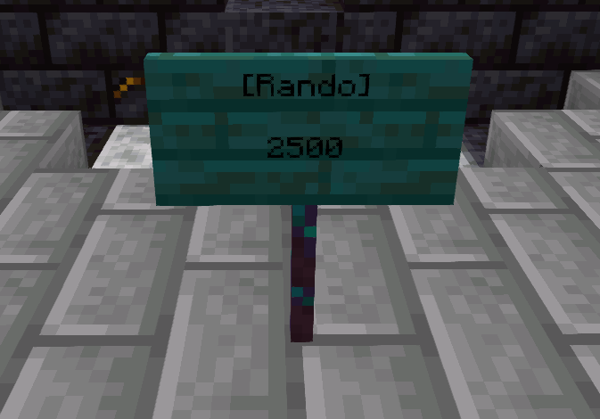
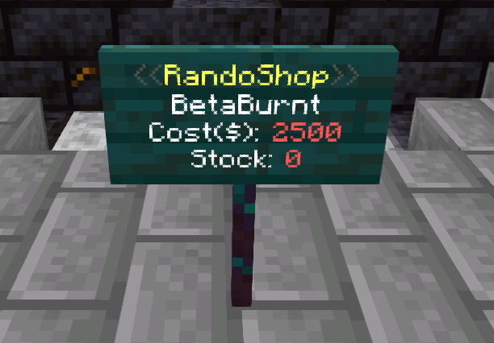
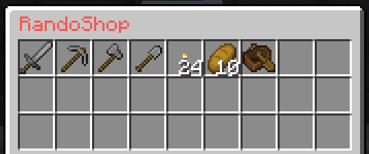
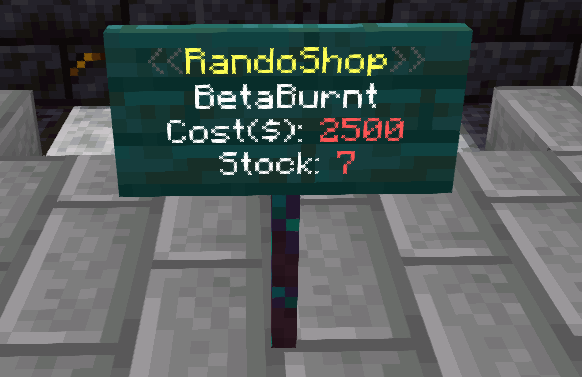
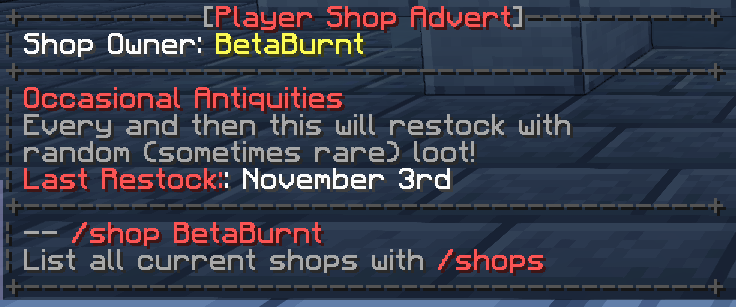
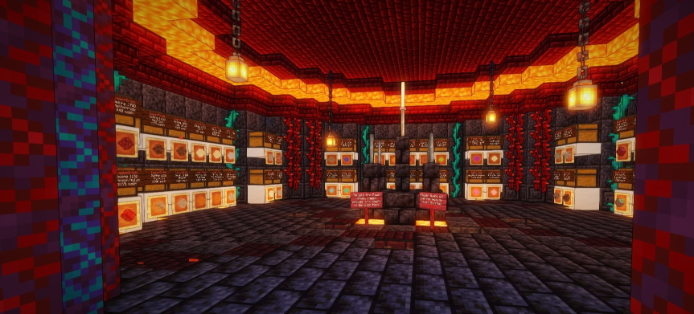

 

### Quicklinks: 
- [Player Shops](#player-shops) 
- [Player Shop Limits](#player-shop-limits) 
- [Shop Teleports](#shop-teleports) 
- [RandoShops](#randoshops) 
- [Shop Adverts](#shop-adverts) 
- [Admin and Pawn Shop](#admin-and-pawn-shop) 
- [Auctions](#auctions) 

## Player Shops

Creating a shop is as simple as placing a chest and punching it with the item you wish to sell in your hand while sneaking! 
If done correctly it will ask you to type how much to sell one for in the chat, enter it (without a slash, so to sell for $10 just enter 10) to create the shop, then stick the stock in the chest!

To set up a shop that players sell items to do exactly the same as above, and then (whilst looking at the sign on the chest) do `/qs buy`! 
Alternatively sneak right click the sign of the shop you own to pull some options up in your chat - simply click the relevant option to change it!

To buy/sell from another players shop simply punch the sign on the front of the chest and enter how many you wish to buy/sell in the chat! 
When selling to a shop there must be space left in the chest for the items you are selling (and stock left for buying) - When you punch the sign it will tell you the available stock/space!

If you punch a shop sign and do not want to purchase from/sell to that shop simply walk away from it to cancel!

**Note:** 
Some item names will not fit on the sign for the shop, or may not show much details - a prime example being Enhanted Books. However - when you punch the sign to buy/sell it will state what is being sold in full in the chat!

## Player Shop Limits

While you will be able to set shops up as a new player, there are limits to how many shops you can create at a time - this goes up as your [player level](https://legioncraft.co.uk/wiki/levels.html) does!

|**Player Level**|**Player Shop Limit**|
|---|---|
|1-17|10 Shops|
|18-27|15 Shops|
|28-27|20 Shops|
|38-44|25 Shops|
|45-51|30 Shops|
|52-58|35 Shops|
|59-63|40 Shops|
|64-68|45 Shops|
|69+|50 Shops|

**A couple of other small limits to note:** 
- The lowest you can sell/buy items for is $2.50 per item. In general, aside from like...dirt... nothing should be set that low anyway. This is mostly to avoid selling/buying for anywhere near as cheaply as the Pawn Shop, but in general be sensible when setting shops up - don't set them stupidly low, it messes with the server economy heavily when doing that or constantly trying to undercut everyone.
- You cannot sell/buy an item through shops for more than $25,000,000 per item - as that's the cap on a players balance!

## Shop Teleports

You can use various commands to allow others to teleport to your shop and to add your shop to a list for all to see.

**PLEASE NOTE::**

**Shop teleports are just for shop use.** 
They are **not** to be used to give public access to villager trades or to mob spawners/grinders - Setting these up for your friends or town members to access is fine, but not for every player on the server to access at any time they like. 
These are also **not** to be used as an extra home/warp. 

**Any shop teleports that we find that have been set up where there isn't a shop, or to give public access to spawners/grinders/villager trades, will be removed and warnings will be issued - repeated offenses will result in temporary/permanent bans.**

Commands:
- Set your shop tp where you are and add it to the shops list with `/setpshop`
- Go to your own shop with `/pshop`
- Teleport to another players shop, if they have one, with `/pshop <name>`
- Delete your shop teleport and remove it from the list with `/delpshop` (any set lore for the shop will remain)

- List all shops and click their icon to go to them with `/pshops`
- Set the lore for your shop in this list (colour codes allowed) with `/setpshoplore <1-4> <message>`
**Note that you can't have gaps in the lore lines, so if you enter 3 as the lore line in the command but don't have text in lines 1 or 2 it'll set it in the lowest free space**
- Delete the lore of the set line from your shop in this list with `/delpshoplore <1-4>`
**Note as above, can't have gaps in the lore lines, so if you had 4 lines set and delete line 3 it will move the text in line 4 down to line 3**
- Set the icon for your shop in the shops list to the item in your hand with `/setpshopicon`
**Note - Base item only, no name/lore/enchants etc.. will carry over**

## RandoShops

RandoShops are separate to the above shops, and allow you to sell a random selection of items to other players at the same price (rather than 1 shop per item as above).

How many RandoShops you can have at any one time depends on your player level:

|Player Level|Max Number of RandoShops|
|---|---|
|1-13|1 RandoShop|
|14-28|3 RandoShops|
|29-48|5 RandoShops|
|49-65|10 RandoShops|
|66-83|15 RandoShops|
|84+|20 RandoShops|

To create your RandoShop simply place a sign (any sign, placed anywhere but it would make sense to keep it where your `/pshop` has been set), set the top line as shown in the image below and set the third line as the amount you wish to sell items for:

Then hit the sign with redstone dust in your hand to activate! The sign will adjust as so:

It will also open your shops inventory so you can add any items you wish! Each RandoShop has the same inventory space as a single chest (27 slots) - any items that can stack will be sold as one, regardless of how you put them in the inventory. When you add items and close the inventory the sign will uodate the stock count, as shown here:

You can adjust the price of your RandoShop by looking at the sign and doing `/rsprice <cost>` (rather than having to remake the whole thing to change it).

To buy from someones RansoShop simply right click the sign - it will ask you to enter in the chat how many items you wish to buy, simply enter a number between 1 and the stock count and if you have enough money you will be charged accordingly and the items will be placed into your inventory (if you don't have space they will drop where you stand).

## Shop Adverts

You can also advertise your shop in the chat to try and grab more attention!

When you have set a shop up, and a teleport to it, run the command `/shopadvert buy` to add your shop to the advert list for the next 3 days, which will cost you just $5000! You can run the command numerous times to add an extra 3 days at $5000 each time.
To check how long your advert has left you can do `/shopadvert` - when it runs out you will also be sent a `/mail` to let you know!

Every 45 minutes the server will pull a random shop that has a paid for advert and push a chat announcement out regarding the shop - including the lore you have set up for your shop in the `/shops` list! For example: 

## Admin and Pawn Shop

There are two server shops - the Admin Shop, and the Pawn Shop.

The Admin Shop (you can use `/buy` to go straight there) sells a number of items, but at a high price. This can be used to grab some items that you're having issues getting and have the money to grab quickly, and as a rough idea for pricings of your shops (if nobody else sells it, sell for a bit less than the Admin Shop!).

At the Pawn Shop (you can use `/sell` to go straight there) you can sell some basic items for a low amount when necessary. 
Note that this is **not** intended to be a main source of income for anybody, even new players - use [Jobs](money.md), player shops and [auctions](auctions.md) for that! 
When setting your own shops up you should never buy items for LESS than the Pawn Shop does!

## Auctions

You can read up on the player auctions [HERE](auctions.md).
