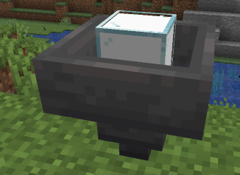
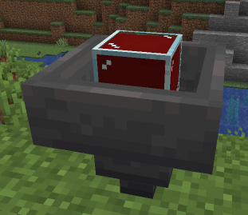
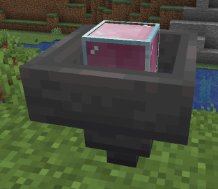

 

# Liquid Tanks

You can now craft special tanks for storing certain liquids!

You can craft a liquid tank via this recipe:

**Note** - The hopper in the recipe can be any hopper (including another tank... so don't waste your items!) **except** for [Upgradable Hoppers](hopper.md). So there is no risk of losing these by accident!

When you place your tank it will create a hopper that has a piece of glass in it to act as the visual for the tank!

These will **not** work as a normal hopper. Items dropped on them will not be taken in, aside from a few options listed below they do not empty into containers or anything below/around them and they do not open a storage GUI when clicked on!

Each tank placed can be filled with one of the following liquids:
- Water
- Lava
- Milk
- Mushroom Soup
- Rabbit Stew
- Beetroot Stew
- Dragon Breath
- Experience
- Honey

Each one of these has a different amount that can be stored as well! 
These are as follows:
- Water - 50 units.
- Lava - 24 units.
- Milk - 50 units.
- Mushroom Soup - 24 units.
- Rabbit Stew - 24 units.
- Beetroot Stew - 24 units.
- Dragon Breath - 50 units.
- Experience - 30 levels.
- Honey - 50 units.

For the most part this works as 3 units per bucket and 1 unit for each bottle/bowl used. 
For Experience the meter given on the tank is the amount of XP levels the tank contains, so each bottle will not add 1 to the value.

To add to the tank simply right click on the tank with the relevant filled bucket/bottle/bowl - to take from the tank right click with an empty bucket/bowl/bottle.

If another tank is placed underneath a tank the liquid will flow down through linked tanks, but you can only get it out of the tank with the liquid in itself (ie using an empty bucket on an empty tank above another tank of water will do nothing, you need to click on the tank that **has** water in it).

**Please note**:
Tanks cannot be locked, and can be used by anybody with access to "use" in that area (ie if it's on town land only by town members etc..).
If you break a tank it **will** lose its contents for the most part! The only exception is the Experience Tank - when you break this it'll give it's contents to the person that broke it.

Most of the liquid types also give the tank some different features as well! These are as follows:
- [Water Tanks](#water-tanks)
- [Lava Tanks](#lava-tanks)
- [Experience Tanks](#experience-tanks)
- [Milk Tanks](#milk-tanks)
- [Mushroom Soup Tanks](#mushroom-soup-tanks)
- [Rabbit Stew and Beetroot Soup Tanks](#rabbit-stew-and-beetroot-soup-tanks)
- [Honey Tanks](#honey-tanks)
- [Dragon Breath Tanks](#dragon-breath-tanks)

## Water Tanks

- Walking under a powered water tank when on fire will put you out and use 1 unit (1 bottle, 1/3 of a bucket) of water in the tank.
- Water tanks will suck up water source blocks above the tank (3 units a source, same as a bucket).
- Placing a dispenser next to the water tank and facing up will create a fountain when powered, but will also slowly use the water up.

## Lava Tanks

- As with Water tanks it will suck up lava sources above it for 3 units per.
- It can power furnaces placed next to or below them (the tank in this case does not need to be powered). It'll use 1 unit of lava in the tank to fuel 33 smelts.

## Experience Tanks

- Sneaking on top will put your XP into it (rather than needing to bottle it all first).
- Standing under the tank when it is powered with redstone will add the experience to your own XP (but only in levels so it needs at least 1 level in it).

Note that it's done by XP level not by units like other liquids so if you have 3 XP levels and stand under a powered tank with 5 XP levels you won't necessarily end up with 8 levels etc.. because 8 levels may require more XP points than levels 3 and 5 added together.

## Milk Tanks

- Standing under a powered milk tank will remove any potion effects you have for 1 unit.
- Cows and Mushroom Cows will fill milk tanks slowly when standing on top of them.

## Mushroom Soup Tanks

- Standing under a powered mushroom stew tank when hungry will use 1 unit of stew and feed you.
- Cows and Mushroom Cows will fill these tanks slowly when standing on top of them.

## Rabbit Stew and Beetroot Soup Tanks

- Standing under a powered rabbit stew or beetroot soup tank when hungry will use 1 unit of stew and feed you.

## Honey Tanks

- As with the other food-related tanks, standing under a powered honey tank when hungry will provide saturation.
- These can be filled automatically by placing them one below an active beehive/nest.

## Dragon Breath Tanks

- Dragon Breath tanks are entirely for storage purposes.
