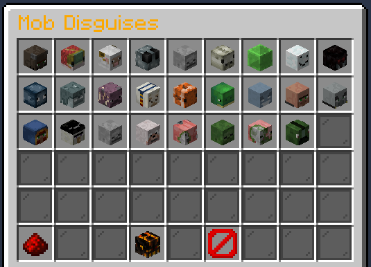
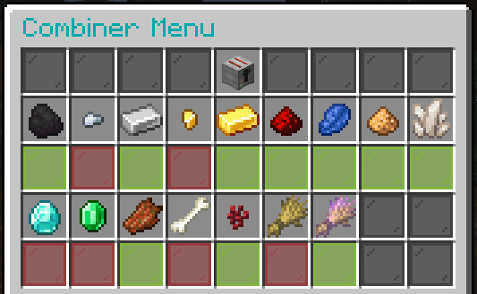

 

# Utilities

## Main Menu

You can access the main GUI with `/menu`

This will give you options to: 
- Open the Utility Menu
- Get a link to the Website
- Get a link to the Forums
- Get a link to the DynMap
- Get a link to the Discord
- Get a link to the Donation Store
- Open the Token Shop
- Help - The same as `/help`

## Utility Menu

You can get to this from either the `/menu` or by using `/util` directly, and it will give you this:

>Note that this is if you have full access to the perks. Any you have not yet unlocked will have a different icon and will let you know what level it is unlocked at!

This menu will give you access to all of the following

The top line - **General Utilities**.
This gives you the following options:
- Utility Bin - This will open the `/bin`
- Titles - This will open the `/titles` menu
- Crafting - This will open `/wbench`
- Backpack - Opens your backpack
- Bow Particles - This will open a new menu for selecting your bow particles (See below on that)
- Elytra Particles - This will open a new menu for selecting your elytra particles (See below on that)

There is also a hidden icon in the top right that will show for anybody that received any Winter Trails in the 2019 Advent to forward you to the menu for those!

On the second line you will get - **Toggleable Utilities**.
This gives you the following options:
- Combiner - Toggles the combiner on/off. This combines certain items as you pick them up.
- Magnet - Toggles Item Magnet on/off, which draws nearby items to you.
- V.O.I.D. - Toggles VOID on/off, which removes common blocks when mining/digging so your inventory doesn't fill up with junk.
- Flashlight - Toggles your flashlight on/off. Permanent night vision when on.

And on the third line - **Donation Perks** (You must have purchased them to use them!).
This gives you the following options:
- Disguises - Opens a new menu for picking a disguise.
- Particle Trails - Opens the trails menu.
- Chat Colours - Opens the chat colours menu.

And finally, a button to go back to the `/menu`.

This has also meant a few other menus have had to be made too!

### Disguises Menu

 

You can click any of the mobs you have paid for to enable the disguise, and your skull at the bottom to remove the disguise (and a button to close the menu and go from page 1 to 2 and vice versa in the corners).

Note that menu this does not support alternatives to the disguises, such as baby forms etc... itself but you can find out what you can use (if you have purchased them) by typing `/dis <mob>` and then put a space and hit tab to bring up options!
You can also view the various mob disguise options that are available over on the wiki page for [Donations](http://legioncraft.co.uk/wiki/dismods.html)!

### Bow Particles Menu

As above, click the particle you wish to use to select it - The icon in the bottom right (the green icon in the image) toggles them on/off! The particle you are currently using will be highlighted in the menu (the yellow box in the image)
This can also be accessed with `/bmenu`

### Elytra Particles Menu

As with the Bow Particles menu, click the particle you wish to use to select it - The icon in the bottom right (the green icon in the image) toggles them on/off! The particle you are currently using will be highlighted in the menu (the yellow box in the image)
This can also be accessed with `/emenu`

### Chat Colours Menu

As above select the colour you wish to use and make sure it is toggled on (the middle item will be coloured if on, and dark if not - click to toggle) and all of your chat text will be changed to that colour!

The colours at the bottom (dark red, dark grey and black) are staff only so non-staff players won't see these options (and any you have not purchased will be locked).

## V.O.I.D.

The VOID, when active, will delete certain items as you pick them up so they don't bloat your inventory with junk!
From this menu you can toggle VOID on/off using the icon on the top line, and when active (when the icon is green as shown) any items with a green glass pane under them will be deleted on pickup! For example in the above image I have VOID on, and any Dirt, Cobblestone, Diorite, Andesite, Granite, Red Sand, Sandstone, Gravel, Netherrack and Wheat Seeds will be deleted as I pick them up.
To toggle an item on.off just click it's icon!

This can be unlocked for use at any time when you get to level 70, and can be toggled from the `/util` menu!
For those not yet at level 70 - you can purchase temporary usage of this through the `/tokenshop`!

You can also access this menu directly via `/void`.

## The Combiner

This is unlocked at level 20 and more or less does what the name suggests. When enabled this will cause any items marked as on in the menu to combine as you pick them up!

In the above case for example I have the combiner on (the toaster in the top row is lit up - click this to turn it on/off), and I have it set to do the following as I pick items up:
- 9 Coal > 1 Coal Block
- 9 Iron Ingots > 1 Iron Block
- 9 Gold Ingots > 1 Gold Block
- 9 Redstone > 1 Redsone Block
- 9 Lapis Lazuli > 1 Lapis Block
- 4 Glowstone > 1 Glowstone Block
- 4 Quartz > 1 Quartz Block
- 9 Rotten Flesh > 1 Leather
- 9 Nether Warts > 1 Nether Wart Block

However I have these options disabled so it won't process them:
- 9 Iron Nuggets > 1 Iron Ingot
- 9 Gold Nuggets > 1 Gold Ingot
- 9 Diamonds > 1 Diamond Block
- 9 Emeralds > 1 Emerald Block
- 4 Bones > 1 Bone Block
- 3 Wheat > 1 Bread

You can also access this menu directly via `/combiner`.

Note that this only happens on pickup - so picking up enough iron nuggets to make 9 iron ingots will not turn those ingots into an iron block if you have both options enabled - but if you drop those ingots and pick them back up it will!

## Item Magnet

Unlocked at level 35, with this enabled, any item drops within 8 blocks of you will be pulled towards you!

Toggling this will close the utilities menu on click unlike the other toggles, as it doesn't register the change of whether it has been enabled or disabled otherwise (due to '/magnet' not working, it has to be '/magnet on/off')
EG: if it didn't close you'd click once to enable, and click again to get a message saying it's already enabled, but if you closed the menu and opened it again it would disable it as it should..... xD

Abusing this as a means to steal item drops from other players will result in a ban for abuse - If you have it enabled and accidentally pick someone elses stuff up, return it (In general maybe just disable it if you're playing near other people!).
