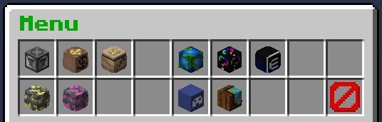
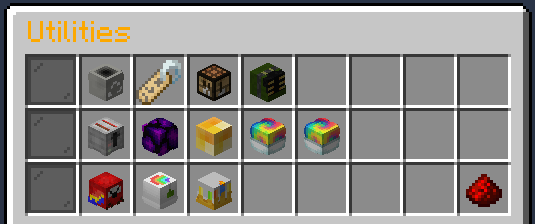

 

# Utilities

## Main Menu

You can access the main GUI with `/menu`

This will give you options to: 
- Open the Utility Menu
- Get a link to the Website
- Get a link to the Forums
- Get a link to the DynMap
- Get a link to the Discord
- Get a link to the Donation Store
- Open the Token Shop
- Help - The same as `/help`

## Utility Menu

You can get to this from either the `/menu` or by using `/util` directly, and it will give you this:

>Note that this is if you have full access to the perks. Any you have not yet unlocked will have a different icon and will let you know what level it is unlocked at!

This menu will give you access to all of the following

The top line - **General Utilities**.
This gives you the following options:
- Utility Bin - This will open the `/bin`
- Titles - This will open the `/titles` menu
- Crafting - This will open `/wbench`
- Backpack - Opens your backpack
- Bow Particles - This will open a new menu for selecting your bow particles (See below on that)

On the second line you will get - **Toggleable Utilities**.
This gives you the following options:
- Combiner - Toggles the combiner on/off. This combines certain items as you pick them up.
- Magnet - Toggles Item Magnet on/off, which draws nearby items to you.
- V.O.I.D. - Toggles VOID on/off, which removes common blocks when mining/digging so your inventory doesn't fill up with junk.
- Flashlight - Toggles your flashlight on/off. Permanent night vision when on.

And on the third line - **Donation Perks** (You must have purchased them to use them!).
This gives you the following options:
- Disguises - Opens a new menu for picking a disguise.
- Particle Trails - Opens the trails menu.

And finally, a button to go back to the `/menu`.

This has also meant a few other menus have had to be made too - Disguises and Bow Particles!

### Disguises Menu

You can click any of the mobs you have paid for to enable the disguise, and your skull in the bottom right to remove the disguise (and a button to close the menu in the corner).

Note that currently this does not support alternatives to the disguises, such as baby forms etc... but you can find out what you can use (if you have purchased them) by typing `/dis <mob>` and then put a space and hit tab to bring up options!

### Bow Particles Menu

As above, click the particle you wish to use to select it - The skull in the bottom right toggles them on/off!
Note that the netherstar in the top right will currently only be there for CatTurtleDog200 as this is their custom particles they won in the last build competition!
This can also be accessed with `/bowmenu`

### Chat Colours Menu

As above select the colour you wish to use and make sure it is toggled on (the middle item will be coloured if on, and dark if not - click to toggle) and all of your chat text will be changed to that colour!

The colours at the bottom (dark red, dark grey and black) are staff only so non-staff players won't see these options (and any you have not purchased will be locked).

## V.O.I.D.

This is the Very Ordinary Item Destroyer.
This can be unlocked for use at any time when you get to level 70, and can be toggled from the `/util` menu!
For those not yet at level 70 - you can purchase temporary usage of this through the `/tokenshop` - 10 tokens gets you 1 day of use!

When enabled this will mean that as you mine and dig any Dirt, Stone, Cobble, Sand, Andesite, Granite, Diorite or Gravel that enters your inventory will be automatically removed/destroyed - allowing you to farm your Mining/Excavation/Jobs for longer without having to empty your inventory! (Note that alternatives do not get removed - such as coarse dirt and red sand).

## The Combiner

This is unlocked at level 20 and goes hand in hand with V.O.I.D.! When enabled this will cause any Glowstone, Quartz, Redstone, Lapis , Coal, Iron/Gold Ingots and Emeralds you pick up to automatically be converted into their respective blocks, Iron/Gold Nuggets into their respective ingots as you pick them up! 

Note that this happens on pickup - so picking up enough iron nuggets to make 9 iron ingots will not turn those ingots into an iron block - but if you drop those ingots and pick them back up it will!

## Item Magnet

Unlocked at level 35, with this enabled, any item drops within 8 blocks of you will be pulled towards you! This will work alongside the VOID and Combiner features!

Toggling this will close the utilities menu on click unlike the other toggles, as it doesn't register the change of whether it has been enabled or disabled otherwise (due to '/magnet' not working, it has to be '/magnet on/off')
EG: if it didn't close you'd click once to enable, and click again to get a message saying it's already enabled, but if you closed the menu and opened it again it would disable it as it should..... xD

Abusing this as a means to steal item drops from other players will result in a ban for abuse - If you have it enabled and accidentally pick someone elses stuff up, return it (In general maybe just disable it if you're playing near other people!).
