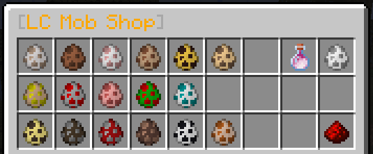

 

Quicklinks:
- [Token Shop](#token-shop)
- [Most Recent Top Voters](#top-voters)

# Voting

You can vote once per link every 24 hours (once every 12 hours for ServerPact), giving a total of 7 votes per day. 
Every vote you put through rewards you with 1 token for use in the `/tokenshop` which can be traded for a variety of things! Each vote will also count towards your Vote Count Trophy.

Note that you do not need to be online to vote - all votes will process when you do them, and you will be reminded in the chat when you log in next how many tokens you have gained since you were last online!

# Monthly Top Voter

Every month the top 3 voters will receive a small reward as a thank you! 
These will include various things such as coupons for the donation store, random MythicDrops Spirit Essences, random decorative head blocks (no effects, just things you can place around your builds) or ingame money among other potential things!

The first time you place 1st in the top voters you will also unlock a new title and the Top Voter Trophy!

**Note:** If you get 1st place in the Top Voters of a month you will not be counted in the rankings the following month, to avoid the same person winning the top rewards constantly.

# Token Shop

You can use the tokens you earn in the Token Shop at `/tshop`. There are 4 sub-shops you can browse and purchase from:

### Armour Shop

Here you can purchase:

|Item|Cost|Extra Information|
|---|---|---|
|Antique Cap|40 Tokens|Iron Helmet with Unbreaking 2, Protection 3 and Respiration 1|
|Antique Breastplate|40 Tokens|Iron Chestplate with Unbreaking 2, Protection 3, Blast Protection 2 and Projectile Protection 2|
|Antique Leggings|40 Tokens|Iron Leggings with Unbreaking 2, Protection 3 and Fire Protection 3|
|Antique Sabatons|40 Tokens|Iron Boots with Unbreaking 2, Protection 3 and Feather Falling 2|
|Crystal Helmet|80 Tokens|Diamond Helmet with Unbreaking 3, Protection 4, Respiration 3 and Aqua Affinity|
|Crystal Armour|80 Tokens|Diamond Chestplate with Unbreaking 3, Protection 4, Blast Protection 3 and Projectile Protection 3|
|Crystal Cuisses|80 Tokens|Diamond Leggings with Unbreaking 3, Protection 4 and Fire Protection 4|
|Crystal Spurs|80 Tokens|Diamond Boots with Unbreaking 3, Protection 4, Feather Falling 3 and Depth Strider 2|
|Demonic SkullCap|150 Tokens|Netherite Helmet with Unbreaking 4, Protection 5, Projectile Protection 4, Respiration 3 and Aqua Affinity|
|Demonic Mail|150 Tokens|Netherite Chestplate with Unbreaking 4, Protection 5, Blast Protection 4 and Projectile Protection 3|
|Demonic Protectors|150 Tokens|Netherite Leggings with Unbreaking 4, Protection 5 and Fire Protection 4|
|Demonic Boots|150 Tokens|Netherite Boots with Unbreaking 4, Protection 5, Feather Falling 4 and Soul Speed|
|Crystal Wings|100 Tokens|Elytra with Unbreaking 2|
|---------|---------|---------|
|Token Cap|75 Tokens|Diamond Helmet with Unbreaking 2, Protection 2, Respiration 2, Projectile Protection 2 and 3 MD Essence Cores|
|Token Mail|75 Tokens|Diamond Chestplate with Unbreaking 2, Protection 2, Fire Protection 2, Blast Protection 2 and 3 MD Essence Cores|
|Token Greaves|75 Tokens|Diamond Leggings with Unbreaking 2, Protection 2, Fire Protection 2, Blast Protection Protection 2 and 3 MD Essence Cores|
|Token Boots|75 Tokens|Diamond Boots with Unbreaking 2, Protection 2, Feather Falling 2, Depth Strider 1 and 3 MD Essence Cores|

### Tool Shop

Here you can purchase:

|Item|Cost|Extra Information|
|---|---|---|
|Antique Sword|25 Tokens|Iron Sword with Sharpness 3, Smite 1, Unbreaking 2 and Looting 1|
|Obsidian Sword|45 Tokens|Diamond Sword with Sharpness 4, Smite 3, Unbreaking 2 and Looting 2|
|Crystal Blade|100 Tokens|Diamond Sword with Sharpness 5, Smite 4, Bane of Arthropods 4, Unbreaking 4 and Looting 3|
|Demonic Blade|150 Tokens|Netherite Sword with Sharpness 7, Smite 5, Bane of Arthropods 5, Unbreaking 4 and Looting 4|
|Antique Pickaxe|25 Tokens|Iron Pickaxe with Efficiency 3, Unbreaking 2 and Fortune 1|
|Obsidian Pickaxe|45 Tokens|Diamond Pickaxe with Efficiency 3, Unbreaking 2 and Fortune 3|
|Crystal Pick|100 Tokens|Diamond Pickaxe with Efficiency 5, Unbreaking 4 and Fortune 4|
|Demonic Pick|150 Tokens|Netherite Pickaxe with Efficiency 6, Unbreaking 4 and Fortune 6|
|Antique Axe|25 Tokens|Iron Axe with Sharpness 3, Efficiency 2, Unbreaking 2 and Fortune 1|
|Obsidian Axe|45 Tokens|Diamond Axe with Sharpness 4, Efficiency 3, Unbreaking 2 and Fortune 2|
|Crystal Hatchet|100 Tokens|Diamond Axe with Sharpness 4, Smite 3, Bane of Arthropods 3, Efficiency 3, Unbreaking 4, Looting 2 and Fortune 2|
|Demonic Hatchet|150 Tokens|Netherite Axe with Sharpness 5, Smite 4, Bane of Arthropods 4, Efficiency 5, Unbreaking 4, Looting 3 and Fortune 3|
|Antique Spade|25 Tokens|Iron Shovel with Efficiency 3 and Unbreaking 2|
|Obsidian Spade|45 Tokens|Diamond Shovel with Efficiency 3, Unbreaking 2 and Fortune 2|
|Crystal Scoop|100 Tokens|Diamond Shovel with Efficiency 5, Unbreaking 4 and Fortune 3|
|Demonic Scoop|150 Tokens|Netherite Shovel with Efficiency 6, Unbreaking 4 and Fortune 5|
|Emerald Hoe|65 Tokens|Diamond Hoe with Efficiency 3, Unbreaking 4 and Silk Touch|
|Crystal Hoe|75 Tokens|Diamond Hoe with Efficiency 3, Unbreaking 4 and Fortune 3|
|Infernal Hoe|100 Tokens|Netherite Hoe with Efficiency 5, Unbreaking 6 and Silk Touch|
|Demonic Hoe|120 Tokens|Netherite Hoe with Efficiency 5, Unbreaking 6 and Fortune 5|
|Antique Pole|25 Tokens|Fishing Rod with Luck of the Sea 2, Lure 2 and Unbreaking 2|
|Obsidian Rod|45 Tokens|Fishing Rod with Luck of the Sea 2, Lure 4 and Unbreaking 3|
|Crystal Rod|150 Tokens|Fishing Rod with Luck of the Sea 7, Lure 5, Unbreaking 4 and Mending|
|Antique Trident|25 Tokens|Trident with Loyalty 1, Impaling 3 and Unbreaking 2|
|Obsidian Trident|45 Tokens|Trident with Loyalty 3, Impaling 4 and Unbreaking 3|
|Crystal Trident|70 Tokens|Trident with Channeling 1, Loyalty 2, Impaling 5 and Unbreaking 3|
|Antique Bow|45 Tokens|Bow with Power 3, Unbreaking 2 and Looting 2|
|Crystal Longbow|125 Tokens|Bow with Power 7, Punch 2, Unbreaking 4, Looting 4 and Infinity 1|
|Antique Crossbow|45 Tokens|Crossbow with Piercing 3, Quick Charge 1, Unbreaking 2 and Looting 1|
|Crystal Arbalest|125 Tokens|Crossbow with MultiShot 1, Piercing 6, Quick Charge 4, Unbreaking 4 and Looting 4|
|---------|---------|---------|
|Token Blade|70 Tokens|Diamond Sword with Sharpness 3, Smite 2, Unbreaking 2, Looting 2 and 3 MD Essence Cores|
|Token Chisel|70 Tokens|Diamond Pickaxe with Unbreaking 2, Efficiency 3, Fortune 2 and 3 MD Essence Cores|
|Token Hatchet|70 Tokens|Diamond Axe with Sharpness 3, Efficiency 2, Unbreaking 2, Looting 2 and 3 MD Essence Cores|
|Token Spade|70 Tokens|Diamond Shovel with Unbreaking 2, Efficiency 3, Fortune 2 and 3 MD Essence Cores|
|Token Hoe|70 Tokens|Diamond Hoe with Unbreaking 3, Efficiency 3, Fortune 2 and 3 MD Essence Cores|
|Token Shortbow|70 Tokens|Bow with Power 4, Unbreaking 2, Looting 2 and 3 MD Essence Cores|
|Token Crossbow|70 Tokens|Crossbow with Piercing 3, Quick Charge 2, Unbreaking 2, Looting 2 and 3 MD Essence Cores|

### Mob Shop

Here you can purchase:

|Item|Cost|
|---|---|
|Wolf Egg|20 Tokens|
|Rabbit Egg|12 Tokens|
|Sheep Egg|12 Tokens|
|Llama Egg|18 Tokens|
|Bee Egg|10 Tokens|
|Cat Egg|18 Tokens|
|Horse Egg|18 Tokens|
|Chicken Egg|12 Tokens|
|Pig Egg|12 Tokens|
|Parrot Egg|15 Tokens|
|Turtle Egg|15 Tokens|
|Ocelot Egg|15 Tokens|
|Cow Egg|12 Tokens|
|Mushroom Cow Egg|15 Tokens|
|Villager Egg|50 Tokens|
|Panda Egg|15 Tokens|
|Fox Egg|15 Tokens|
|Safari Net - Single Use|15 Tokens|
|Dragon Breath|4 Tokens|

### Misc Shop

Here you can purchase:

|Item|Cost|Extra Information|
|---|---|---|
|Slime Crystal|3 Tokens|Right click with the item it gives to check if the chunk you are in is a slime chunk|
|Extra Towny Chunk Claim|5 Tokens|An additional chunk claim for your town - You **must** be the town mayor to do this!|
|Baby Tag|7 Tokens|Forces a mob to stay as a baby for life! Renames at the same time as a normal nametag (if the mob is an adult when used it'll change to a baby)|
|Colour Palette|7 Tokens|Drop the item it gives you onto an item you want to rename and you can then rename it with the old & colours! (costs 1 XP level to rename)|
|Hex Renamer|20 Tokens|Right click with the item it gives you then hold the item you wish to rename and type the new name (with colour codes - including hex/gradient code support) in the chat! (costs 5 XP levels to rename)|
|Totem of Undying|30 Tokens||
|DeathPoint Scroll|15 Tokens|When held and sneak-right clicked with it will return you to your last recorded death point!|
|Temporary TFly Access|10 Tokens|1 Hour of access to use `/tfly` to fly within your towns borders|
|Temporary Combiner Access|15 Tokens|Grants you 4 hours of full Combiner usage from the time of purchase. You can access the Combiner menu, turn it on/off and toggle what gets combined on pickup with `/combine`|
|Temporary V.O.I.D. Access|20 Tokens|Grants you 4 hours of full V.O.I.D. usage from the time of purchase. You can access the VOID menu, turn it on/off and toggle what gets destroyed on pickup with `/void`|
|Random Legendary MD Item|200 Tokens|Get a random MD Legendary drop!|
|Random MD Essence|60 Tokens|Get a random MD Essence!|

# Top Voters

On the 1st of every month the tally of votes from the previous month are checked (before being reset for the next month) and the players with the top 5 amount of votes are all given a variety of rewards which differs between each month.
You can read up on Voting, and the Token Shop (votings other perk) [HERE](voting.md).

**Month of the last Top Voters**: November 2020. 
**Top Voters**: 
1 -- DoctorGurke -- 209 votes 
2 -- aknitwhitz -- 178 votes 
3 -- beale947 -- 173 votes 
4 -- Funization -- 143 votes 
5 -- Sahoonie -- 129 votes 
**Prizes Given**: 
**1st Place** -- One of the dono store options listed on the Discord, 10000 McRPG EXP, 3x Totem of Undying and 4 DeathPoint Scrolls. 
**2nd Place** -- One of the dono store options listed on the Discord, 7500 McRPG EXP, 2x Totem of Undying and 3 DeathPoint Scrolls. 
**3rd Place** -- One of the dono store options listed on the Discord, 5000 McRPG EXP, 1x Totem of Undying and 2 DeathPoint Scrolls. 
**4th and 5th Place** -- 5000 McRPG EXP and a DeathPoint Scroll.
