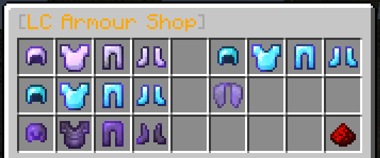
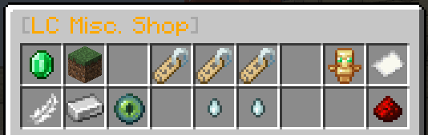

 

# Voting

You can vote once per link every 24 hours (once every 12 hours for ServerPact). Every vote you put through rewards you with 1 token for use in the `/tokenshop` which can be traded for a variety of things!

Note that you do not need to be online to vote - all votes will be queued for when you net log in!

### Voting Links
- [MinecraftList.org](https://minecraftlist.org/vote/2846)
- [Minecraft-MC.com](https://minecraft-mp.com/server/228349/vote/)
- [MinecraftServers.org](https://minecraftservers.org/vote/558604)
- [ServerPact.com](https://www.serverpact.com/vote-33941)
- [Minelist.net](https://minelist.net/vote/2573)
- [Minecraft-Server-List.com](https://minecraft-server-list.com/server/443183/vote/)
- [PlanetMinecraft](https://www.planetminecraft.com/server/legioncraft-3163956/vote/)

# Monthly Top Voter

Every month the top 5 voters will receive a small reward as a thank you! These will vary from coupons for the donation store, to perk scrolls and scratch cards/raffle tickets for use ingame!

# Token Shop

You can use the tokens you earn through voting at the above links in the Token Shop at `/tshop`. There are 4 sub-shops you can browse and purchase from:

### Armour Shop

Here you can purchase:

|Item|Cost|Extra Information|
|---|---|---|
|Antique Coif|7 Tokens|Leather Helmet with Unbreaking 2 and Protection 2|
|Antique Leather Plate|7 Tokens|Leather Chestplate with Unbreaking 2 and Protection 2|
|Antique Chaps|7 Tokens|Leather Leggings with Unbreaking 2 and Protection 2|
|Antique Sandals|7 Tokens|Leather Boots with Unbreaking 2 and Protection 2|
|Antique Helmet|20 Tokens|Chainmail Helmet with Unbreaking 3 and Protection 3|
|Antique Chainmail|20 Tokens|Chainmail Chestplate with Unbreaking 3 and Protection 3|
|Antique Greaves|20 Tokens|Chainmail Leggings with Unbreaking 3 and Protection 3|
|Antique Boots|20 Tokens|Chainmail Boots with Unbreaking 3 and Protection 3|
|Antique Cap|35 Tokens|Iron Helmet with Unbreaking 3, Protection 3 and Respiration 1|
|Antique Breastplate|35 Tokens|Iron Chestplate with Unbreaking 3, Protection 2, Blast Protection 2 and Projectile Protection 2|
|Antique Leggings|35 Tokens|Iron Leggings with Unbreaking 3, Protection 3 and Fire Protection 3|
|Antique Sabatons|35 Tokens|Iron Boots with Unbreaking 3, Protection 3 and Feather Falling 2|
|Crystal Helmet|60 Tokens|Diamond Helmet with Unbreaking 4, Protection 5, Respiration 3 and Aqua Affinity|
|Crystal Armour|60 Tokens|Diamond Chestplate with Unbreaking 4, Protection 5, Blast Protection 3 and Projectile Protection 3|
|Crystal Cuisses|60 Tokens|Diamond Leggings with Unbreaking 4, Protection 4 and Fire Protection 4|
|Crystal Spurs|60 Tokens|Diamond Boots with Unbreaking 4, Protection 5 and Feather Falling 4|
|Token Cap|75 Tokens|Diamond Helmet with Unbreaking 3, Protection 3, Respiration 2, Projectile Protection 2 and 3 MD Essence Cores|
|Token Mail|75 Tokens|Diamond Chestplate with Unbreaking 3, Protection 3, Fire Protection 2, Blast Protection 2 and 3 MD Essence Cores|
|Token Greaves|75 Tokens|Diamond Leggings with Unbreaking 3, Protection 3, Fire Protection 2, Blast Protection Protection 2 and 3 MD Essence Cores|
|Token Boots|75 Tokens|Diamond Boots with Unbreaking 3, Protection 2, Feather Falling 3, Depth Strider 1 and 3 MD Essence Cores|
|Crystal Wings|100 Tokens|Elytra with Mending|
|Crystal Aegis|20 Tokens|Shield, patterned, with Mending|

### Tool Shop

Here you can purchase:

|Item|Cost|Extra Information|
|---|---|---|
|Antique Sword|15 Tokens|Iron Sword with Sharpness 2, Unbreaking 3 and Looting 1|
|Obsidian Sword|35 Tokens|Diamond Sword with Sharpness 3, Unbreaking 4, Fire Aspect 2 and Looting 2|
|Emerald Sword|65 Tokens|Diamond Sword with Sharpness 5, Unbreaking 5, Fire Aspect 2 and Looting 3|
|Crystal Blade|125 Tokens|Diamond Sword with Sharpness 5, Smite 5, Unbreaking 5, Fire Aspect 5 and Looting 5|
|Token Blade|75 Tokens|Diamond Sword with Looting 2, Sharpness 3, Smite 3, Unbreaking 3 and 3 MD Essence slots|
|Antique Pickaxe|15 Tokens|Iron Pickaxe with Efficiency 2, Unbreaking 3 and Fortune 1|
|Obsidian Pickaxe|35 Tokens|Diamond Pickaxe with Efficiency 3, Unbreaking 4 and Fortune 2|
|Emerald Pickaxe|65 Tokens|Diamond Pickaxe with Efficiency 5, Unbreaking 5 and Fortune 4|
|Crystal Pick|125 Tokens|Diamond Pickaxe with Efficiency 6, Unbreaking 5 and Fortune 6|
|Token Chisel|75 Tokens|Diamond Pickaxe with Fortune 3, Efficiency 3, Unbreaking 3 and 3 MD Essence slots|
|Antique Axe|15 Tokens|Iron Axe with Sharpness 2, Unbreaking 2, Efficiency 2 and Fortune 1|
|Obsidian Axe|35 Tokens|Diamond Axe with Sharpness 3, Unbreaking 4, Efficiency 3 and Fortune 2|
|Emerald Axe|65 Tokens|Diamond Axe with Sharpness 4, Unbreaking 5, Efficiency 5 and Fortune 4|
|Crystal Hatchet|125 Tokens|Diamond Axe with Sharpness 4, Smite 3, Unbreaking 5, Efficiency 5, Fortune 4 and Looting 4|
|Token Hatchet|75 Tokens|Diamond Axe with Looting 2, Shaprness 3, Efficiency 3, Unbreaking 3 and 3 MD Essence slots|
|Antique Spade|15 Tokens|Iron Shovel with Efficiency 3 and Unbreaking 3|
|Obsidian Spade|35 Tokens|Diamond Shovel with Efficiency 3, Unbreaking 4 and Fortune 2|
|Emerald Spade|65 Tokens|Diamond Shovel with Efficiency 5, Unbreaking 5 and Fortune 4|
|Crystal Scoop|125 Tokens|Diamond Shovel with Efficiency 6, Unbreaking 5 and Fortune 6|
|Token Spade|75 Tokens|Diamond Shovel with Fortune 3, Efficiency 3, Unbreaking 3 and 3 MD Essence slots|
|Antique Bow|25 Tokens|Bow with Power 5, Punch 2, Unbreaking 3 and Looting 2|
|Crystal Longbow|125 Tokens|Bow with Power 7, Punch 4, Unbreaking 5 and Looting 4, Infinity|
|Token Shortbow|75 Tokens|Bow with Looting 3, Power 5, Unbreaking 3 and 3 MD Essence slots|
|Antique Crossbow|25 Tokens|Crossbow with Looting 2, Piercing 3, Quick Charge 2 and Unbreaking 3|
|Crystal Arbalest|125 Tokens|Crossbow with Looting 4, Multishot, Piercing 7, Quick Charge 4 and Unbreaking 5|
|Token Crossbow|75 Tokens|Crossbow with Looting 3, Piercing 3, Quick Charge 2, Unbreaking 3 and 3 MD Essence slots|
|Antique Pole|15 Tokens|Fishing Rod with Luck 2, Lure 2 and Unbreaking 2|
|Obsidian Rod|35 Tokens|Fishing Rod with Luck 7 and Unbreaking 5|
|Emerald Rod|65 Tokens|Fishing Rod with Lure 5 and Unbreaking 5|
|Crystal Rod|125 Tokens|Fishing Rod with Luck 7, Lure 5 and Unbreaking 5|
|Emerald Trident|35 Tokens|Trident with Riptide 3, Impaling 5 and Unbreaking 3|
|Crystal Trident|40 Tokens|Trident with Loyalty 3, Impaling 5 and Unbreaking 3|
|Ruby Trident|50 Tokens|Trident with Channeling, Impaling 5 and Unbreaking 3|
|Token Trident|75 Tokens|Trident with Impaling 4, Loyalty 3, Unbreaking 3 and 3 MD Essence slots|

### Mob Shop

Here you can purchase:

|Item|Cost|
|---|---|
|Wolf Egg|20 Tokens|
|Rabbit Egg|12 Tokens|
|Sheep Egg|12 Tokens|
|Llama Egg|18 Tokens|
|Bee Egg|10 Tokens|
|Cat Egg|18 Tokens|
|Horse Egg|18 Tokens|
|Chicken Egg|12 Tokens|
|Pig Egg|12 Tokens|
|Parrot Egg|15 Tokens|
|Turtle Egg|15 Tokens|
|Ocelot Egg|15 Tokens|
|Cow Egg|12 Tokens|
|Mushroom Cow Egg|15 Tokens|
|Villager Egg|50 Tokens|
|Panda Egg|15 Tokens|
|Fox Egg|15 Tokens|
|Safari Net - Single Use|8 Tokens|
|Safari Net - Reusable|60 Tokens|
|Dragon Breath|12 Tokens|
|Shulker Shell|8 Tokens|

### Misc Shop

Here you can purchase:

|Item|Cost|Extra Information|
|---|---|---|
|Totem of Undying|30 Tokens||
|Colour Palette|10 Tokens|Drop the item it gives you onto an item you want to rename and you can then rename it with colours!|
|Baby Tag|10 Tokens|Forces a mob to stay as a baby for life! Renames at the same time as a normal nametag (if the mob is an adult when used it'll change to a baby)|
|Slime Crystal|3 Tokens|Right click with the item it gives to check if the chunk you are in is a slime chunk|
|Rainbow Essence|10 Tokens|Use the item given on a glass block to turn it into Rainbow Glass which changes colour every few seconds!  **Note:** Limit of 10 Rainbow Glass blocks per player, and breaking on (you can't break someone elses unless you're BurntValentine) has a chance to return the Essence!|
|Return/DeathPoint Ticket|15 Tokens|Acts as either a teleport to your last death point (in DeathPoint mode - default mode when purchased), or your last teleport point (in Return mode - does not take you to death points). Shift right click with one in your hand to change the mode!|
|Extra Towny Chunk Claim|5 Tokens|An additional chunk claim for your town - You **must** be the town mayor to do this!|
|V.O.I.D. Access|20 Tokens|Grants you 6 hours of VOID usage from the time of purchase. You can toggle it through the `/utils` menu - when on it will remove all "junk" items while digging or mining (cobblestone, stone, andesite, diorite, granite, gravel, sand, dirt)|
|Random Legendary MD Item|200 Tokens|Get a random MD Legendary drop!|
|Random MD Essence|60 Tokens|Get a random MD Essence!|
